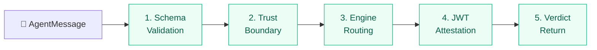
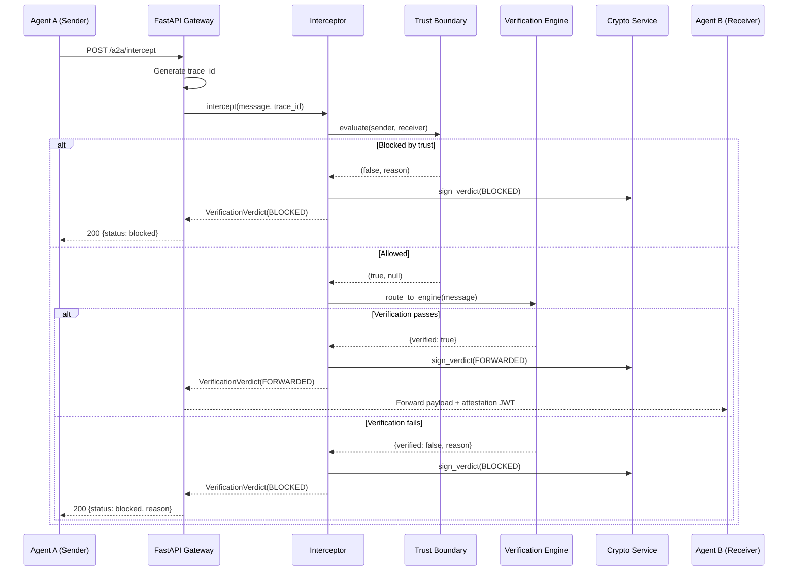
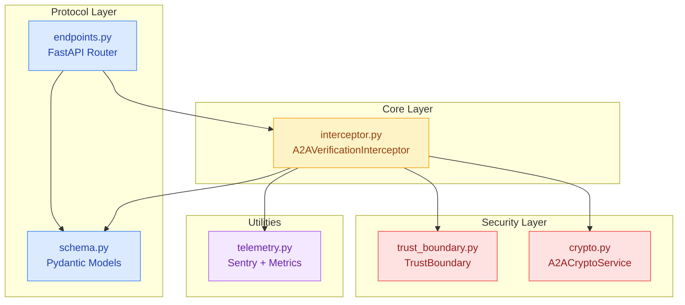
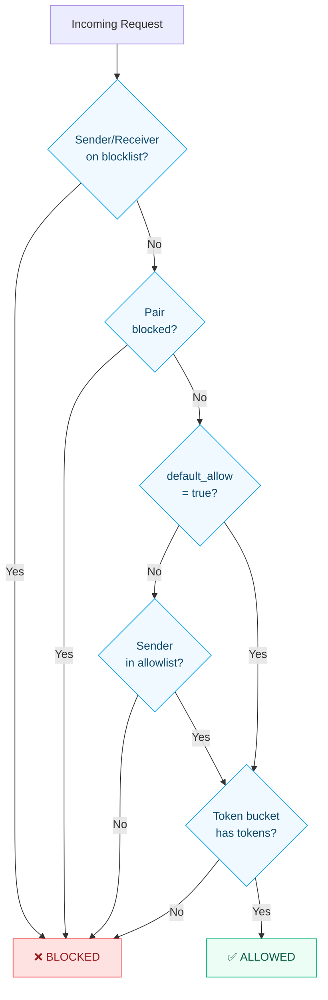
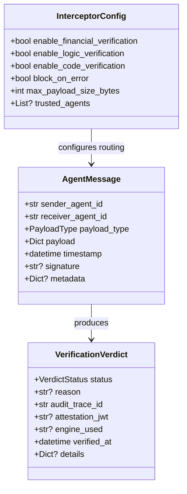

## Pipeline overview

Every inter-agent message flows through five deterministic stages:



| Stage | Component | What it does |
|-------|-----------|-------------|
| **1. Schema** | Pydantic `AgentMessage` | Validates sender/receiver IDs, payload type, timestamp, optional signature |
| **2. Trust** | `TrustBoundary` | Checks blocklists, allowlists, pair blocks, rate limits — deny-all by default |
| **3. Engine** | `_route_to_engine()` | Routes to `finance_guard`, `logic_guard`, `code_guard`, or `passthrough` |
| **4. Attestation** | `A2ACryptoService` | Signs the verdict with ES256 JWT — includes payload hash, trace ID, engine used |
| **5. Verdict** | `VerificationVerdict` | Returns `forwarded` or `blocked` with reason, attestation, and audit trace |

---

## Full verification sequence



---

## Component relationship



---

## Trust boundary evaluation

The trust boundary evaluates **every** request through a strict sequence. Note that allowlist checks happen **before** rate-limit allocation to prevent map-spray attacks.



---

## Engine routing

The interceptor routes payloads based on `payload_type`:

| PayloadType | Engine | Verification | Precision |
|------------|--------|-------------|-----------|
| `financial_transaction` | `finance_guard` | Decimal arithmetic — recomputes totals from line items | `Decimal("0.01")` tolerance |
| `logic_assertion` | `logic_guard` | Set-based contradiction detection (P AND NOT P) | Deterministic, sorted output |
| `code_execution` | `code_guard` | Case-insensitive regex for `eval`, `exec`, `subprocess`, `os.system`, etc. | Import/alias detection |
| `general` / `data_query` | `passthrough` | No verification — forwarded immediately | N/A |

---

## Data model



---

## JWT attestation structure

Every verdict includes a signed JWT with this payload:

```json
{
  "iss": "did:qwed:a2a:local",
  "sub": "sha256:abc123...",
  "iat": 1711411200,
  "exp": 1711497600,
  "jti": "a2a_demo_001",
  "qwed_a2a": {
    "version": "1.0",
    "verdict": "forwarded",
    "engine": "finance_guard",
    "sender": "procurement-agent",
    "receiver": "treasury-agent"
  }
}
```

<Info>
The `sub` claim is a SHA-256 hash of the original payload, making the attestation tamper-evident. Any modification to the payload invalidates the hash match.
</Info>
