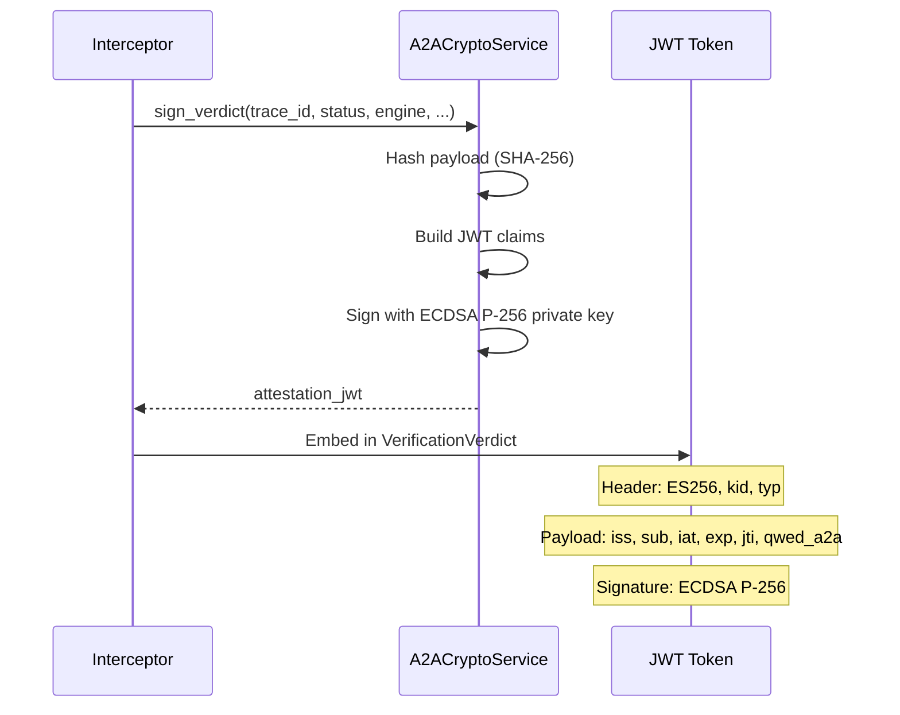

## Overview

Every verification verdict is signed with an **ES256 JWT attestation** — a cryptographic proof that the verification took place. This enables:

- **Tamper detection** — any modification invalidates the signature
- **Non-repudiation** — the signing service is identified by DID
- **Audit compliance** — attestations are stored and queryable
- **Cross-service verification** — any QWED node can verify the token

---

## How it works



---

## JWT structure

### Header

```json
{
  "alg": "ES256",
  "typ": "qwed-a2a-attestation+jwt",
  "kid": "did:qwed:a2a:local#signing-key-v1"
}
```

### Payload

```json
{
  "iss": "did:qwed:a2a:local",
  "sub": "sha256:e3b0c44298fc1c149afb...",
  "iat": 1711411200,
  "exp": 1711497600,
  "jti": "a2a_trace_001",
  "qwed_a2a": {
    "version": "1.0",
    "verdict": "forwarded",
    "engine": "finance_guard",
    "sender": "procurement-agent",
    "receiver": "treasury-agent"
  }
}
```

| Claim | Description |
|-------|-------------|
| `iss` | DID-based issuer identity of the signing service |
| `sub` | SHA-256 hash of the original payload (tamper detection) |
| `iat` | Token issued-at timestamp |
| `exp` | Token expiration (default: 24 hours) |
| `jti` | Trace ID linking to the verification event |
| `qwed_a2a` | QWED-specific claims: verdict, engine, sender/receiver |

---

## Signing a verdict

```python
from qwed_a2a.security.crypto import A2ACryptoService

crypto = A2ACryptoService(
    issuer_id="did:qwed:a2a:production",
    validity_seconds=86400,  # 24 hours
)

token = crypto.sign_verdict(
    trace_id="a2a_audit_001",
    verdict_status="forwarded",
    engine="finance_guard",
    sender_id="procurement-agent",
    receiver_id="treasury-agent",
    payload_hash="sha256:abc123...",
)

print(token)
# eyJhbGciOiJFUzI1NiIsInR5cCI6InF3ZWQtYTJhLWF0dGVzdGF0aW9uK2p3dCIs...
```

---

## Verifying an attestation

```python
is_valid, claims, error = crypto.verify_attestation(token)

if is_valid:
    print(f"Verdict: {claims['qwed_a2a']['verdict']}")
    print(f"Engine:  {claims['qwed_a2a']['engine']}")
    print(f"Trace:   {claims['jti']}")
else:
    print(f"Invalid: {error}")
```

### Verification outcomes

| Result | Meaning |
|--------|---------|
| `(True, claims, None)` | Valid attestation — claims are trustworthy |
| `(False, None, "Attestation has expired")` | Token past its `exp` time |
| `(False, None, "Invalid token: ...")` | Signature mismatch, tampering, or wrong key |

---

## Tamper detection

The `sub` claim contains a SHA-256 hash of the original payload:

```python
payload_hash = A2ACryptoService.hash_content(
    '{"claimed_total": 150.00, "line_items": [...]}'
)
# "sha256:e3b0c44298fc1c149afbf4c8996fb92427ae41e4649b934ca495991b7852b855"
```

<Warning>
If the original payload is modified after signing, the hash will not match the `sub` claim — even though the JWT signature itself is still valid. Always verify **both** the JWT signature and the payload hash.
</Warning>

---

## Cross-service isolation

Each `A2ACryptoService` instance generates its own ECDSA P-256 key pair. Tokens signed by one instance **cannot** be verified by another:

```python
service_a = A2ACryptoService(issuer_id="did:qwed:a2a:node-A")
service_b = A2ACryptoService(issuer_id="did:qwed:a2a:node-B")

token = service_a.sign_verdict(...)

is_valid, _, error = service_b.verify_attestation(token)
# is_valid = False — different key pairs
```

<Tip>
For multi-node deployments, share the same key pair across instances or implement a key distribution protocol. See [Deployment](/a2a/deployment) for details.
</Tip>

---

## Graceful degradation

If `cryptography` and `PyJWT` packages are not installed, the interceptor operates **without attestations**. Verdicts are still generated, but `attestation_jwt` will be `None`.

```python
from qwed_a2a.security.crypto import HAS_CRYPTO

if HAS_CRYPTO:
    print("✅ Crypto available — attestations enabled")
else:
    print("⚠️ Crypto unavailable — attestations disabled")
```
