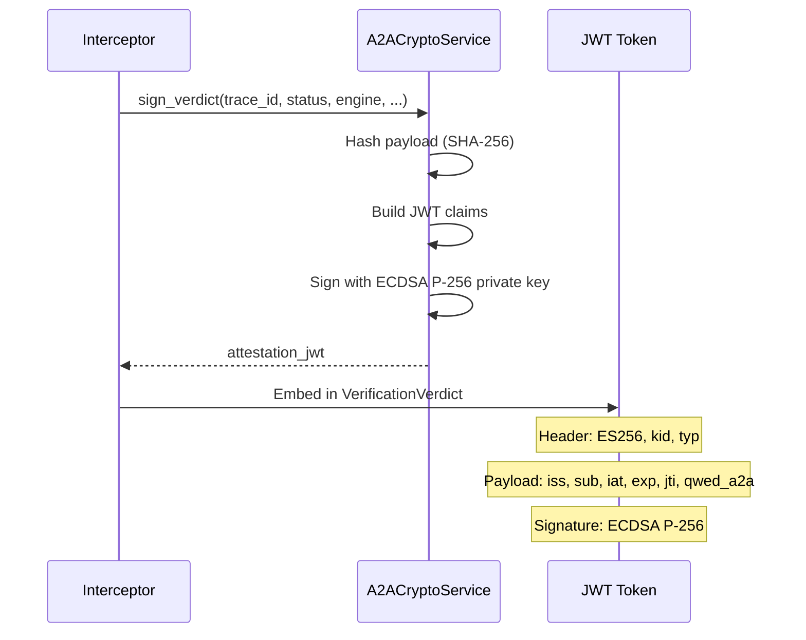

## Overview

Every verification verdict is signed with an **ES256 JWT attestation** — a cryptographic proof that the verification took place. This enables:

- **Tamper detection** — any modification invalidates the signature
- **Non-repudiation** — the signing service is identified by DID
- **Audit compliance** — attestations are stored and queryable
- **Cross-service verification** — any QWED node can verify the token

---

## How it works



---

## JWT structure

### Header

```json
{
  "alg": "ES256",
  "typ": "qwed-a2a-attestation+jwt",
  "kid": "did:qwed:a2a:local#key-<sha256-fingerprint>"
}
```

The `kid` is derived from a SHA-256 fingerprint of the public key, so it stays stable as long as `QWED_A2A_SIGNING_KEY_PEM` is unchanged — even across process restarts.

### Payload

```json
{
  "iss": "did:qwed:a2a:local",
  "sub": "sha256:e3b0c44298fc1c149afb...",
  "iat": 1711411200,
  "exp": 1711497600,
  "jti": "a2a_trace_001",
  "qwed_a2a": {
    "version": "1.0",
    "verdict": "forwarded",
    "engine": "finance_guard",
    "sender": "procurement-agent",
    "receiver": "treasury-agent"
  }
}
```

| Claim | Description |
|-------|-------------|
| `iss` | DID-based issuer identity of the signing service |
| `sub` | SHA-256 hash of the original payload (tamper detection) |
| `iat` | Token issued-at timestamp |
| `exp` | Token expiration (default: 24 hours) |
| `jti` | Trace ID linking to the verification event |
| `qwed_a2a` | QWED-specific claims: verdict, engine, sender/receiver |

---

## Configure the signing key

QWED A2A requires a **persistent** ECDSA P-256 signing key so that JWT attestations signed before a restart can still be verified afterwards. Keys are never generated inside the process — the service loads them from the `QWED_A2A_SIGNING_KEY_PEM` environment variable (or the `pem_key` constructor argument).

<Warning>
If `QWED_A2A_SIGNING_KEY_PEM` is not set, `A2ACryptoService` fails closed: calls to `sign_verdict`, `verify_attestation`, `get_public_key_jwk`, and the interceptor's `intercept()` raise `RuntimeError`. This is deliberate — signing with a per-process ephemeral key would silently break audit continuity.
</Warning>

Generate an unencrypted PKCS#8 P-256 key with `openssl`:

```bash
openssl ecparam -name prime256v1 -genkey -noout \
  | openssl pkcs8 -topk8 -nocrypt \
  > qwed_a2a_signing_key.pem

export QWED_A2A_SIGNING_KEY_PEM="$(cat qwed_a2a_signing_key.pem)"
```

Store the PEM in your secrets manager (AWS Secrets Manager, Vault, etc.) and inject it as an environment variable at runtime. Every replica in the same logical deployment must load the same PEM so all instances share one `key_id` and can verify each other's tokens.

---

## Signing a verdict

```python
from qwed_a2a.security.crypto import A2ACryptoService

# Key is loaded from QWED_A2A_SIGNING_KEY_PEM
crypto = A2ACryptoService(
    issuer_id="did:qwed:a2a:production",
    validity_seconds=86400,  # 24 hours
)

token = crypto.sign_verdict(
    trace_id="a2a_audit_001",
    verdict_status="forwarded",
    engine="finance_guard",
    sender_id="procurement-agent",
    receiver_id="treasury-agent",
    payload_hash="sha256:abc123...",
)

print(token)
# eyJhbGciOiJFUzI1NiIsInR5cCI6InF3ZWQtYTJhLWF0dGVzdGF0aW9uK2p3dCIs...
```

---

## Verifying an attestation

```python
is_valid, claims, error = crypto.verify_attestation(token)

if is_valid:
    print(f"Verdict: {claims['qwed_a2a']['verdict']}")
    print(f"Engine:  {claims['qwed_a2a']['engine']}")
    print(f"Trace:   {claims['jti']}")
else:
    print(f"Invalid: {error}")
```

### Verification outcomes

| Result | Meaning |
|--------|---------|
| `(True, claims, None)` | Valid attestation — claims are trustworthy |
| `(False, None, "Attestation has expired")` | Token past its `exp` time |
| `(False, None, "Invalid token: ...")` | Signature mismatch, tampering, or wrong key |

---

## Tamper detection

The `sub` claim contains a SHA-256 hash of the original payload:

```python
payload_hash = A2ACryptoService.hash_content(
    '{"claimed_total": 150.00, "line_items": [...]}'
)
# "sha256:e3b0c44298fc1c149afbf4c8996fb92427ae41e4649b934ca495991b7852b855"
```

<Warning>
If the original payload is modified after signing, the hash will not match the `sub` claim — even though the JWT signature itself is still valid. Always verify **both** the JWT signature and the payload hash.
</Warning>

---

## Publishing the public key (JWKS)

External consumers verify attestations by fetching the public key. `A2ACryptoService.get_public_key_jwk()` returns the current key in JWK format:

```python
jwk = crypto.get_public_key_jwk()
# {
#   "kty": "EC",
#   "crv": "P-256",
#   "x":   "…base64url…",
#   "y":   "…base64url…",
#   "kid": "did:qwed:a2a:production#key-<sha256-fingerprint>",
#   "use": "sig",
#   "alg": "ES256"
# }
```

The FastAPI gateway exposes this at [`GET /.well-known/jwks.json`](/a2a/deployment#jwks-endpoint) so downstream services and auditors can fetch keys over HTTP.

---

## Cross-service verification

Because every replica loads the same PEM from `QWED_A2A_SIGNING_KEY_PEM`, they all derive the same `key_id` and can verify each other's tokens:

```python
# Both processes load the same PEM (from env or secrets manager)
service_a = A2ACryptoService(issuer_id="did:qwed:a2a:production")
service_b = A2ACryptoService(issuer_id="did:qwed:a2a:production")

token = service_a.sign_verdict(...)

is_valid, claims, _ = service_b.verify_attestation(token)
# is_valid = True — shared key pair
```

<Tip>
If you rotate `QWED_A2A_SIGNING_KEY_PEM`, attestations signed with the previous key become unverifiable once the new JWKS is served — the endpoint only publishes the current key. To avoid rejecting in-flight attestations during rotation, keep the previous key accessible until all tokens signed with it expire (check their `exp` claim). Future releases may add multi-key JWKS support for seamless rotation.
</Tip>

---

## Fail-closed behavior

QWED A2A treats missing or invalid signing keys as an unrecoverable configuration error, not a soft warning. There is no ephemeral-key fallback.

| Condition | Behavior |
|-----------|----------|
| `QWED_A2A_SIGNING_KEY_PEM` not set | `sign_verdict`, `verify_attestation`, `get_public_key_jwk`, and `interceptor.intercept()` raise `RuntimeError` |
| PEM is not a valid EC private key | `RuntimeError` at first key access |
| PEM uses a curve other than `SECP256R1` (P-256) | `RuntimeError` at first key access |
| `cryptography` or `PyJWT` not installed | `RuntimeError` at first key access |

The FastAPI gateway surfaces these as `HTTP 503 Signing key unavailable` on both `/a2a/intercept` and `/.well-known/jwks.json` so orchestrators can detect a misconfigured deployment before it accepts traffic.
