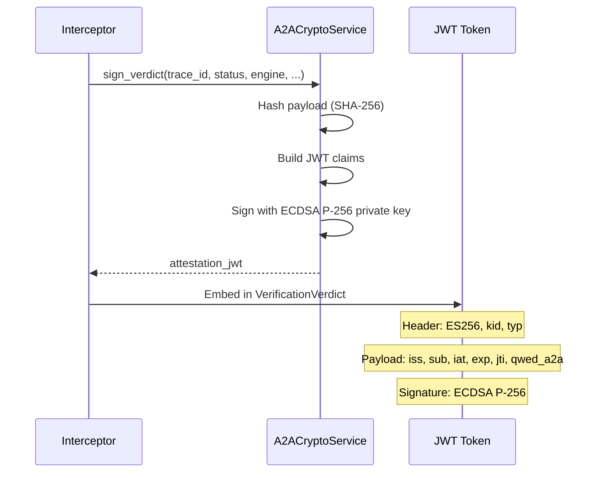

## Overview

Every verification verdict is signed with an **ES256 JWT attestation** — a cryptographic proof that the verification took place. This enables:

- **Tamper detection** — any modification invalidates the signature
- **Non-repudiation** — the signing service is identified by DID
- **Audit compliance** — attestations are stored and queryable
- **Cross-service verification** — any QWED node can verify the token

---

## How it works


```mermaid
sequenceDiagram
    participant Int as Interceptor
    participant Crypto as A2ACryptoService
    participant JWT as JWT Token

    Int->>Crypto: sign_verdict(trace_id, status, engine, ...)
    Crypto->>Crypto: Hash payload (SHA-256)
    Crypto->>Crypto: Build JWT claims
    Crypto->>Crypto: Sign with ECDSA P-256 private key
    Crypto-->>Int: attestation_jwt
    Int->>JWT: Embed in VerificationVerdict

    Note over JWT: Header: ES256, kid, typ
    Note over JWT: Payload: iss, sub, iat, exp, jti, qwed_a2a
    Note over JWT: Signature: ECDSA P-256
```

---

## JWT structure

### Header

```json
{
  "alg": "ES256",
  "typ": "qwed-a2a-attestation+jwt",
  "kid": "did:qwed:a2a:local#key-<sha256-fingerprint>"
}
```

The `kid` is derived from a SHA-256 fingerprint of the public key, so it stays stable as long as `QWED_A2A_SIGNING_KEY_PEM` is unchanged — even across process restarts.

### Payload

```json
{
  "iss": "did:qwed:a2a:local",
  "sub": "sha256:e3b0c44298fc1c149afb...",
  "iat": 1711411200,
  "exp": 1711497600,
  "jti": "a2a_trace_001",
  "qwed_a2a": {
    "version": "1.0",
    "verdict": "forwarded",
    "engine": "finance_guard",
    "sender": "procurement-agent",
    "receiver": "treasury-agent"
  }
}
```

| Claim | Description |
|-------|-------------|
| `iss` | DID-based issuer identity of the signing service |
| `sub` | SHA-256 hash of the original payload (tamper detection) |
| `iat` | Token issued-at timestamp |
| `exp` | Token expiration (default: 24 hours) |
| `jti` | Trace ID linking to the verification event |
| `qwed_a2a` | QWED-specific claims: verdict, engine, sender/receiver |

---

## Configure the signing key

QWED A2A requires a **persistent** ECDSA P-256 signing key so that JWT attestations signed before a restart can still be verified afterwards. Keys are never generated inside the process — the service loads them from the `QWED_A2A_SIGNING_KEY_PEM` environment variable (or the `pem_key` constructor argument).

<Warning>
If `QWED_A2A_SIGNING_KEY_PEM` is not set, `A2ACryptoService` fails closed: calls to `sign_verdict`, `verify_attestation`, `get_public_key_jwk`, and the interceptor's `intercept()` raise `RuntimeError`. This is deliberate — signing with a per-process ephemeral key would silently break audit continuity.
</Warning>

Generate an unencrypted PKCS#8 P-256 key with `openssl`:

```bash
openssl ecparam -name prime256v1 -genkey -noout \
  | openssl pkcs8 -topk8 -nocrypt \
  > qwed_a2a_signing_key.pem

export QWED_A2A_SIGNING_KEY_PEM="$(cat qwed_a2a_signing_key.pem)"
```

Store the PEM in your secrets manager (AWS Secrets Manager, Vault, etc.) and inject it as an environment variable at runtime. Every replica in the same logical deployment must load the same PEM so all instances share one `key_id` and can verify each other's tokens.

---

## Signing a verdict

```python
from qwed_a2a.security.crypto import A2ACryptoService

# Key is loaded from QWED_A2A_SIGNING_KEY_PEM
crypto = A2ACryptoService(
    issuer_id="did:qwed:a2a:production",
    validity_seconds=86400,  # 24 hours
)

token = crypto.sign_verdict(
    trace_id="a2a_audit_001",
    verdict_status="forwarded",
    engine="finance_guard",
    sender_id="procurement-agent",
    receiver_id="treasury-agent",
    payload_hash="sha256:abc123...",
)

print(token)
# eyJhbGciOiJFUzI1NiIsInR5cCI6InF3ZWQtYTJhLWF0dGVzdGF0aW9uK2p3dCIs...
```

---

## Verifying an attestation

`verify_attestation()` requires an `AttestationContext` describing the request the token is being presented against. A cryptographically valid signature is not enough — the token must also be **bound** to the current sender, receiver, payload, and (optionally) session. Detached attestations replayed against a different message are rejected.

<Warning>
**Breaking change in July 2026.** The single-argument form `verify_attestation(token)` has been removed. All callers must now pass an `AttestationContext`. See the [migration snippet](#migrating-to-context-bound-verification) below.
</Warning>

### The `AttestationContext` dataclass

```python
from qwed_a2a.security.crypto import AttestationContext

context = AttestationContext(
    sender_agent_id="procurement-agent",
    receiver_agent_id="treasury-agent",
    payload={"claimed_total": 150.00, "line_items": [...]},
    session_id="sess_2026_07_28_001",  # optional
)
```

| Field | Type | Required | Compared against |
|-------|------|----------|------------------|
| `sender_agent_id` | `str` | yes | `qwed_a2a.sender` claim |
| `receiver_agent_id` | `str` | yes | `qwed_a2a.receiver` claim |
| `payload` | `Any` (JSON-serializable) | yes | `sub` claim (SHA-256 hash) |
| `session_id` | `str \| None` | no | `qwed_a2a.session_id` claim — only enforced when set |

The verifier hashes `payload` internally with the same deterministic method as `sign_verdict()` (`json.dumps(..., sort_keys=True, default=str)`), so callers never handle raw hashes.

### Verification steps

`verify_attestation()` runs these checks in order — the first failure short-circuits and returns a structured error:

1. Cryptographic signature (ES256 / ECDSA P-256).
2. Expiry (`exp` claim).
3. Required claims present (`iss`, `sub`, `iat`, `exp`, `jti`).
4. Structural validation of the `qwed_a2a` claim block.
5. Deployment context — the `deployment_id` claim matches this instance.
6. **Context binding** — sender, receiver, payload hash, and (if provided) `session_id` all match the `AttestationContext`.
7. `jti` replay check — rejects previously seen trace IDs.

<Note>
The replay check deliberately runs **last**, after context binding. This prevents an out-of-context token — for example one replayed against the wrong receiver — from polluting the `jti` registry and locking out a legitimate future presentation of the same token in its correct context.
</Note>

### Call signature

```python
is_valid, claims, error = crypto.verify_attestation(token, context)

if is_valid:
    print(f"Verdict: {claims['qwed_a2a']['verdict']}")
    print(f"Engine:  {claims['qwed_a2a']['engine']}")
    print(f"Trace:   {claims['jti']}")
else:
    print(f"Invalid: {error}")
```

`is_valid=True` guarantees the token is cryptographically sound **and** bound to the supplied context — not just that its signature is valid.

### Verification outcomes

| Result | Meaning |
|--------|---------|
| `(True, claims, None)` | Valid attestation, bound to this context — claims are trustworthy |
| `(False, None, "Attestation has expired")` | Token past its `exp` time |
| `(False, None, "Invalid token: ...")` | Signature mismatch, tampering, or wrong key |
| `(False, None, "Deployment context mismatch: ...")` | Token was issued by a different deployment |
| `(False, None, "Attestation sender mismatch: expected=..., got=...")` | Token's `sender` claim differs from `context.sender_agent_id` |
| `(False, None, "Attestation receiver mismatch: expected=..., got=...")` | Token's `receiver` claim differs from `context.receiver_agent_id` |
| `(False, None, "Attestation payload hash mismatch — detached attestation rejected")` | `sub` claim does not match the hash of `context.payload` |
| `(False, None, "Attestation session mismatch: expected=..., got=...")` | `session_id` was supplied and did not match the token's session claim |
| `(False, None, "Attestation replay detected: jti already used")` | `jti` was seen in a previous verification |

### Migrating to context-bound verification

If you're upgrading from the pre-context release, update every `verify_attestation()` call site to construct an `AttestationContext` from the same fields you signed with:

```python
# Before — single-argument form (removed)
is_valid, claims, error = crypto.verify_attestation(token)

# After — pass the current request context
from qwed_a2a.security.crypto import AttestationContext

context = AttestationContext(
    sender_agent_id="procurement-agent",
    receiver_agent_id="treasury-agent",
    payload=request_payload,
    session_id=request_session_id,  # optional
)
is_valid, claims, error = crypto.verify_attestation(token, context)
```

The signing side (`sign_verdict()`) is unchanged.

---

## Tamper detection

The `sub` claim contains a SHA-256 hash of the original payload:

```python
payload_hash = A2ACryptoService.hash_content(
    '{"claimed_total": 150.00, "line_items": [...]}'
)
# "sha256:e3b0c44298fc1c149afbf4c8996fb92427ae41e4649b934ca495991b7852b855"
```

<Note>
`verify_attestation()` performs this hash comparison internally as part of [context binding](#verification-steps) — as long as you pass the current `payload` in the `AttestationContext`, a modified payload will be rejected with `"Attestation payload hash mismatch — detached attestation rejected"`. You only need to hash content directly when you want the digest for logging or out-of-band comparison.
</Note>

---

## Publishing the public key (JWKS)

External consumers verify attestations by fetching the public key. `A2ACryptoService.get_public_key_jwk()` returns the current key in JWK format:

```python
jwk = crypto.get_public_key_jwk()
# {
#   "kty": "EC",
#   "crv": "P-256",
#   "x":   "…base64url…",
#   "y":   "…base64url…",
#   "kid": "did:qwed:a2a:production#key-<sha256-fingerprint>",
#   "use": "sig",
#   "alg": "ES256"
# }
```

The FastAPI gateway exposes this at [`GET /.well-known/jwks.json`](/a2a/deployment#jwks-endpoint) so downstream services and auditors can fetch keys over HTTP.

---

## Cross-service verification

Because every replica loads the same PEM from `QWED_A2A_SIGNING_KEY_PEM`, they all derive the same `key_id` and can verify each other's tokens:

```python
# Both processes load the same PEM (from env or secrets manager)
service_a = A2ACryptoService(issuer_id="did:qwed:a2a:production")
service_b = A2ACryptoService(issuer_id="did:qwed:a2a:production")

token = service_a.sign_verdict(
    trace_id="a2a_audit_042",
    verdict_status="forwarded",
    engine="finance_guard",
    sender_id="procurement-agent",
    receiver_id="treasury-agent",
    payload_hash=A2ACryptoService.payload_hash(payload),
)

context = AttestationContext(
    sender_agent_id="procurement-agent",
    receiver_agent_id="treasury-agent",
    payload=payload,
)
is_valid, claims, _ = service_b.verify_attestation(token, context)
# is_valid = True — shared key pair and matching context
```

<Tip>
If you rotate `QWED_A2A_SIGNING_KEY_PEM`, attestations signed with the previous key become unverifiable once the new JWKS is served — the endpoint only publishes the current key. To avoid rejecting in-flight attestations during rotation, keep the previous key accessible until all tokens signed with it expire (check their `exp` claim). Future releases may add multi-key JWKS support for seamless rotation.
</Tip>

---

## Fail-closed behavior

QWED A2A treats missing or invalid signing keys as an unrecoverable configuration error, not a soft warning. There is no ephemeral-key fallback.

| Condition | Behavior |
|-----------|----------|
| `QWED_A2A_SIGNING_KEY_PEM` not set | `sign_verdict`, `verify_attestation`, `get_public_key_jwk`, and `interceptor.intercept()` raise `RuntimeError` |
| PEM is not a valid EC private key | `RuntimeError` at first key access |
| PEM uses a curve other than `SECP256R1` (P-256) | `RuntimeError` at first key access |
| `cryptography` or `PyJWT` not installed | `RuntimeError` at first key access |

The FastAPI gateway surfaces these as `HTTP 503 Signing key unavailable` on both `/a2a/intercept` and `/.well-known/jwks.json` so orchestrators can detect a misconfigured deployment before it accepts traffic.
