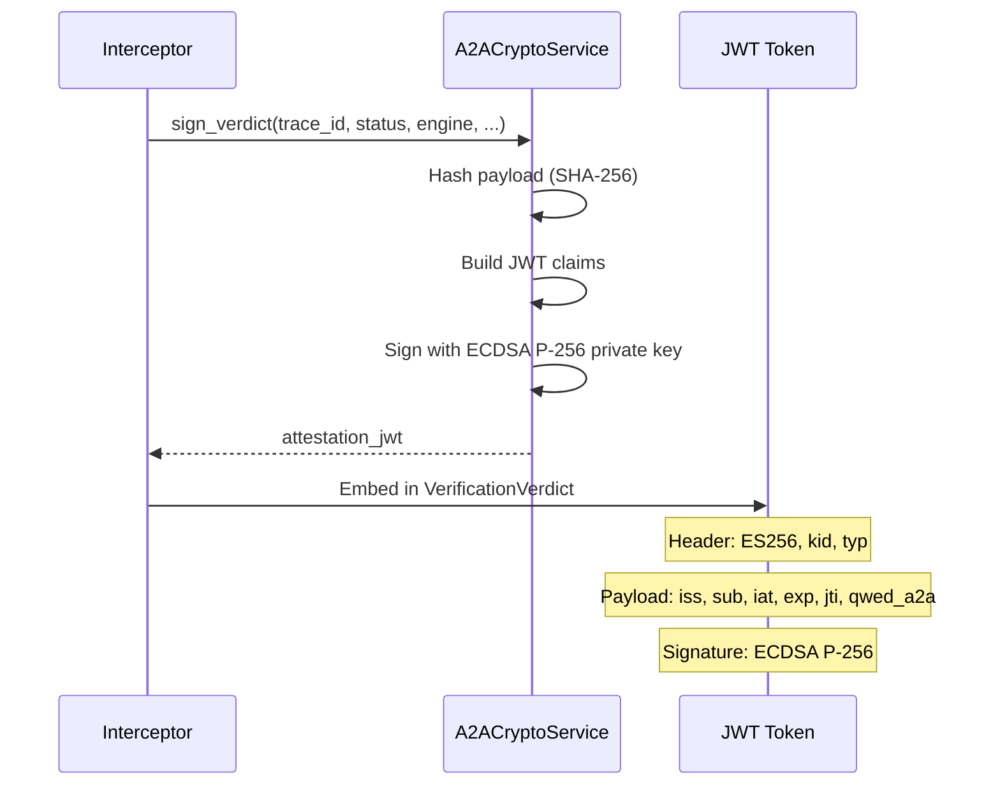

## Overview

Every verification verdict is signed with an **ES256 JWT attestation** — a cryptographic proof that the verification took place. This enables:

- **Tamper detection** — any modification invalidates the signature
- **Non-repudiation** — the signing service is identified by DID
- **Audit compliance** — attestations are stored and queryable
- **Cross-service verification** — any QWED node can verify the token

---

## How it works


```mermaid
sequenceDiagram
    participant Int as Interceptor
    participant Crypto as A2ACryptoService
    participant JWT as JWT Token

    Int->>Crypto: sign_verdict(trace_id, status, engine, ...)
    Crypto->>Crypto: Hash payload (SHA-256)
    Crypto->>Crypto: Build JWT claims
    Crypto->>Crypto: Sign with ECDSA P-256 private key
    Crypto-->>Int: attestation_jwt
    Int->>JWT: Embed in VerificationVerdict

    Note over JWT: Header: ES256, kid, typ
    Note over JWT: Payload: iss, sub, iat, exp, jti, qwed_a2a
    Note over JWT: Signature: ECDSA P-256
```

---

## JWT structure

### Header

```json
{
  "alg": "ES256",
  "typ": "qwed-a2a-attestation+jwt",
  "kid": "did:qwed:a2a:local#key-<sha256-fingerprint>"
}
```

The `kid` is derived from a SHA-256 fingerprint of the public key, so it stays stable as long as `QWED_A2A_SIGNING_KEY_PEM` is unchanged — even across process restarts.

### Payload

```json
{
  "iss": "did:qwed:a2a:local",
  "sub": "sha256:e3b0c44298fc1c149afb...",
  "iat": 1711411200,
  "exp": 1711497600,
  "jti": "a2a_trace_001",
  "qwed_a2a": {
    "version": "1.0",
    "verdict": "forwarded",
    "engine": "finance_guard",
    "sender": "procurement-agent",
    "receiver": "treasury-agent"
  }
}
```

| Claim | Description |
|-------|-------------|
| `iss` | DID-based issuer identity of the signing service |
| `sub` | SHA-256 hash of the original payload (tamper detection) |
| `iat` | Token issued-at timestamp |
| `exp` | Token expiration (default: 300 seconds / 5 minutes — one A2A hop) |
| `jti` | Trace ID linking to the verification event |
| `qwed_a2a` | QWED-specific claims: verdict, engine, sender/receiver |

---

## Configure the signing key

QWED A2A requires a **persistent** ECDSA P-256 signing key so that JWT attestations signed before a restart can still be verified afterwards. Keys are never generated inside the process — the service loads them from the `QWED_A2A_SIGNING_KEY_PEM` environment variable (or the `pem_key` constructor argument).

<Warning>
If `QWED_A2A_SIGNING_KEY_PEM` is not set, `A2ACryptoService` fails closed: calls to `sign_verdict`, `verify_attestation`, `get_public_key_jwk`, and the interceptor's `intercept()` raise `RuntimeError`. This is deliberate — signing with a per-process ephemeral key would silently break audit continuity.
</Warning>

Generate an unencrypted PKCS#8 P-256 key with `openssl`:

```bash
openssl ecparam -name prime256v1 -genkey -noout \
  | openssl pkcs8 -topk8 -nocrypt \
  > qwed_a2a_signing_key.pem

export QWED_A2A_SIGNING_KEY_PEM="$(cat qwed_a2a_signing_key.pem)"
```

Store the PEM in your secrets manager (AWS Secrets Manager, Vault, etc.) and inject it as an environment variable at runtime. Every replica in the same logical deployment must load the same PEM so all instances share one `key_id` and can verify each other's tokens.

---

## Signing a verdict

```python
from qwed_a2a.security.crypto import A2ACryptoService

# Key is loaded from QWED_A2A_SIGNING_KEY_PEM
crypto = A2ACryptoService(
    issuer_id="did:qwed:a2a:production",
    validity_seconds=300,  # 5 minutes (default) — one A2A hop
)

token = crypto.sign_verdict(
    trace_id="a2a_audit_001",
    verdict_status="forwarded",
    engine="finance_guard",
    sender_id="procurement-agent",
    receiver_id="treasury-agent",
    payload_hash="sha256:abc123...",
)

print(token)
# eyJhbGciOiJFUzI1NiIsInR5cCI6InF3ZWQtYTJhLWF0dGVzdGF0aW9uK2p3dCIs...
```

Each `trace_id` becomes the token's `jti` and must be unique per instance: signing the same `trace_id` again within its validity window raises `ValueError`. See [Replay protection](#replay-protection-jti-lifecycle).

---

## Verifying an attestation

`verify_attestation` checks the token against an `AttestationContext` — the sender, receiver, and payload you expect the attestation to cover. A valid signature alone is not enough: the token must also be bound to the provided context.

```python
from qwed_a2a.security.crypto import A2ACryptoService, AttestationContext

context = AttestationContext(
    sender_agent_id="procurement-agent",
    receiver_agent_id="treasury-agent",
    payload='{"claimed_total": 150.00, "line_items": [...]}',
    session_id=None,  # optional — bound when provided
)

is_valid, claims, error = crypto.verify_attestation(token, context)

if is_valid:
    print(f"Verdict: {claims['qwed_a2a']['verdict']}")
    print(f"Engine:  {claims['qwed_a2a']['engine']}")
    print(f"Trace:   {claims['jti']}")
else:
    print(f"Invalid: {error}")
```

Verification tries every configured key until one verifies the signature: the local key first (when configured), then each [trusted peer issuer's](#cross-deployment-verification-trusted-issuers) keys. The token's header and payload are only read after a candidate key verifies the signature, and the verified `iss` and `kid` are bound to the key that verified them — routing never trusts unverified claims.

### Verification outcomes

| Result | Meaning |
|--------|---------|
| `(True, claims, None)` | Valid attestation — claims are trustworthy and bound to the context |
| `(False, None, "Attestation has expired")` | Token past its `exp` time |
| `(False, None, "Invalid token: no trusted key verified the signature")` | Signature mismatch, tampering, or unknown issuer |
| `(False, None, "Key id mismatch for trusted issuer")` | A registered key verified the signature but the token's `kid` doesn't match the key's registered `kid` |
| `(False, None, "Deployment context mismatch: ...")` | Token's `deployment_id` doesn't match this instance (self-issued) or the registered peer deployment |
| `(False, None, "Attestation sender/receiver/session mismatch: ...")` | Token claims don't match the `AttestationContext` |
| `(False, None, "Attestation payload hash mismatch — detached attestation rejected")` | The context payload's hash doesn't match the `sub` claim |
| `(False, None, "Replay detected: jti already seen")` | This instance already consumed a token with the same `jti` |
| `(False, None, "No verification keys available (no local key, no trusted issuers)")` | Neither a local signing key nor any trusted issuer is configured |

---

## Tamper detection

The `sub` claim contains a SHA-256 hash of the original payload:

```python
payload_hash = A2ACryptoService.hash_content(
    '{"claimed_total": 150.00, "line_items": [...]}'
)
# "sha256:e3b0c44298fc1c149afbf4c8996fb92427ae41e4649b934ca495991b7852b855"
```

<Warning>
If the original payload is modified after signing, the hash will not match the `sub` claim — even though the JWT signature itself is still valid. Always verify **both** the JWT signature and the payload hash.
</Warning>

---

## Publishing the public key (JWKS)

External consumers verify attestations by fetching the public key. `A2ACryptoService.get_public_key_jwk()` returns the current key in JWK format:

```python
jwk = crypto.get_public_key_jwk()
# {
#   "kty": "EC",
#   "crv": "P-256",
#   "x":   "…base64url…",
#   "y":   "…base64url…",
#   "kid": "did:qwed:a2a:production#key-<sha256-fingerprint>",
#   "use": "sig",
#   "alg": "ES256"
# }
```

The FastAPI gateway exposes this at [`GET /.well-known/jwks.json`](/a2a/deployment#jwks-endpoint) so downstream services and auditors can fetch keys over HTTP.

---

## Cross-service verification

Because every replica loads the same PEM from `QWED_A2A_SIGNING_KEY_PEM`, they all derive the same `key_id` and can verify each other's tokens:

```python
# Both processes load the same PEM (from env or secrets manager)
service_a = A2ACryptoService(issuer_id="did:qwed:a2a:production")
service_b = A2ACryptoService(issuer_id="did:qwed:a2a:production")

token = service_a.sign_verdict(...)

is_valid, claims, _ = service_b.verify_attestation(token, context)
# is_valid = True — shared key pair
```

Sharing a PEM is only for replicas of **one** logical deployment. To verify tokens from a different deployment, use [trusted issuers](#cross-deployment-verification-trusted-issuers) instead of sharing private keys.

<Tip>
If you rotate `QWED_A2A_SIGNING_KEY_PEM`, attestations signed with the previous key become unverifiable once the new JWKS is served — the endpoint only publishes the current key. To avoid rejecting in-flight attestations during rotation, keep the previous key accessible until all tokens signed with it expire (check their `exp` claim). Future releases may add multi-key JWKS support for seamless rotation.
</Tip>

---

## Cross-deployment verification (trusted issuers)

By default an attestation verifies only against the issuing deployment's own key. A token from another deployment fails closed as an unknown issuer, so sharing one private key across deployments — which would let any agent mint attestations as any other — is never required and never works.

To verify attestations from a peer deployment, register the peer as a **trusted issuer** with its deployment ID and public JWKS. Copy the JWKS entry verbatim from the peer's [`/.well-known/jwks.json`](/a2a/deployment#jwks-endpoint) endpoint:

```bash
export QWED_A2A_TRUSTED_ISSUERS='{
  "did:qwed:a2a:peer": {
    "deployment_id": "peer-deploy",
    "jwks": {"keys": [{"kty": "EC", "crv": "P-256", "kid": "<peer-kid>", "x": "<base64url-x>", "y": "<base64url-y>"}]}
  }
}'
```

Replace the `kid`/`x`/`y` placeholders with the peer's real values. The environment variable is re-read on every verification, so key rotation takes effect without a restart.

You can also pass the mapping directly to `verify_attestation` — the explicit argument takes precedence over the environment variable:

```python
is_valid, claims, error = crypto.verify_attestation(
    peer_token,
    context,
    trusted_issuers={
        "did:qwed:a2a:peer": {
            "deployment_id": "peer-deploy",
            "jwks": {"keys": [peer_jwk]},
        }
    },
)
```

Trusted-issuer verification fails closed on every mismatch:

| Condition | Result |
|-----------|--------|
| Token issuer not in the trusted-issuer mapping (and not self-issued) | `Invalid token: no trusted key verified the signature` |
| Token `kid` doesn't match the registered key's `kid` | `Key id mismatch for trusted issuer` |
| Token `deployment_id` doesn't match the registered `deployment_id` | `Deployment context mismatch` |
| Same public key registered under two issuer identities | The later entry is skipped with a warning — one key must never verify as two issuers |
| `QWED_A2A_TRUSTED_ISSUERS` is malformed JSON or has no usable entries | Peer verification disabled; a warning is logged (at most once per minute) |

### Verifier-only nodes

A node that only verifies peer attestations doesn't need a signing key of its own. With `QWED_A2A_SIGNING_KEY_PEM` unset and trusted issuers configured, `verify_attestation` verifies peer tokens normally — only `sign_verdict`, `get_public_key_jwk`, and the interceptor still require the local key. With neither a local key nor trusted issuers, verification returns `No verification keys available (no local key, no trusted issuers)`.

---

## Replay protection (jti lifecycle)

Each attestation's `jti` (the `trace_id`) can be consumed **once per verifying instance**. `A2ACryptoService` keeps two separate records:

- **Issuance record** — `trace_id` values this instance has signed. Signing a duplicate `trace_id` within its validity window raises `ValueError` at `sign_verdict`: each attestation needs a unique `jti`, and minting two tokens under one `jti` would poison every consumer's replay registry.
- **Consumption registry** — `jti` values this instance has verified. The first verification of a token succeeds; presenting the same token again returns `Replay detected: jti already seen`.

Because issuance and consumption are tracked separately, an issuer can verify its own token once — signing no longer consumes the replay slot. Peer-issued tokens are namespaced by issuer in the consumption registry, so two deployments legitimately reusing the same trace ID never shadow each other.

```python
crypto = A2ACryptoService(issuer_id="did:qwed:a2a:production")

token = crypto.sign_verdict(trace_id="a2a_audit_001", ...)

crypto.verify_attestation(token, context)   # (True, claims, None) — first consumption
crypto.verify_attestation(token, context)   # (False, None, "Replay detected: jti already seen")

crypto.sign_verdict(trace_id="a2a_audit_001", ...)  # ValueError — duplicate trace_id
```

### Replay scope and multi-worker deployments

<Warning>
The default consumption registry is **process-local**. Two service instances in one process each keep their own registry; two workers in two processes share nothing. A token replayed against a *different* worker is not detected by the default registry.
</Warning>

For cross-worker replay protection, inject a shared registry via the `jti_registry` constructor argument:

```python
crypto = A2ACryptoService(
    issuer_id="did:qwed:a2a:production",
    jti_registry=shared_registry,  # e.g. Redis- or database-backed
)
```

An injected registry must satisfy the `ReplayRegistry` contract:

- `check_and_register(jti, now=..., *, valid_until=...)` with **atomic** insert-if-absent semantics — two workers racing on the same `jti` must not both be accepted.
- Retention covering each token's full lifetime: honor `valid_until` and never evict a live token's slot.
- Thread safety for in-process concurrent use.
- A `ttl_seconds` property reporting the retention window.

The constructor fails closed on unverifiable retention: a registry whose `ttl_seconds` is missing, non-numeric, non-finite, or shorter than `validity_seconds` raises `ValueError` at construction.

---

## Fail-closed behavior

QWED A2A treats missing or invalid signing keys as an unrecoverable configuration error, not a soft warning. There is no ephemeral-key fallback.

| Condition | Behavior |
|-----------|----------|
| `QWED_A2A_SIGNING_KEY_PEM` not set | `sign_verdict`, `get_public_key_jwk`, and `interceptor.intercept()` raise `RuntimeError`. `verify_attestation` still works against [trusted peer issuers](#verifier-only-nodes); with no trusted issuers either, it returns `(False, None, "No verification keys available ...")` |
| PEM is not a valid EC private key | `RuntimeError` at first key access |
| PEM uses a curve other than `SECP256R1` (P-256) | `RuntimeError` at first key access |
| `cryptography` or `PyJWT` not installed | `RuntimeError` at first key access |

The FastAPI gateway surfaces these as `HTTP 503 Signing key unavailable` on both `/a2a/intercept` and `/.well-known/jwks.json` so orchestrators can detect a misconfigured deployment before it accepts traffic.
