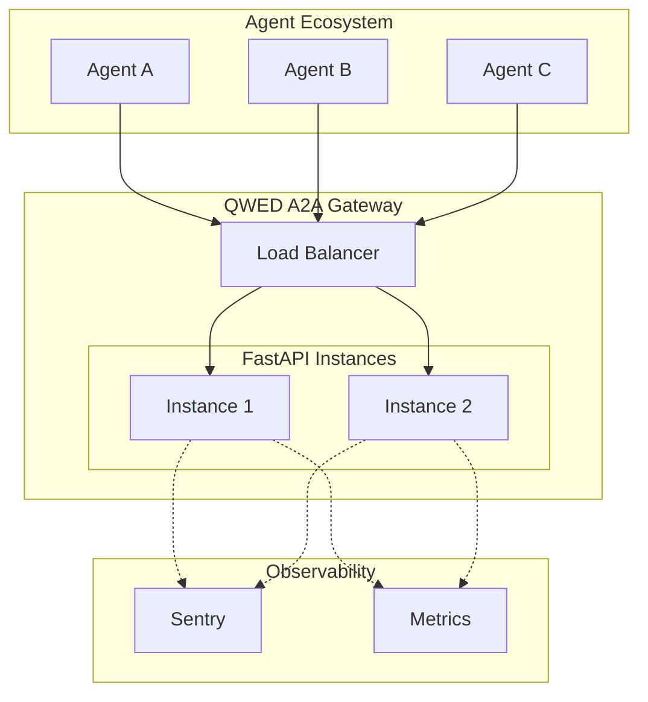

## Deployment architecture



---

## FastAPI application

Create your production entrypoint:

```python
# main.py
from fastapi import FastAPI
from qwed_a2a.protocol.endpoints import router

app = FastAPI(
    title="QWED A2A Gateway",
    description="Zero-trust verification interceptor for A2A communication",
    version="0.1.0",
)

app.include_router(router)

@app.on_event("startup")
async def startup():
    """Initialize interceptor on startup."""
    from qwed_a2a.protocol.endpoints import configure_interceptor
    from qwed_a2a.protocol.schema import InterceptorConfig

    config = InterceptorConfig(
        enable_financial_verification=True,
        enable_code_verification=True,
        enable_logic_verification=True,
        block_on_error=True,
    )
    configure_interceptor(config)
```

---

## Docker

```dockerfile
# Dockerfile
FROM python:3.12-slim

WORKDIR /app

COPY pyproject.toml .
COPY src/ src/

RUN pip install --no-cache-dir .
RUN pip install --no-cache-dir uvicorn

COPY main.py .

EXPOSE 8000

CMD ["uvicorn", "main:app", "--host", "0.0.0.0", "--port", "8000"]
```

Build and run:

<CodeGroup>

```bash Docker
docker build -t qwed-a2a-gateway .
docker run -p 8000:8000 qwed-a2a-gateway
```

```bash Docker Compose
# docker-compose.yml
services:
  qwed-a2a:
    build: .
    ports:
      - "8000:8000"
    environment:
      - SENTRY_DSN=${SENTRY_DSN}
      - QWED_LOG_LEVEL=INFO
    restart: unless-stopped
    healthcheck:
      test: ["CMD", "curl", "-f", "http://localhost:8000/a2a/health"]
      interval: 30s
      timeout: 5s
      retries: 3
```

</CodeGroup>

---

## Available endpoints

| Endpoint | Method | Description |
|----------|--------|-------------|
| `/a2a/intercept` | POST | Primary verification gateway — accepts `AgentMessage`, returns `VerificationVerdict` |
| `/a2a/health` | GET | Service health check with version |
| `/a2a/metrics` | GET | Aggregated intercept metrics |

### Health check response

```json
{
  "status": "healthy",
  "service": "qwed-a2a",
  "version": "0.1.0"
}
```

### Metrics response

```json
{
  "total_intercepts": 15420,
  "forwarded": 15200,
  "blocked": 180,
  "errors": 40,
  "avg_latency_ms": 12.5,
  "engines": {
    "finance_guard": 5000,
    "code_guard": 3200,
    "logic_guard": 1800,
    "passthrough": 5420
  }
}
```

---

## Environment variables

| Variable | Description | Default |
|----------|-------------|---------|
| `SENTRY_DSN` | Sentry error tracking DSN | *(disabled)* |
| `QWED_LOG_LEVEL` | Logging level (`DEBUG`, `INFO`, `WARNING`, `ERROR`) | `INFO` |
| `QWED_A2A_BLOCK_ON_ERROR` | Block on internal errors (`true`/`false`) | `true` |

---

## Monitoring

### Sentry integration

QWED A2A includes built-in Sentry integration for error tracking:

```python
import sentry_sdk

sentry_sdk.init(
    dsn="https://your-dsn@sentry.io/project",
    traces_sample_rate=0.1,
    environment="production",
)
```

### Structured logging

All intercepts are logged with structured fields:

```text
INFO  A2A Intercept [a2a_trace_001] FORWARDED -> engine=finance_guard (12.3ms)
INFO  A2A Intercept [a2a_trace_002] BLOCKED -> engine=code_guard (3.1ms)
WARN  Trust boundary violation: Sender 'rogue-agent' is globally blocked
```

---

## CI/CD integration

### GitHub Actions

```yaml
# .github/workflows/a2a-tests.yml
name: A2A Verification Tests

on: [push, pull_request]

jobs:
  test:
    runs-on: ubuntu-latest
    steps:
      - uses: actions/checkout@v4
      - uses: actions/setup-python@v5
        with:
          python-version: "3.12"
      - run: pip install -e ".[dev]"
      - run: pytest tests/ -v --tb=short
```

### Mergify auto-merge

```yaml
# .mergify.yml
pull_request_rules:
  - name: Auto-merge when CI passes
    conditions:
      - check-success=test
      - check-success=CodeQL
    actions:
      merge:
        method: squash
```

---

## Integration with QWED ecosystem

<CardGroup cols={2}>
  <Card title="QWED Core" icon="shield-check" href="/intro">
    A2A uses the same verification principles as the core QWED engine — deterministic, symbolic, and provable.
  </Card>
  <Card title="QWED MCP" icon="plug" href="/mcp/overview">
    MCP provides tool-level verification. A2A provides agent-to-agent communication verification. They complement each other.
  </Card>
  <Card title="QWED Finance" icon="building-columns" href="/finance/overview">
    The A2A finance guard uses the same Decimal arithmetic patterns as QWED Finance, adapted for inter-agent payloads.
  </Card>
  <Card title="Agent Specification" icon="scroll" href="/specs/agent">
    The QWED-Agent spec defines trust levels and budget enforcement. A2A implements the verification gateway described in the spec.
  </Card>
</CardGroup>
