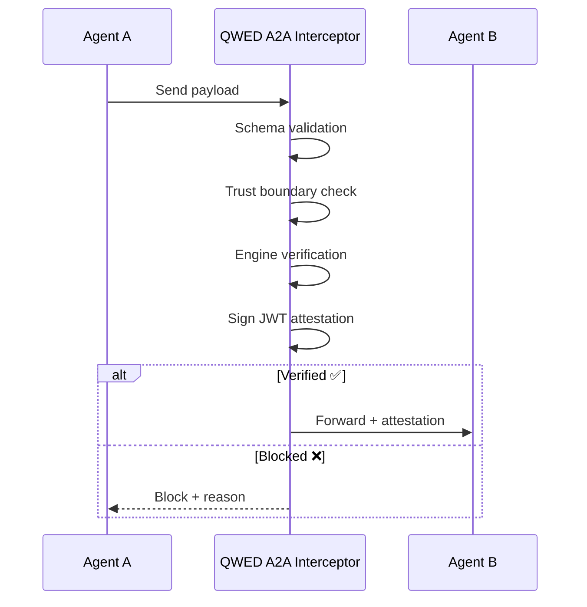
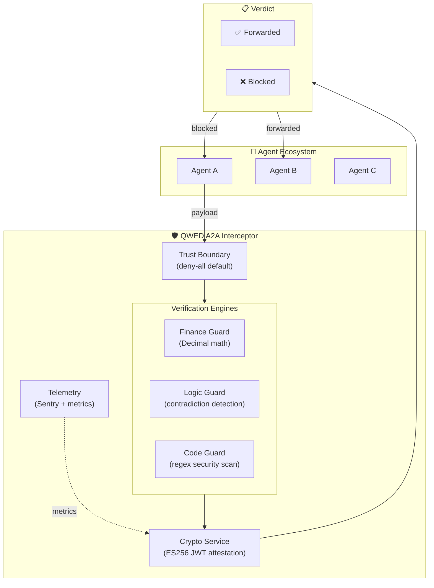

<Note>
**QWED A2A v0.1.0** — The verification gateway for autonomous agent ecosystems. [See the repo →](https://github.com/QWED-AI/qwed-a2a)
</Note>

## What is QWED A2A?

QWED A2A is a **verification interceptor** that sits between autonomous agents communicating via Google's [Agent-to-Agent (A2A) protocol](https://google.github.io/A2A/). It intercepts every payload, runs deterministic verification, and either **forwards** or **blocks** the message — with a signed JWT attestation proving the decision.

> **"Agents don't trust each other. QWED verifies for them."**



## Why A2A is different from Extensions

<CardGroup cols={2}>
  <Card title="Extensions (Finance, Legal, Tax)" icon="puzzle-piece">
    Domain-specific guard libraries that verify individual claims — financial math, legal citations, tax rules.
  </Card>
  <Card title="A2A Protocol (This)" icon="network-wired">
    Infrastructure-level interceptor that verifies **all inter-agent communication** — payloads, trust boundaries, and cryptographic attestations.
  </Card>
</CardGroup>

## Core capabilities

<CardGroup cols={2}>
  <Card title="Verification Interceptor" icon="shield-check" href="/a2a/interceptor">
    Routes payloads to specialized engines — financial math, logic assertions, code security — and blocks hallucinations before they propagate.
  </Card>
  <Card title="Zero-Trust Boundary" icon="lock" href="/a2a/trust-boundary">
    Deny-all by default. Agent pairs must be explicitly trusted. Token-bucket rate limiting with automatic eviction of cold pairs.
  </Card>
  <Card title="Crypto Attestations" icon="certificate" href="/a2a/crypto-attestations">
    Every verdict is signed with an ES256 JWT attestation — tamper-proof, auditable, and verifiable by any party in the chain.
  </Card>
  <Card title="Deterministic Engines" icon="microchip" href="/a2a/interceptor#verification-engines">
    Financial verification uses `Decimal` arithmetic. Logic uses set-based contradiction detection. Code uses regex-hardened pattern scanning.
  </Card>
</CardGroup>

## Quick example

```python
from qwed_a2a.interceptor import A2AVerificationInterceptor
from qwed_a2a.protocol.schema import AgentMessage, PayloadType

interceptor = A2AVerificationInterceptor()

message = AgentMessage(
    sender_agent_id="procurement-agent",
    receiver_agent_id="treasury-agent",
    payload_type=PayloadType.FINANCIAL_TRANSACTION,
    payload={
        "data": {
            "claimed_total": 150.00,
            "line_items": [
                {"description": "Widget A", "amount": 50.00, "quantity": 2},
                {"description": "Widget B", "amount": 25.00, "quantity": 2},
            ]
        }
    }
)

verdict = await interceptor.intercept(message, trace_id="a2a_demo_001")

print(verdict.status)           # "forwarded" ✅
print(verdict.engine_used)      # "finance_guard"
print(verdict.attestation_jwt)  # "eyJhbGciOiJFUzI1NiIs..."
```

## Without A2A vs. With A2A

| Scenario | Without A2A | With A2A |
|----------|-------------|----------|
| Agent sends wrong total | **Propagates** to downstream agent | **Blocked** — math hallucination detected |
| Agent sends `os.system()` code | **Executes** on receiver | **Blocked** — dangerous pattern detected |
| Agent makes contradictory claims | **Accepted** silently | **Blocked** — logical contradiction caught |
| Rogue agent floods messages | **No limit** — DoS possible | **Rate-limited** — token bucket enforced |
| Audit trail needed | **None** — no proof of verification | **JWT attestation** — cryptographic proof |

## Architecture at a glance



## Next steps

<Steps>
  <Step title="Quick Start">
    Install and run your first verification in 5 minutes. [Quick Start →](/a2a/quickstart)
  </Step>
  <Step title="Understand the Architecture">
    Deep-dive into the pipeline, data flow, and component relationships. [Architecture →](/a2a/architecture)
  </Step>
  <Step title="Configure Trust & Security">
    Set up zero-trust boundaries, agent allowlists, and rate limits. [Trust Boundary →](/a2a/trust-boundary)
  </Step>
  <Step title="Deploy to Production">
    Docker, FastAPI gateway, monitoring, and CI/CD integration. [Deployment →](/a2a/deployment)
  </Step>
</Steps>

## Links

- **GitHub:** [github.com/QWED-AI/qwed-a2a](https://github.com/QWED-AI/qwed-a2a)
- **PyPI:** [pypi.org/project/qwed-a2a](https://pypi.org/project/qwed-a2a/) *(coming soon)*
- **QWED Core:** [Introduction to QWED](/intro)
- **Agent Spec:** [QWED-Agent Specification](/specs/agent)
