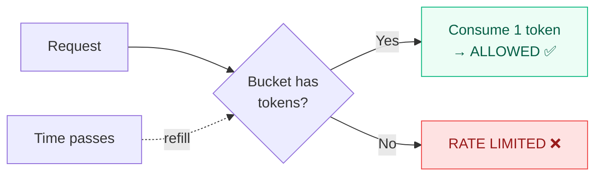

## Overview

The `TrustBoundary` enforces **zero-trust isolation** between agents. By default, all communication is **denied** unless explicitly allowed.

<Warning>
`default_allow` is `False` by default. You must explicitly trust agents or set `default_allow=True` for permissive deployments. The interceptor sets `default_allow=True` since it handles its own verification — but standalone trust boundary usage defaults to deny-all.
</Warning>

---

## Deny-all by default

```python
from qwed_a2a.security.trust_boundary import TrustBoundary

# Zero-trust: deny all unknown pairs
boundary = TrustBoundary()  # default_allow=False

allowed, reason = boundary.evaluate("agent-A", "agent-B")
# allowed = False
# reason = "Sender 'agent-A' is not in the trust allowlist"
```

To allow communication, explicitly trust the agents:

```python
boundary.trust_agent("agent-A")
boundary.trust_agent("agent-B")

allowed, reason = boundary.evaluate("agent-A", "agent-B")
# allowed = True ✅
```

---

## Controls

<AccordionGroup>
  <Accordion title="Global blocklist" icon="ban" defaultOpen>
    Block an agent from **all** communication:

    ```python
    boundary.block_agent("rogue-agent-007")
    # Now blocked as both sender and receiver
    ```

    Blocking automatically removes the agent from the trusted list.
  </Accordion>

  <Accordion title="Global allowlist" icon="check">
    Trust an agent for **all** pairs:

    ```python
    boundary.trust_agent("orchestrator-001")
    # Bypasses strict mode checks
    ```

    Trusting automatically removes the agent from the blocked list.
  </Accordion>

  <Accordion title="Pair-level blocking" icon="link-slash">
    Block a specific directional pair:

    ```python
    boundary.block_pair("agent-A", "agent-B")
    # A→B blocked, B→A still allowed
    ```
  </Accordion>
</AccordionGroup>

---

## Token-bucket rate limiting

Rate limiting uses a **token-bucket** algorithm (not fixed-window), providing smooth, fair enforcement:



| Property | Value | Description |
|----------|-------|-------------|
| **Capacity** | `max_requests_per_minute` | Maximum burst size |
| **Refill rate** | `capacity / 60.0` tokens/sec | Smooth refill over time |
| **Initial tokens** | Full capacity | First request never rate-limited |

### Configuration

```python
boundary = TrustBoundary(
    max_requests_per_minute=120,  # 2 req/sec sustained
    default_allow=True,
)
```

### Automatic eviction

Cold pairs (no requests for 5 minutes) are automatically evicted from the rate-limit map to prevent unbounded memory growth. Eviction runs once per minute.

<Tip>
Rate-limit entries are **only allocated after allowlist checks pass**. This prevents malicious agents from spraying the map with one-off sender/receiver IDs in strict mode.
</Tip>

---

## Evaluation order

The trust boundary evaluates requests in this exact order:

| Step | Check | On Failure |
|------|-------|------------|
| 1 | Sender on global blocklist? | **BLOCKED** |
| 2 | Receiver on global blocklist? | **BLOCKED** |
| 3 | Pair explicitly blocked? | **BLOCKED** |
| 4 | (Strict mode) Both agents in allowlist? | **BLOCKED** |
| 5 | Token bucket has tokens? | **RATE LIMITED** |
| ✅ | All passed | **ALLOWED** |

<Info>
Steps 1–4 are **stateless** (no side effects). Rate-limit state is only allocated at step 5, after all policy checks pass.
</Info>

---

## Usage with the interceptor

The interceptor creates a `TrustBoundary` with `default_allow=True` by default, since it handles verification itself. For zero-trust deployments, inject your own:

```python
from qwed_a2a.interceptor import A2AVerificationInterceptor
from qwed_a2a.security.trust_boundary import TrustBoundary

# Zero-trust: only allow known agent pairs
boundary = TrustBoundary(default_allow=False)
boundary.trust_agent("procurement-agent")
boundary.trust_agent("treasury-agent")

interceptor = A2AVerificationInterceptor(
    trust_boundary=boundary,
)
```
