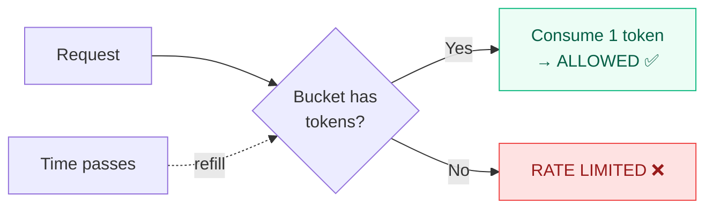

## Overview

The `TrustBoundary` enforces **zero-trust isolation** between agents. By default, all communication is **denied** unless explicitly allowed.

<Warning>
`default_allow` is `False` by default. You must explicitly trust agents or set `default_allow=True` for permissive deployments. The interceptor sets `default_allow=True` since it handles its own verification — but standalone trust boundary usage defaults to deny-all.
</Warning>

---

## Deny-all by default

```python
from qwed_a2a.security.trust_boundary import TrustBoundary

# Zero-trust: deny all unknown pairs
boundary = TrustBoundary()  # default_allow=False

allowed, reason = boundary.evaluate("agent-A", "agent-B")
# allowed = False
# reason = "Sender 'agent-A' is not in the trust allowlist"
```

To allow communication, explicitly trust the **sender**:

```python
boundary.trust_agent("agent-A")

allowed, reason = boundary.evaluate("agent-A", "agent-B")
# allowed = True ✅
```

<Warning>
**Trust is directional.** Only the *sender* must be in the allowlist for a message to pass the gate — trusting the *receiver* alone is not sufficient. This closes a "name-drop" attack where an untrusted sender addresses a trusted receiver to bypass the allowlist. If you need to restrict which receivers a trusted sender may reach, use [scoped trust grants](#scoped-trust-grants) with `allowed_receivers`.
</Warning>

---

## Controls

<AccordionGroup>
  <Accordion title="Global blocklist" icon="ban" defaultOpen>
    Block an agent from **all** communication:

    ```python
    boundary.block_agent("rogue-agent-007")
    # Now blocked as both sender and receiver
    ```

    Blocking automatically removes the agent from the trusted list.
  </Accordion>

  <Accordion title="Global allowlist" icon="check">
    Trust an agent for **all** pairs:

    ```python
    boundary.trust_agent("orchestrator-001")
    # Bypasses strict mode checks
    ```

    Trusting automatically removes the agent from the blocked list.
  </Accordion>

  <Accordion title="Scoped trust grants" icon="filter">
    Restrict trust to specific receivers and payload types, and optionally set an expiry:

    ```python
    import time

    boundary.trust_agent(
        "analytics-agent",
        allowed_receivers={"metrics-agent"},
        allowed_payload_types={"data_query"},
        valid_until=time.time() + 3600,   # 1 hour
        granted_by="ops-oncall",
    )
    ```

    A message from `analytics-agent` is only permitted when the receiver matches `allowed_receivers` **and** the payload type matches `allowed_payload_types`. Any field left as `None` means "unrestricted for this dimension". Once `valid_until` passes, the entry is treated as if it never existed and is auto-evicted on the next evaluation.
  </Accordion>

  <Accordion title="Runtime revocation" icon="rotate-left">
    Revoke a trust grant without restarting the service:

    ```python
    was_trusted = boundary.revoke_agent("analytics-agent", revoked_by="ops-oncall")
    ```

    Grants and revocations are written to the audit log with the redacted agent ID and `granted_by` / `revoked_by` attribution. `block_agent()` also removes any existing trust entry as a side effect.
  </Accordion>

  <Accordion title="Pair-level blocking" icon="link-slash">
    Block a specific directional pair:

    ```python
    boundary.block_pair("agent-A", "agent-B")
    # A→B blocked, B→A still allowed
    ```
  </Accordion>
</AccordionGroup>

---

## Scoped trust grants

`trust_agent()` accepts optional scope and expiry parameters so operators can grant narrow, time-bounded exceptions instead of permanent, unscoped bypasses.

| Parameter | Type | Description |
|-----------|------|-------------|
| `agent_id` | `str` | Agent receiving the trust grant. |
| `allowed_receivers` | `Set[str]?` | Receivers the sender may reach. `None` means "any receiver". |
| `allowed_payload_types` | `Set[str]?` | Payload type values (e.g. `"financial_transaction"`, `"code_execution"`) the sender may emit. `None` means "any type". |
| `valid_until` | `float?` | Unix timestamp when the grant expires. `None` means process-lifetime. |
| `granted_by` | `str` | Free-form principal recorded in the audit log. Defaults to `"config"`. |

`evaluate()` accepts an optional `payload_type`. When provided, it is checked against the `allowed_payload_types` field of both the sender entry (outbound filter) and the receiver entry (inbound filter) — the message is only trusted if the payload type is permitted by both sides:

```python
allowed, reason = boundary.evaluate(
    sender_id="analytics-agent",
    receiver_id="metrics-agent",
    payload_type="data_query",
)
```

<Info>
Expired entries are treated as non-existent — including their scope. If you need permanent scope restrictions, leave `valid_until=None` rather than setting a far-future expiry.
</Info>

Expired trust entries are auto-evicted at most once per minute during `evaluate()`, so revocation via `revoke_agent()` or expiry via `valid_until` never requires a service restart.

---

## Loading trust from environment

`QWED_A2A_TRUSTED_AGENTS` accepts two formats. The HTTP gateway calls `load_from_env()` on startup; both formats work interchangeably.

**Simple CSV (unrestricted, no expiry):**

```bash
export QWED_A2A_TRUSTED_AGENTS="agent-a,agent-b"
```

**JSON array (scoped and/or expiring):**

```bash
export QWED_A2A_TRUSTED_AGENTS='[
  {
    "agent_id": "analytics-agent",
    "allowed_receivers": ["metrics-agent"],
    "allowed_payload_types": ["data_query"],
    "valid_until": 1785000000
  },
  {"agent_id": "orchestrator-001"}
]'
```

Each JSON entry requires a non-empty `agent_id`; the other fields are optional. Invalid entries (non-object, missing ID, non-string scope values, non-finite `valid_until`) are logged and skipped without failing the load — the remaining entries still apply.

---

## Token-bucket rate limiting

Rate limiting uses a **token-bucket** algorithm (not fixed-window), providing smooth, fair enforcement:



| Property | Value | Description |
|----------|-------|-------------|
| **Capacity** | `max_requests_per_minute` | Maximum burst size |
| **Refill rate** | `capacity / 60.0` tokens/sec | Smooth refill over time |
| **Initial tokens** | Full capacity | First request never rate-limited |

### Configuration

```python
boundary = TrustBoundary(
    max_requests_per_minute=120,  # 2 req/sec sustained
    default_allow=True,
)
```

### Automatic eviction

Cold pairs (no requests for 5 minutes) are automatically evicted from the rate-limit map to prevent unbounded memory growth. Eviction runs once per minute.

<Tip>
Rate-limit entries are **only allocated after allowlist checks pass**. This prevents malicious agents from spraying the map with one-off sender/receiver IDs in strict mode.
</Tip>

---

## Evaluation order

The trust boundary evaluates requests in this exact order:

| Step | Check | On Failure |
|------|-------|------------|
| 1 | Sender on global blocklist? | **BLOCKED** |
| 2 | Receiver on global blocklist? | **BLOCKED** |
| 3 | Pair explicitly blocked? | **BLOCKED** |
| 4 | (Strict mode) Sender in allowlist? | **BLOCKED** |
| 5 | Token bucket has tokens? | **RATE LIMITED** |
| ✅ | All passed | **ALLOWED** |

<Info>
Steps 1–4 are **stateless** (no side effects). Rate-limit state is only allocated at step 5, after all policy checks pass.
</Info>

---

## Usage with the interceptor

The interceptor creates a `TrustBoundary` with `default_allow=True` by default, since it handles verification itself. For zero-trust deployments, inject your own:

```python
from qwed_a2a.interceptor import A2AVerificationInterceptor
from qwed_a2a.security.trust_boundary import TrustBoundary

# Zero-trust: only allow known agent pairs
boundary = TrustBoundary(default_allow=False)
boundary.trust_agent("procurement-agent")
boundary.trust_agent("treasury-agent")

interceptor = A2AVerificationInterceptor(
    trust_boundary=boundary,
)
```
