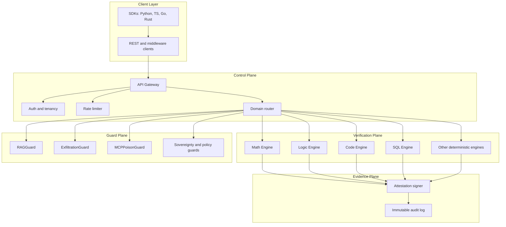
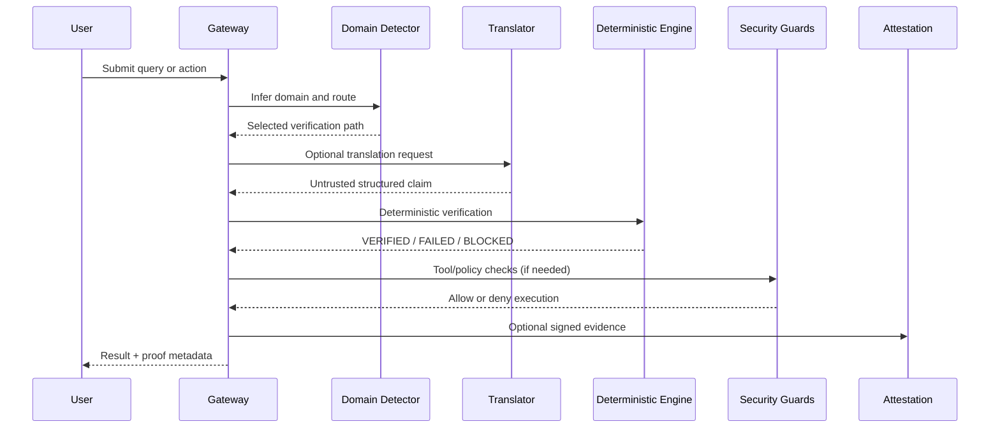
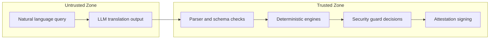
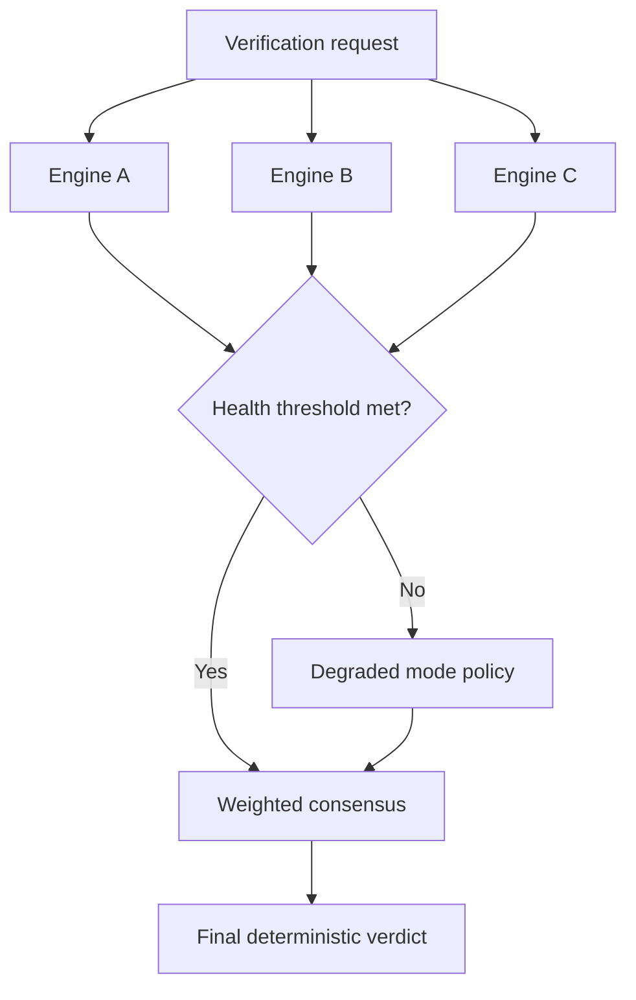

Use this page as a reference companion to [Architecture Overview](/architecture).

<Tip>
  If you are new to QWED, start with the high-level architecture page first.\
  This page is optimized for implementation and operations teams.
</Tip>

## 1) System topology

**Use this when:** you need a full map of components and external dependencies.

## 2) Request lifecycle

**Use this when:** you want to understand where decisions happen in the request path.

## 3) Trust boundary

**Use this when:** you need to explain security posture to reviewers or compliance teams.

## 4) Consensus verification path

**Use this when:** you want resilience through multi-engine cross-checking.

## Diagram usage guide

| Need | Diagram |
| --- | --- |
| Component map and ownership | System topology |
| Per-request execution flow | Request lifecycle |
| Security/compliance explanation | Trust boundary |
| Reliability and fallback behavior | Consensus verification path |

## Related pages

1. [Architecture Overview](/architecture)
2. [Determinism Guarantee](/advanced/determinism-guarantee)
3. [Agent Verification](/advanced/agent-verification)
4. [SDK Guards](/sdks/guards)