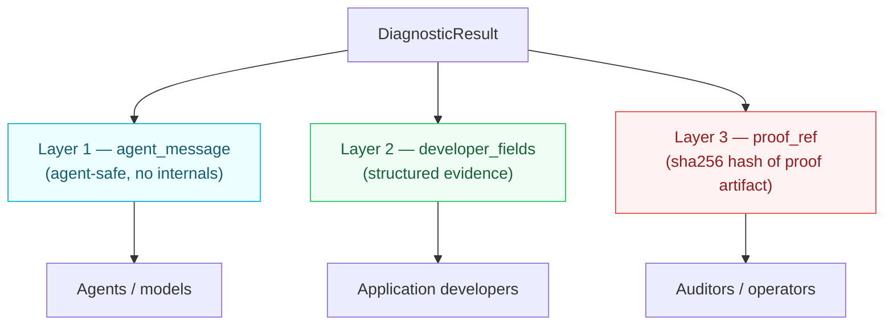

import { Card, CardGroup, Warning } from '@mintlify/components';

## Overview

<Info>
**Introduced in v5.2.0.** The `DiagnosticResult` model is an additive contract — no existing engine return types are changed. Engines migrate incrementally.
</Info>

QWED verification engines historically returned ad-hoc `Dict[str, Any]` results with no consistent structure. Three incompatible `VerificationResult` dataclasses existed. Some engines returned `(bool, str)` tuples. Verification diagnostics were not separable by audience — agents saw internal detection patterns, developers couldn't reliably find expected vs actual values, and auditors had no proof artifact references.

**v5.2.0** introduces a unified `DiagnosticResult` type with three disclosure layers, each targeted at a specific audience.

## The 3-layer model



### Layer 1 — Agent-Safe Diagnostics

**Field:** `agent_message: str`

Agent/model-facing summary. Allows agents to correct failures without exposing verification internals.

**Allowed:**
- "Missing required field: customer_id"
- "Verification failed — claim not supported"
- "Could not deterministically verify"

**Forbidden:**
- Detection signatures
- Rule IDs
- Internal regex patterns
- Prompt injection indicators
- Security bypass guidance
- Verification implementation details

### Layer 2 — Developer Diagnostics

**Field:** `developer_fields: dict`

Application-developer-facing structured evidence. Includes `constraint_id`, `expected`/`actual` values, `advisory_checks`, `methods_used`, and engine-specific evidence.

```python
developer_fields = {
    "constraint_id": "math_verifier.irr_non_convergent",
    "iterations": 100,
    "final_npv": "0.7",
    "converged": False,
    "advisory_checks": [
        {
            "name": "llm_fallback",
            "advisory_only": True,
            "constraint_id": "fact_verifier.llm_advisory_only",
            "details": {"llm_verdict": "SUPPORTED", "llm_confidence": 0.65},
        },
    ],
}
```

### Layer 3 — Proof Diagnostics

**Field:** `proof_ref: Optional[str]`

Cryptographic hash (`sha256:...`) of retained proof artifact. Present only when `status == VERIFIED` and proof was established. `None` for `UNVERIFIABLE` / `BLOCKED`.

**This is the authority bit.** Downstream gates use a mechanical rule:

```python
if result.proof_ref is not None:
    # Authoritative — admissible for control flow
    admit()
else:
    # Non-authoritative — reject for control flow
    block()
```

## Status taxonomy

Three states only — no proliferation.

| Status | Meaning | `proof_ref` | Control flow |
|--------|---------|-------------|-------------|
| `VERIFIED` | Claim deterministically proven | Required (non-empty) | May admit |
| `UNVERIFIABLE` | Claim could not be proven | `None` | Must reject |
| `BLOCKED` | Verification could not be attempted | `None` | Must reject |

Richer distinctions (ambiguity, insufficient evidence, non-convergence, provider drift) live in `developer_fields.constraint_id`, not in status values. This keeps the taxonomy small while preserving diagnostic richness.

<Warning>
**No `HEURISTIC`, `AMBIGUOUS`, or `CORRECTION_NEEDED` statuses.** Ambiguity IS unverifiability — the distinction is structured in `constraint_id`, not in the status string.
</Warning>

## Key invariants

### VERIFIED requires proof

`__post_init__` raises `ValueError` if `status == VERIFIED` and `proof_ref` is `None` or empty. "VERIFIED without proof" is impossible to construct — not a caller convention, a type-level invariant.

```python
# This raises ValueError
DiagnosticResult(
    status=DiagnosticStatus.VERIFIED,
    agent_message="ok",
    developer_fields={},
    proof_ref=None,  # ← impossible
)
```

### Non-VERIFIED rejects proof

The inverse is also enforced — `UNVERIFIABLE` and `BLOCKED` must have `proof_ref = None`. A non-pass state with a proof hash is a contract violation.

### Frozen dataclasses

Both `DiagnosticResult` and `AdvisoryCheck` are `frozen=True`. Post-construction mutation of `proof_ref` or `status` is blocked — prevents bypassing the authority contract.

```python
r = DiagnosticResult.unverifiable("no", {})
r.proof_ref = "sha256:fake"  # ← raises FrozenInstanceError
```

### Advisory checks never influence verdicts

`AdvisoryCheck` represents non-proof-bearing analysis (LLM fallback, NLI entailment, VLM interpretation, heuristic consistency checks). It populates `developer_fields.advisory_checks` with `advisory_only=True` enforced via `__post_init__`.

Advisory checks **never** set `status` or `proof_ref`. This structurally enforces the constraint: *diagnostics must never originate from model reasoning, confidence, or self-assessment.*

## Usage

### Constructing results

```python
from src.qwed_new.core.diagnostics import DiagnosticResult, DiagnosticStatus, AdvisoryCheck

# VERIFIED with proof
result = DiagnosticResult.verified(
    agent_message="Claim verified — unique mode match",
    developer_fields={
        "statistic": "mode",
        "calculated_value": 1,
        "claimed_value": 1,
        "modes": [1],
        "modes_count": 1,
        "constraint_id": "math_verifier.mode_unique_match",
    },
    evidence={"calculated": 1, "claimed": 1, "modes": [1]},
)
# result.proof_ref = "sha256:abc123..."
# result.is_authoritative = True

# UNVERIFIABLE — cannot prove
result = DiagnosticResult.unverifiable(
    agent_message="Statistical claim inconclusive — dataset has multiple modes",
    developer_fields={
        "modes": [1, 2],
        "modes_count": 2,
        "tie_detected": True,
        "constraint_id": "math_verifier.mode_ambiguous_tie",
    },
)
# result.proof_ref = None
# result.is_authoritative = False

# BLOCKED — cannot attempt
result = DiagnosticResult.blocked(
    agent_message="Logic verification blocked — variable declarations missing",
    developer_fields={
        "missing_declarations": ["x"],
        "constraint_id": "logic_verifier.explicit_declarations_required",
    },
)
# result.proof_ref = None
```

### Advisory checks

```python
# LLM fallback as advisory — never verdict-deciding
result = DiagnosticResult.unverifiable(
    agent_message="Claim could not be deterministically verified",
    developer_fields={
        "deterministic_verdict": "INSUFFICIENT_EVIDENCE",
        "advisory_checks": [
            AdvisoryCheck(
                name="llm_fallback",
                advisory_only=True,
                constraint_id="fact_verifier.llm_advisory_only",
                details={"llm_verdict": "SUPPORTED", "llm_confidence": 0.65},
            ),
        ],
    },
)
```

### Downstream gate

```python
def release_gate(result: DiagnosticResult) -> bool:
    """Mechanical authority check — proof_ref presence decides."""
    if not result.is_authoritative:
        log_block(result.constraint_id, result.agent_message)
        return False
    return True
```

### Serialization

```python
# to_dict — JSON-safe, AdvisoryCheck instances serialized
d = result.to_dict()
# {"status": "VERIFIED", "agent_message": "...", "developer_fields": {...}, "proof_ref": "sha256:...", "is_authoritative": True}

# from_dict — deserialize with validation
result = DiagnosticResult.from_dict(d)
```

### Migrating legacy engines

`from_legacy_dict()` converts ad-hoc engine dicts to `DiagnosticResult` for fail-closed states:

```python
# Legacy engine returns dict
legacy = {"is_correct": False, "status": "CORRECTION_NEEDED", "calculated_value": 3}

# Migrate
result = DiagnosticResult.from_legacy_dict(legacy, engine="math")
# DiagnosticResult(status=UNVERIFIABLE, proof_ref=None, ...)
```

<Warning>
`from_legacy_dict` **raises** for legacy `VERIFIED` results — proof artifacts were discarded by pre-v5.2.0 engines, so backfilling is impossible. Use `DiagnosticResult.verified()` with explicit evidence for true verified results.
</Warning>

## API reference

### `DiagnosticStatus`

```python
class DiagnosticStatus(str, Enum):
    VERIFIED = "VERIFIED"
    UNVERIFIABLE = "UNVERIFIABLE"
    BLOCKED = "BLOCKED"
```

### `DiagnosticResult`

| Field | Type | Description |
|-------|------|-------------|
| `status` | `DiagnosticStatus` | Tri-state verdict |
| `agent_message` | `str` | Layer 1 — agent-safe summary |
| `developer_fields` | `dict` | Layer 2 — structured evidence |
| `proof_ref` | `Optional[str]` | Layer 3 — sha256 hash of proof artifact |

| Property | Type | Description |
|----------|------|-------------|
| `is_verified` | `bool` | True only when status is VERIFIED |
| `is_authoritative` | `bool` | True when proof_ref is not None (authority bit) |
| `is_fail_closed` | `bool` | True when status is UNVERIFIABLE or BLOCKED |
| `constraint_id` | `Optional[str]` | Primary constraint identifier from developer_fields |
| `advisory_checks` | `List[AdvisoryCheck]` | Deserialized advisory checks |

| Method | Description |
|--------|-------------|
| `to_dict()` | Serialize to JSON-safe dict |
| `from_dict(data)` | Deserialize from dict |
| `verified(agent_message, developer_fields, evidence)` | Construct VERIFIED with computed proof_ref |
| `unverifiable(agent_message, developer_fields)` | Construct UNVERIFIABLE |
| `blocked(agent_message, developer_fields)` | Construct BLOCKED |
| `from_legacy_dict(data, engine)` | Migrate ad-hoc engine dict |

### `AdvisoryCheck`

| Field | Type | Description |
|-------|------|-------------|
| `name` | `str` | Check name (e.g. "llm_fallback") |
| `advisory_only` | `bool` | Always True — structurally enforced |
| `constraint_id` | `Optional[str]` | Constraint identifier |
| `details` | `dict` | Check-specific details |

### `compute_proof_ref(evidence)`

```python
def compute_proof_ref(evidence: Dict[str, Any]) -> str:
    """Deterministic sha256 hash of JSON-serialized evidence."""
    # Returns "sha256:abcdef..."
```

Evidence must be JSON-serializable. Non-serializable values raise `ValueError` (fail-closed) — callers must pre-convert.

## Constraints

<Warning>
**Non-negotiable constraints (per #204):**

1. Diagnostics are NOT explainability — no confidence scores, no chain-of-thought, no model reasoning
2. All diagnostic fields must originate from verification results, constraints, rule evaluation, schema validation, or proof systems
3. Agent-safe diagnostics must never expose detection logic, rule IDs, regex patterns, or security bypass guidance
4. Existing fail-closed behavior must not be weakened
</Warning>

## Migration path

The `DiagnosticResult` contract is additive. Existing engines continue to work with their ad-hoc return types. Migration is incremental:

1. **v5.2.0** (this release) — contract established, 83 tests
2. **Engine conformance** — each engine adopts `DiagnosticResult` in a separate PR
3. **Full migration** — ad-hoc dicts and `VerificationResult` dataclasses replaced

### Engines being migrated

| Engine | Issue | Diagnostic focus |
|--------|-------|-----------------|
| MathVerifier (mode) | [#129](https://github.com/QWED-AI/qwed-verification/issues/129) | Layer 2 + 3 |
| MathVerifier (eigenvalues) | [#130](https://github.com/QWED-AI/qwed-verification/issues/130) | Layer 2 + 3 |
| MathVerifier (IRR) | [#131](https://github.com/QWED-AI/qwed-verification/issues/131) | Layer 3 |
| FactVerifier (LLM fallback) | [#133](https://github.com/QWED-AI/qwed-verification/issues/133) | Layer 1 + 2 + 3 |
| ImageVerifier (VLM fallback) | [#134](https://github.com/QWED-AI/qwed-verification/issues/134) | Layer 1 + 3 |
| LogicVerifier (symbol inference) | [#162](https://github.com/QWED-AI/qwed-verification/issues/162) | Layer 2 + 3 |
| GraphFactVerifier (NLI) | [#163](https://github.com/QWED-AI/qwed-verification/issues/163) | Layer 2 + 3 |
| ReasoningVerifier (no proof) | [#164](https://github.com/QWED-AI/qwed-verification/issues/164) | Layer 3 |
| FactVerifier (provider drift) | [#190](https://github.com/QWED-AI/qwed-verification/issues/190) | Layer 3 |
| SecureCodeExecutor | [#205](https://github.com/QWED-AI/qwed-verification/issues/205) | Layer 1 + 2 |

## Related

<CardGroup cols={2}>
  <Card title="Attestations" icon="key" href="/advanced/attestations">
    Cryptographic proof artifacts and JWT signing for verification results.
  </Card>
  <Card title="Architecture overview" icon="sitemap" href="/architecture">
    High-level QWED architecture and verification lifecycle.
  </Card>
  <Card title="Determinism guarantee" icon="calculator" href="/advanced/determinism-guarantee">
    How QWED enforces deterministic verification outcomes.
  </Card>
  <Card title="Compliance" icon="shield-check" href="/advanced/compliance">
    Audit trails, SOC 2, and GDPR compliance documentation.
  </Card>
</CardGroup>
