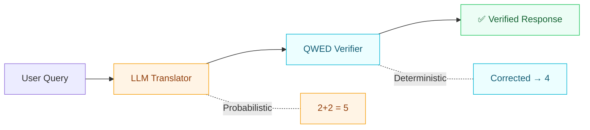

<Note>
**QWED v4.0.0 Sentinel Edition** is now live — Agentic Security Guards, Process Determinism, and 147 commits of hardening. [See what's new →](/changelog)
</Note>

## What is QWED?

**QWED** (Query With Evidence & Determinism) is a **model-agnostic verification protocol** for Large Language Models.

> **"Trust, but Verify."** — QWED treats LLMs as untrusted translators and uses symbolic engines as trusted verifiers. Your LLM, Your Choice, Our Verification.



---

## Quick Start

<CodeGroup>

```bash pip
pip install qwed
```

```bash docker
docker pull qwedai/qwed-verification:latest
```

</CodeGroup>

```bash
# Verify math
qwed verify "Is 2+2=5?"
# → ❌ CORRECTED: The answer is 4, not 5.

# Verify logic
qwed verify-logic "(AND (GT x 5) (LT y 10))"
# → ✅ SAT: {x=6, y=9}
```

---

## Why QWED?

<CardGroup cols={2}>
  <Card title="LLMs hallucinate math" icon="calculator">
    QWED uses **SymPy** for symbolic verification — algebraic proof, not pattern matching.
  </Card>
  <Card title="LLMs break logic" icon="microchip">
    **Z3 SAT solver** provides formal satisfiability checks with model generation.
  </Card>
  <Card title="LLMs generate unsafe code" icon="bug">
    **AST analysis** + pattern detection catches vulnerabilities before execution.
  </Card>
  <Card title="LLMs produce SQL injection" icon="database">
    **Query parsing** + schema validation catches injections and malformed queries.
  </Card>
</CardGroup>

---

## 11 Verification Engines

<CardGroup cols={3}>
  <Card title="Math" icon="square-root-variable" href="/engines/math">
    Symbolic algebra with SymPy
  </Card>
  <Card title="Logic" icon="microchip" href="/engines/logic">
    SAT/SMT solving with Z3
  </Card>
  <Card title="Code" icon="code" href="/engines/code">
    AST security analysis
  </Card>
  <Card title="SQL" icon="database" href="/engines/sql">
    Query validation & injection detection
  </Card>
  <Card title="Fact" icon="magnifying-glass" href="/engines/fact">
    NLI-based fact checking
  </Card>
  <Card title="Stats" icon="chart-bar" href="/engines/stats">
    Statistical claim verification
  </Card>
  <Card title="Reasoning" icon="brain" href="/engines/reasoning">
    Chain-of-Thought verification
  </Card>
  <Card title="Image" icon="image" href="/engines/image">
    Visual content verification
  </Card>
  <Card title="Graph" icon="diagram-project" href="/engines/graph">
    Knowledge graph fact checking
  </Card>
  <Card title="Schema" icon="brackets-curly" href="/engines/schema">
    JSON/API schema validation
  </Card>
  <Card title="Taint" icon="shield-halved" href="/engines/taint">
    Data flow taint analysis
  </Card>
</CardGroup>

---

## Model Agnostic = Your Choice

<Tip>
QWED works with **ANY LLM** — OpenAI, Anthropic, Gemini, Llama (via Ollama), or any local model. Same verification quality, your choice of cost.
</Tip>

<Steps>
  <Step title="Choose your LLM">
    Use any provider — cloud or local. QWED stays neutral. No vendor lock-in.
  </Step>
  <Step title="Send queries through QWED">
    QWED routes LLM responses through the appropriate symbolic engine for verification.
  </Step>
  <Step title="Get verified results">
    Receive deterministic, provably-correct responses with optional cryptographic attestations.
  </Step>
</Steps>

---

## Ecosystem & SDKs

<CardGroup cols={2}>
  <Card title="Python SDK" icon="python" href="/sdks/python">
    `pip install qwed` — Full-featured SDK with CLI.
  </Card>
  <Card title="TypeScript SDK" icon="js" href="/sdks/typescript">
    `npm install @qwed-ai/sdk` — Browser and Node.js support.
  </Card>
  <Card title="Go SDK" icon="golang" href="/sdks/go">
    Lightweight Go module for backend services.
  </Card>
  <Card title="Rust SDK" icon="rust" href="/sdks/rust">
    `cargo add qwed` — Zero-cost abstractions.
  </Card>
</CardGroup>

<CardGroup cols={3}>
  <Card title="LangChain" icon="link" href="/integrations/langchain">
    Drop-in verification guard
  </Card>
  <Card title="LlamaIndex" icon="llama" href="/integrations/llamaindex">
    Query engine integration
  </Card>
  <Card title="CrewAI" icon="users" href="/integrations/crewai">
    Multi-agent verification
  </Card>
</CardGroup>

---

## 🆕 What's New in v4.0.0: Sentinel Edition

The **v4.0.0 Sentinel Release** introduces **Agentic Security Guards**, **Process Determinism**, and critical security hardening. 147 commits — the largest update in QWED history.

<AccordionGroup>
  <Accordion title="Agentic Security Guards (Phase 17)" icon="shield-halved" defaultOpen>
    * **RAGGuard** — Detects prompt injection and data poisoning in RAG pipelines.
    * **ExfiltrationGuard** — Prevents data exfiltration through agent tool calls.
    * **MCP Poison Guard** — Detects poisoned MCP tool definitions.
  </Accordion>
  <Accordion title="New Standalone Guards" icon="tower-observation">
    * **SovereigntyGuard** — Data residency and local routing enforcement.
    * **ToxicFlowGuard** — Stateful toxic tool-chaining detection.
    * **SelfInitiatedCoTGuard** — Reasoning integrity verification.
  </Accordion>
  <Accordion title="Process Determinism" icon="list-check">
    * **ProcessVerifier** — IRAC/milestone-based verification with decimal scoring, budget-aware timeouts, and structured compliance reporting.
  </Accordion>
  <Accordion title="Security Hardening" icon="lock">
    * Replaced all `eval()` with AST-compiled execution.
    * Patched sandbox escape, SymPy injection, and protocol bypass vulnerabilities.
    * Resolved CVE-2026-24049 (Critical), 19 Snyk findings, and CodeQL alerts.
  </Accordion>
</AccordionGroup>

<Card title="Full Changelog" icon="list-timeline" href="/changelog">
  See the complete release history including v3.0.1 Ironclad and v2.4.1 Reasoning Engine.
</Card>

---

## Next Steps

<CardGroup cols={2}>
  <Card title="Installation" icon="download" href="/getting-started/installation">
    Install QWED via pip, Docker, or from source.
  </Card>
  <Card title="Quick Start" icon="rocket" href="/getting-started/quickstart">
    Verify your first LLM output in 5 minutes.
  </Card>
  <Card title="SDK Documentation" icon="book" href="/sdks/overview">
    Choose your language — Python, TypeScript, Go, or Rust.
  </Card>
  <Card title="Specifications" icon="file-lines" href="/specs/overview">
    Read the formal protocol specification.
  </Card>
</CardGroup>
