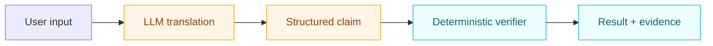
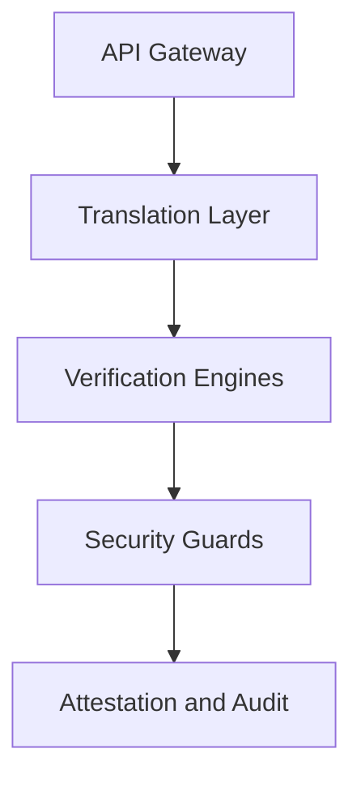
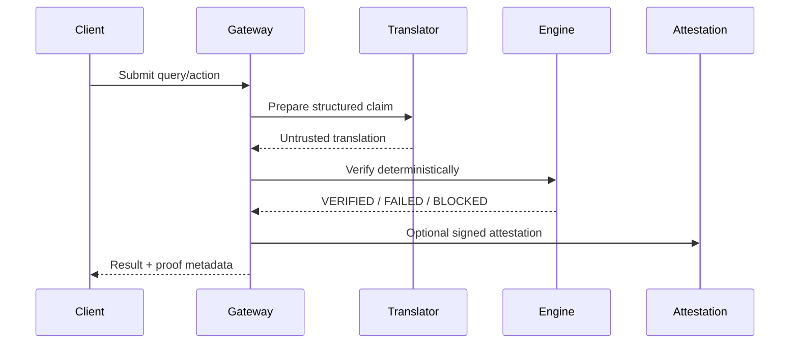

This page gives the high-level architecture.  
For deeper diagrams, see [Architecture Diagrams](/advanced/architecture-diagrams).

QWED separates untrusted model translation from deterministic verification so you can enforce AI reliability, tool call verification, and zero-trust policy boundaries at runtime.

## Core principle



Translation is useful but untrusted. Verification is the trust anchor.

## Layered architecture



### 1) API gateway

- Authentication and authorization
- Rate limiting and tenancy controls
- Request routing and transport security

### 2) Translation layer (untrusted)

- Converts natural language into structured inputs
- Can use any LLM provider (cloud or local)
- Output is always treated as untrusted until verified

### 3) Verification engines (deterministic)

| Engine | Purpose |
|---|---|
| Math | Symbolic arithmetic and algebra checks |
| Logic | SAT/SMT verification and constraint solving |
| Code | AST and symbolic security analysis |
| SQL | Query safety and structure validation |
| Schema/Taint/Graph/Stats/Fact/Image/Reasoning | Domain-specific verification paths |

### 4) Agent security guards

Guards inspect tool calls, contexts, and policy boundaries before execution.

| Guard | Purpose |
|---|---|
| RAGGuard | Defends retrieval contexts from injection/poisoning |
| ExfiltrationGuard | Prevents unauthorized data movement |
| MCPPoisonGuard | Validates MCP tool definitions and safety |
| SovereigntyGuard | Enforces data residency and routing policy |
| SelfInitiatedCoTGuard | Checks reasoning flow integrity |
| ProcessVerifier | Milestone-based process validation |
| StateGuard | Deterministic workspace rollback via shadow git snapshots |

### 5) Attestation and audit

Each verification can emit signed evidence for traceability and compliance workflows.

```python
{
  "query_hash": "sha256(...)",
  "verification_result": true,
  "engine": "QWED-Math-v2",
  "timestamp": 1735689600
}
```

## Request lifecycle



## Security model snapshot

| Threat | QWED response |
|---|---|
| Hallucinated claim | Rejected or corrected by deterministic check |
| Prompt injection | Translation may be affected, but verifier/guards enforce policy |
| Unsafe code or SQL | Blocked by parser, AST checks, and guard rules |
| Untrusted tool action | Guarded and policy-checked before execution |

## Related verification guides

<CardGroup cols={2}>
  <Card title="LLM verification" icon="badge-check" href="/advanced/llm-verification">
    See how QWED validates LLM outputs with formal methods instead of probability-only confidence.
  </Card>
  <Card title="AI agent verification" icon="shield-halved" href="/advanced/agent-verification">
    Apply policy enforcement and pre-execution checks to autonomous agents.
  </Card>
  <Card title="Prompt injection defense" icon="lock" href="/advanced/security-hardening">
    Review production guidance for prompt injection defense and OWASP LLM risks.
  </Card>
  <Card title="MCP security" icon="plug" href="/mcp/overview">
    Secure Model Context Protocol integrations and verify tool execution paths.
  </Card>
</CardGroup>

## Deployment modes

| Mode | Fit |
|---|---|
| Cloud API | Fastest start, hosted control plane |
| Self-hosted | Data control in your VPC/Kubernetes |
| Hybrid | Mix cloud scale with local policy boundaries |

## Next steps

1. [Core Concepts](/getting-started/concepts)
2. [Architecture Diagrams](/advanced/architecture-diagrams)
3. [SDK Guards](/sdks/guards)
4. [Self-Hosting](/advanced/self-hosting)
