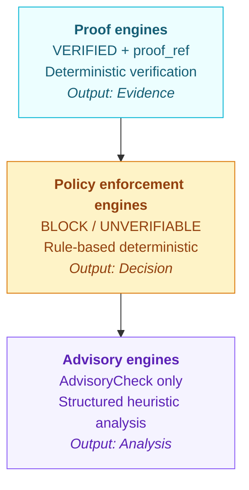

QWED verification engines are formally classified into three tiers, each with a distinct output guarantee. This classification defines what an engine can and cannot claim, and constrains the "no hallucinations" property to supported proof domains.

## The 3-tier engine architecture



A single verification request flows through the tiers: proof engines attempt a deterministic proof, policy enforcement engines apply runtime rules, and advisory engines contribute structured diagnostics. Only the proof tier can produce a `VERIFIED` status.

<Info>
This is the target `DiagnosticResult` architecture. `SymbolicVerifier` is the reference implementation; other engines are being migrated incrementally and some still return legacy types (e.g., `Dict[str, Any]` with a `verified` boolean, or `ImageVerificationResult`).
</Info>

## Tier 1: Proof engines

Proof engines produce **mathematical evidence** using symbolic solvers and formal methods. They are the only tier that can emit `VERIFIED`, and `VERIFIED` always requires a `proof_ref`.

**Guarantee.** For supported proof domains, hallucinations cannot bypass deterministic verification — an answer either has a reproducible proof or it is not `VERIFIED`.

**When to use.** Any claim that can be reduced to arithmetic, algebra, a constraint system, an AST invariant, a SQL structure, or a schema check.

| Engine | Backend | Domain |
|---|---|---|
| [Math](/engines/math) | SymPy + Decimal | Arithmetic, calculus, matrices, NPV/IRR |
| [Logic](/engines/logic) | Z3 | SAT/SMT, quantifiers, BitVectors |
| [SQL](/engines/sql) | SQLGlot AST | Query structure, complexity, schema |
| [Code](/engines/code) | Multi-language AST | Python, JS, Java, Go security analysis |
| [Schema](/engines/schema) | Pydantic + Math | JSON structure + embedded calculations |
| [Stats](/engines/stats) | Pandera + Wasm | Data-frame invariants, sandboxed exec |
| Symbolic | CrossHair | Reference `DiagnosticResult` engine |

Example proof-engine output:

```python
{
  "status": "VERIFIED",
  "engine": "QWED-Math-v2",
  "proof_ref": "sha256:9f2c...",
  "evidence": {"expression": "2+2", "value": 4}
}
```

## Tier 2: Policy enforcement engines

Policy enforcement engines apply **deterministic policies** to inputs, contexts, and tool calls at runtime. They produce enforcement decisions — `BLOCK` or `UNVERIFIABLE` — but never a mathematical proof.

**Guarantee.** Rule-based, reproducible enforcement. The same input against the same policy produces the same decision, with a full decision trace.

**When to use.** Runtime guardrails on agents, MCP tools, RAG contexts, configs, and processes — anywhere you need a deterministic gate but the underlying question is not a math problem.

| Engine | Purpose |
|---|---|
| SystemGuard | System-prompt integrity and policy binding |
| ConfigGuard | Secret detection and configuration policy |
| RAGGuard | Retrieval-context injection and poisoning defense |
| MCPPoisonGuard | MCP tool definition validation |
| ExfiltrationGuard | Unauthorized data-movement prevention |
| SelfInitiatedCoTGuard | Reasoning-flow integrity |
| SovereigntyGuard | Data residency and routing policy |
| StartupHookGuard | Startup and hook integrity |
| ProcessVerifier | Milestone-based process validation |

Example policy-engine output:

```python
{
  "status": "BLOCK",
  "engine": "ConfigGuard",
  "reason": "SECRETS_DETECTED",
  "decision_trace": ["match:OPENAI_API_KEY@api_key"]
}
```

## Tier 3: Advisory engines

Advisory engines run **structured heuristic analysis** on inputs where a formal proof is not available. They emit `AdvisoryCheck` records only — they can never emit `VERIFIED`, and their signals are carried as `advisory_checks` in the diagnostic result.

**Guarantee.** Advisory outputs are transparent and inspectable, but not deterministic proofs. Treat them as inputs to audit and human review, not as verification statuses.

**When to use.** Fact-similarity checks, knowledge-graph triples, reasoning traces, multi-model consensus, and image analysis — signals that inform a decision but should not gate execution on their own.

| Engine | Approach |
|---|---|
| [Fact](/engines/fact) | TF-IDF similarity, entity matching, citations |
| [Graph](/engines/graph) | Knowledge-graph triple checks |
| [Reasoning](/engines/reasoning) | Multi-LLM chain-of-thought review |
| [Consensus](/engines/consensus) | Parallel-execution agreement |
| [Image](/engines/image) | Deterministic metadata + VLM cross-check |

Example advisory-engine output:

```python
{
  "status": "ADVISORY",
  "engine": "Fact",
  "advisory_checks": [
    {"name": "tfidf_similarity", "score": 0.82, "threshold": 0.75}
  ]
}
```

## Behavior by engine type

Compare engines by the output guarantee they provide, not by a single accuracy number — different tiers are answering different questions.

| Tier | Emits `VERIFIED`? | Output kind | Determinism | Explainability | Best for |
|---|---|---|---|---|---|
| Proof engines | ✅ Yes (with `proof_ref`) | Evidence | ✅ Reproducible | ✅ Full trace + proof | Production AI decisions |
| Policy enforcement | ❌ No — `BLOCK` / `UNVERIFIABLE` | Decision | ✅ Reproducible | ✅ Decision trace | Runtime agent guards |
| Advisory | ❌ No — `AdvisoryCheck` only | Analysis | ⚠️ Heuristic | ✅ Structured diagnostics | Audit and review |

For comparison to other approaches:

| Approach | Emits proof? | Deterministic | Explainable |
|---|---|---|---|
| QWED proof engines | ✅ Yes | ✅ Yes | ✅ Full trace + `proof_ref` |
| QWED policy enforcement | ❌ No | ✅ Yes | ✅ Decision trace |
| QWED advisory | ❌ No | ⚠️ Heuristic | ✅ Structured diagnostics |
| Fine-tuning / RLHF | ❌ No | ❌ No | ❌ Black box |
| RAG (retrieval) | ❌ No | ❌ No | ⚠️ Limited |
| LLM-as-judge | ❌ No | ❌ No | ❌ Prompt-dependent |

## Engine selection

QWED auto-detects the appropriate engine based on content, then routes through the tiers:

| Content pattern | Detected engine | Tier |
|---|---|---|
| `2+2=4`, `sqrt(16)`, `derivative` | Math | Proof |
| `(AND ...)`, `ForAll`, `Exists` | Logic | Proof |
| `SELECT`, `INSERT`, `DROP` | SQL | Proof |
| ```` ```python ````, `import`, `function` | Code | Proof |
| JSON with embedded math | Schema | Proof |
| Retrieval context | RAGGuard | Policy enforcement |
| MCP tool definition | MCPPoisonGuard | Policy enforcement |
| Claim + context | Fact | Advisory |
| Image bytes + claim | Image | Advisory |

Or specify explicitly:

```python
result = client.verify(query, type="math")
```

## Deterministic-first philosophy

Across all tiers, QWED follows a **deterministic-first** approach:

1. Try deterministic methods first (100% reproducible).
2. Fall back to advisory signals only when necessary.
3. Never promote a heuristic signal to `VERIFIED` — advisory outputs stay in `advisory_checks`.

> See [Determinism guarantee](/advanced/determinism-guarantee) for how to inspect whether a response is `SYMBOLIC` or `HEURISTIC`, and the [Verification Diagnostics guide](/advanced/diagnostics) for the full `DiagnosticResult` model.

## Engine documentation

### Proof engines

- [Math engine](/engines/math) — calculus, matrix, financial
- [Logic engine](/engines/logic) — quantifiers, theorem proving
- [Schema engine](/engines/schema) — JSON structure and math
- [Code engine](/engines/code) — multi-language security
- [SQL engine](/engines/sql) — complexity limits
- [Stats engine](/engines/stats) — Pandera invariants, Wasm sandbox
- [Taint engine](/engines/taint) — data-flow analysis

### Advisory engines

- [Fact engine](/engines/fact) — TF-IDF and citations
- [Graph engine](/engines/graph) — knowledge-graph triples
- [Image engine](/engines/image) — metadata and VLM cross-check
- [Reasoning engine](/engines/reasoning) — multi-LLM review
- [Consensus engine](/engines/consensus) — parallel execution

### Policy enforcement

Policy enforcement engines ship as [SDK guards](/sdks/guards) — see that page for `SystemGuard`, `ConfigGuard`, `RAGGuard`, `MCPPoisonGuard`, `ExfiltrationGuard`, `SelfInitiatedCoTGuard`, `SovereigntyGuard`, `StartupHookGuard`, and `ProcessVerifier`.
