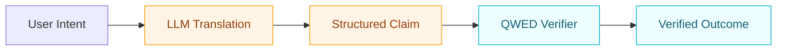

Understand the core mental model behind QWED in one page.

## The trust boundary

QWED is built on a simple idea:

> **LLMs are useful translators, not final authorities.**



The important boundary is between translation and verification:

- Before verification: output is untrusted.
- After deterministic verification: output is accepted, corrected, or blocked.

## How verification actually works

<Steps>
  <Step title="1) Receive natural language input">
    Example: "Is the sum of triangle angles 180 degrees?"
  </Step>
  <Step title="2) Translate to a structured form">
    LLM maps intent into DSL, symbolic expression, or typed schema.
  </Step>
  <Step title="3) Verify with deterministic engine">
    QWED uses engines like SymPy, Z3, AST analyzers, and SQL parsers.
  </Step>
  <Step title="4) Return a proof-backed result">
    Final status is returned with evidence, not just confidence.
  </Step>
</Steps>

## One concrete example

```python
from qwed_sdk import QWEDClient

client = QWEDClient(api_key="qwed_your_key")

result = client.verify_logic("(AND (GT x 5) (LT y 10))")
print(result.status)  # SAT
print(result.model)   # {"x": 6, "y": 9}
```

## Determinism vs probability

| Characteristic | LLM-only flow | QWED flow |
|---|---|---|
| Output consistency | Varies by run/prompt | Stable for same input |
| Correctness basis | Statistical likelihood | Formal or rule-based verification |
| Failure visibility | Often implicit | Explicit statuses and proofs |
| Production safety | Risky without guards | Built for verification gates |

## Verification statuses

| Status | Meaning |
|---|---|
| `VERIFIED` | Claim is valid and accepted |
| `FAILED` | Claim is invalid |
| `CORRECTED` | Claim was wrong and corrected |
| `INCONCLUSIVE` | Expression evaluated deterministically, but the translation from natural language was not formally verified. Check the `trust_boundary` field for details |
| `BLOCKED` | Security or policy violation detected |
| `ERROR` | Engine could not complete verification |

## Where each engine fits

| Engine | Typical use |
|---|---|
| Math (SymPy) | Equations, identities, numeric claims |
| Logic (Z3) | Constraints, SAT/UNSAT, model generation |
| Code (AST/symbolic) | Vulnerability and unsafe pattern detection |
| SQL (parser/rules) | Injection prevention and query validation |
| Schema | Structured output integrity |

## Attestations and auditability

QWED can generate signed attestations so downstream systems can verify that a check occurred:

```python
result = client.verify("2+2=4", include_attestation=True)
print(result.attestation)  # signed token
```

Use this for compliance, audit logs, and third-party verification.

## Next steps

1. [Quick start](/getting-started/quickstart)
2. [Architecture overview](/architecture)
3. [Verification engines](/engines/overview)
4. [Attestation spec](/specs/attestation)
