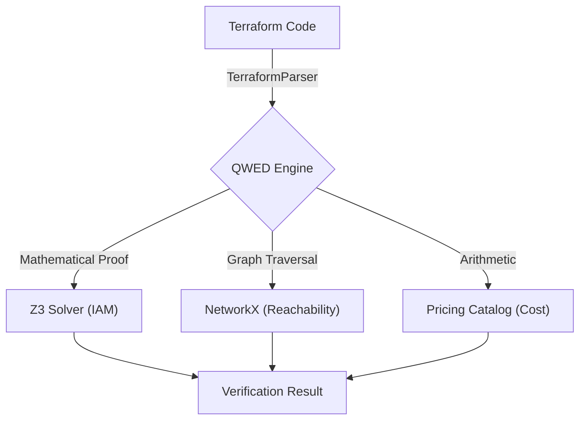

**Deterministic verification for infrastructure as code (IaC).**


`qwed-infra` is a Python library that mathematically proves the security and compliance of infrastructure definitions (Terraform, AWS IAM, Kubernetes). It uses **formal methods (Z3 solver)** and **graph theory** to do so deterministically.

It prevents AI agents (like Devin or Copilot Workspace) from deploying insecure or expensive infrastructure by verifying configuration *before* deployment.

## Architecture



## Key features

### IamGuard
Verifies AWS IAM policies using the **Z3 theorem prover**. Instead of regex matching, it converts policies into logical formulas to prove reachability and specific permissions.

### NetworkGuard
Verifies network reachability using **graph theory** (NetworkX). Validates paths like `Internet -> Internet Gateway (IGW) -> Route -> Security Group -> Instance`.

### CostGuard
Deterministic cloud cost estimation before deployment. Enforce budgets and prevent expensive instance provisioning errors.

## Installation

```bash
pip install qwed-infra
```
