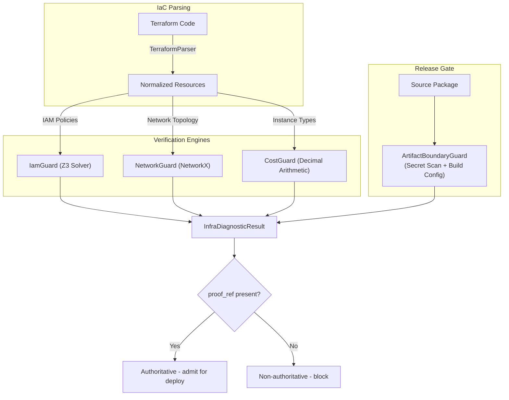

**Deterministic verification for infrastructure as code (IaC).**


`qwed-infra` is a Python library (v0.2.0) that mathematically proves the security and compliance of infrastructure definitions (Terraform, AWS IAM, Kubernetes). It uses **formal methods (Z3 solver)**, **graph theory**, and **deterministic arithmetic** to do so without ML, heuristics, or confidence scores.

It prevents AI agents (like Devin or Copilot Workspace) from deploying insecure, non-compliant, or expensive infrastructure by verifying configuration *before* deployment.

## Architecture



## Key features

### IamGuard
Verifies AWS IAM policies using the **Z3 theorem prover**. Converts policies into first-order logic formulas to prove or disprove access, wildcard expansion, condition evaluation, and deny precedence.

### NetworkGuard
Verifies network reachability using **graph theory** (NetworkX). Validates paths like `Internet -> Internet Gateway (IGW) -> Route -> Security Group -> Instance`. Fail-closed on NAT gateways, VPC peering, NACLs, and Transit Gateway.

### CostGuard
Deterministic cloud cost estimation using **Decimal arithmetic** (no floating-point rounding errors). Enforce budgets and detect expensive instance types before deployment.

### ArtifactBoundaryGuard
Release-gate verification for Python packages. Scans for secret leaks, debug artifact inclusion, and validates hatch build configuration. Blocks publishing when the package surface is unknown or unsafe.

## Audit & Diagnostics

Every guard produces an `InfraDiagnosticResult` — a 3-layer diagnostic with:

- **Layer 1 (`agent_message`):** Human-readable status, safe for downstream tools
- **Layer 2 (`developer_fields`):** Structured evidence — constraint IDs, audit traces, findings
- **Layer 3 (`proof_ref`):** SHA-256 hash of verification evidence; present only when the result is `VERIFIED` and authoritative

Each result also carries a canonical **`RuleRef`** audit trace (`build_trace()`) referencing the specific statute or policy rule that drove the verdict.

## Installation

Pin to a known version for reproducible builds:

```bash
pip install "qwed-infra>=0.2.0"
```
