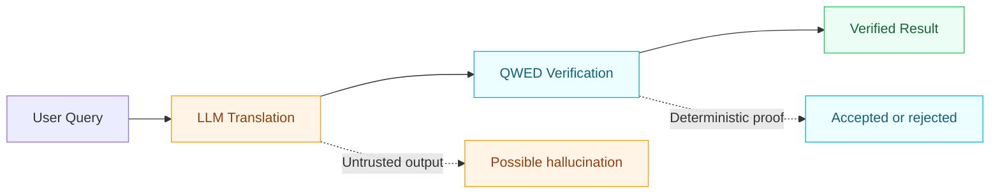

<Note>
**QWED v5.1.0** is now live — AgentStateGuard, fail-closed hardening, and 7 adversarial bypass fixes. Now available on [GitHub Marketplace](https://github.com/marketplace/qwed-security). [See what's new →](/changelog#v5-1-0-—-agent-state-governance-and-fail-closed-hardening)
</Note>

## What is QWED?

QWED (Query With Evidence & Determinism) is a trust boundary for AI systems:

- LLMs can translate user intent into structured claims.
- QWED verifies those claims with deterministic engines before execution or response.
- You get proof-backed outcomes instead of probability-only confidence.

QWED is designed for LLM verification, AI agent security, verified tool calls, prompt injection defense, and deterministic transaction verification in high-stakes workflows.

> **"Do not trust generated output. Verify it."**



## Explore common verification problems

<CardGroup cols={2}>
  <Card title="LLM verification" icon="badge-check" href="/advanced/llm-verification">
    Learn how formal verification for LLMs differs from prompting, RAG, and output formatting.
  </Card>
  <Card title="AI agent security" icon="shield-halved" href="/advanced/agent-verification">
    Add pre-execution checks, policy enforcement, and budget controls for agent actions.
  </Card>
  <Card title="Prompt injection defense" icon="lock" href="/advanced/security-hardening">
    Harden your stack against prompt injection, exfiltration, and unsafe execution paths.
  </Card>
  <Card title="MCP security" icon="plug" href="/mcp/overview">
    Secure Model Context Protocol tools with deterministic verification and tool schema checks.
  </Card>
</CardGroup>

## When to use QWED first

<CardGroup cols={2}>
  <Card title="Math and logic" icon="square-root-variable">
    Verify equations, constraints, and logical claims before they reach users.
  </Card>
  <Card title="Code and SQL" icon="code">
    Catch unsafe patterns, injection risks, and structural errors before execution.
  </Card>
  <Card title="Agent tool calls" icon="toolbox">
    Inspect actions and payloads before external systems are touched.
  </Card>
  <Card title="High-stakes workflows" icon="shield-halved">
    Add deterministic checkpoints for finance, legal, tax, and regulated systems.
  </Card>
</CardGroup>

## Quick start (5 minutes)

<CodeGroup>

```bash pip
pip install qwed
```

```bash docker
docker pull qwedai/qwed-verification:latest
```

</CodeGroup>

```bash
# Verify a simple claim
qwed verify "Is 2+2=5?"
# -> CORRECTED: The answer is 4

# Verify logic constraints
qwed verify-logic "(AND (GT x 5) (LT y 10))"
# -> SAT: {x=6, y=9}
```

<Steps>
  <Step title="Install and configure">
    Follow [Installation](/getting-started/installation) and set your provider with [LLM Configuration](/getting-started/llm-configuration).
  </Step>
  <Step title="Run first verification">
    Use [Quick Start](/getting-started/quickstart) to validate math, logic, code, and SQL.
  </Step>
  <Step title="Integrate into production flow">
    Use [Integration Getting Started](/integration/getting-started) and [Production Deployment](/integration/production).
  </Step>
</Steps>

## Verification engines at a glance

<CardGroup cols={3}>
  <Card title="Math" icon="square-root-variable" href="/engines/math">
    SymPy-based symbolic verification.
  </Card>
  <Card title="Logic" icon="microchip" href="/engines/logic">
    Z3 SAT/SMT verification with models.
  </Card>
  <Card title="Code" icon="code" href="/engines/code">
    AST and symbolic checks for risky behavior.
  </Card>
  <Card title="SQL" icon="database" href="/engines/sql">
    Parser-backed SQL safety and validation.
  </Card>
  <Card title="Schema" icon="brackets-curly" href="/engines/schema">
    Type and shape validation for structured outputs.
  </Card>
  <Card title="Taint" icon="shield-halved" href="/engines/taint">
    Data-flow tracking for untrusted inputs.
  </Card>
</CardGroup>

<Card title="See all engines" icon="book" href="/engines/overview">
  Explore core, analysis, and specialized engines.
</Card>

## What's new in v5.1.0

<AccordionGroup>
  <Accordion title="AgentStateGuard" icon="shield-halved" defaultOpen>
    Deterministic structural and semantic verification of agent state payloads with governed atomic commits. [Learn more →](/advanced/agent-state-guard)
  </Accordion>
  <Accordion title="Fail-closed hardening" icon="lock">
    Legacy CodeExecutor blocked, unknown tools default-denied, bounded math tolerance, ambiguous expressions rejected, schema uniqueItems fail-closed, and identity sampling rejected.
  </Accordion>
  <Accordion title="Progress-aware doom loop guard" icon="rotate">
    LOOP-004 state-aware replay protection detects agents repeating actions on unchanged world state.
  </Accordion>
</AccordionGroup>

## Recommended learning path

1. [Core Concepts](/getting-started/concepts)
2. [Architecture Overview](/architecture)
3. [SDKs Overview](/sdks/overview)
4. [API Overview](/api/overview)
5. [Integration Guide](/integration/getting-started)
