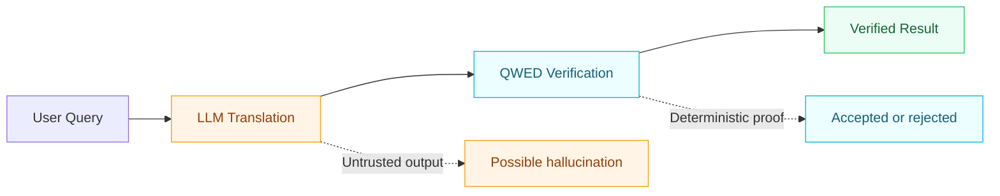

<Note>
**QWED v6.0.0** is now live — Trust boundary completion: unified `DiagnosticResult` schema across all `/verify/*` endpoints, mandatory control-plane attestation, and deterministic `proof_ref` guarantees. [See what's new →](/changelog#v6-0-0---trust-boundary-completion)
</Note>

## What is QWED?

QWED (Query With Evidence & Determinism) is a trust boundary for AI systems:

- LLMs can translate user intent into structured claims.
- QWED verifies those claims with deterministic engines before execution or response.
- You get proof-backed outcomes instead of probability-only confidence.

QWED is designed for LLM verification, AI agent security, verified tool calls, prompt injection defense, and deterministic transaction verification in high-stakes workflows.

> **"Do not trust generated output. Verify it."**


```mermaid
flowchart LR
    U[User Query] --> L[LLM Translation]
    L --> Q[QWED Verification]
    Q --> R[Verified Result]

    L -. Untrusted output .-> X[Possible hallucination]
    Q -. Deterministic proof .-> Y[Accepted or rejected]

    classDef untrusted fill:#fff4e5,stroke:#f59e0b,color:#92400e;
    classDef trusted fill:#ecfeff,stroke:#06b6d4,color:#155e75;
    classDef result fill:#ecfdf5,stroke:#22c55e,color:#166534;
    class L,X untrusted;
    class Q,Y trusted;
    class R result;
```

## Explore common verification problems

<CardGroup cols={2}>
  <Card title="LLM verification" icon="badge-check" href="/advanced/llm-verification">
    Learn how formal verification for LLMs differs from prompting, RAG, and output formatting.
  </Card>
  <Card title="AI agent security" icon="shield-halved" href="/advanced/agent-verification">
    Add pre-execution checks, policy enforcement, and budget controls for agent actions.
  </Card>
  <Card title="Prompt injection defense" icon="lock" href="/advanced/security-hardening">
    Harden your stack against prompt injection, exfiltration, and unsafe execution paths.
  </Card>
  <Card title="MCP security" icon="plug" href="/mcp/overview">
    Secure Model Context Protocol tools with deterministic verification and tool schema checks.
  </Card>
</CardGroup>

## When to use QWED first

<CardGroup cols={2}>
  <Card title="Math and logic" icon="square-root-variable">
    Verify equations, constraints, and logical claims before they reach users.
  </Card>
  <Card title="Code and SQL" icon="code">
    Catch unsafe patterns, injection risks, and structural errors before execution.
  </Card>
  <Card title="Agent tool calls" icon="toolbox">
    Inspect actions and payloads before external systems are touched.
  </Card>
  <Card title="High-stakes workflows" icon="shield-halved">
    Add deterministic checkpoints for finance, legal, tax, and regulated systems.
  </Card>
</CardGroup>

## Quick start (5 minutes)

<CodeGroup>

```bash pip
pip install qwed==6.0.0
```

```bash docker
docker pull qwedai/qwed-verification:6.0.0
```

</CodeGroup>

```bash
# Verify a simple claim
qwed verify "Is 2+2=5?"
# -> CORRECTED: The answer is 4

# Verify logic constraints
qwed verify-logic "(AND (GT x 5) (LT y 10))"
# -> SAT: {x=6, y=9}
```

<Steps>
  <Step title="Install and configure">
    Follow [Installation](/getting-started/installation) and set your provider with [LLM configuration](/getting-started/llm-configuration).
  </Step>
  <Step title="Run first verification">
    Use [Quick start](/getting-started/quickstart) to validate math, logic, code, and SQL.
  </Step>
  <Step title="Integrate into production flow">
    Use [Integration getting started](/integration/getting-started) and [Production deployment](/integration/production).
  </Step>
</Steps>

## Verification engines at a glance

<CardGroup cols={3}>
  <Card title="Math" icon="square-root-variable" href="/engines/math">
    SymPy-based symbolic verification.
  </Card>
  <Card title="Logic" icon="microchip" href="/engines/logic">
    Z3 SAT/SMT verification with models.
  </Card>
  <Card title="Code" icon="code" href="/engines/code">
    AST and symbolic checks for risky behavior.
  </Card>
  <Card title="SQL" icon="database" href="/engines/sql">
    Parser-backed SQL safety and validation.
  </Card>
  <Card title="Schema" icon="brackets-curly" href="/engines/schema">
    Type and shape validation for structured outputs.
  </Card>
  <Card title="Taint" icon="shield-halved" href="/engines/taint">
    Data-flow tracking for untrusted inputs.
  </Card>
</CardGroup>

<Card title="See all engines" icon="book" href="/engines/overview">
  Explore core, analysis, and specialized engines.
</Card>

## What's new in v6.0.0

<AccordionGroup>
  <Accordion title="Trust Boundary Completion" icon="shield-check" defaultOpen>
    All 12/12 sub-issues closed in Epic #263. Every `/verify/*` API pathway returns `DiagnosticResult` and routes through mandatory `enforce_trust_decision`. VERIFIED is a protocol guarantee backed by a non-empty, deterministic `proof_ref`. [Learn more →](/releases)
  </Accordion>
  <Accordion title="Unified DiagnosticResult Schema" icon="brackets-curly">
    Observation vs Admission architecture codified: `/verify/*` endpoints return the 3-layer `DiagnosticResult` (`status` / `agent_message` / `developer_fields` / `proof_ref`). [Learn more →](/advanced/diagnostics)
  </Accordion>
  <Accordion title="Logic & Fact Engine Conformance" icon="microchip">
    `LogicVerifier` and `FactVerifier` migrated to `DiagnosticResult` with attestation-backed verdicts and advisory checks.
  </Accordion>
  <Accordion title="TOCTOU & Tenant Isolation Hardening" icon="lock">
    Developer fields snapshotted recursively to prevent alias windows in `enforce_trust_decision`, and `VerificationCache` key namespacing by normalized `tenant_id`.
  </Accordion>
</AccordionGroup>

## Recommended learning path

1. [Core concepts](/getting-started/concepts)
2. [Architecture overview](/architecture)
3. [SDKs overview](/sdks/overview)
4. [API overview](/api/overview)
5. [Integration guide](/integration/getting-started)