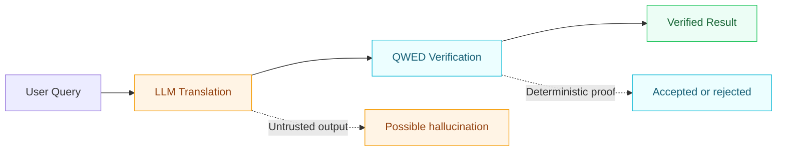

<Note>
**QWED v10.0.0 is the current release.** Routes stop reporting `VERIFIED`, or admitting a result, on evidence that does not prove the claim: RAG and process checks are `UNVERIFIABLE`, a consensus needs two distinct engines, a logic verdict is not admitted, and `/verify/math` without `=` is `UNVERIFIABLE`. The `claude_opus` provider is removed, and the Go module path ends in `/v10`. Read the [10.0.0 upgrade steps](/changelog#v10-0-0-evidence-is-not-proof) before you upgrade.
</Note>

## What is QWED?

QWED (Query With Evidence & Determinism) is a trust boundary for AI systems:

- LLMs can translate user intent into structured claims.
- QWED verifies those claims with deterministic engines before execution or response.
- You get proof-backed outcomes instead of probability-only confidence.

QWED is designed for LLM verification, AI agent security, verified tool calls, prompt injection defense, and deterministic transaction verification in high-stakes workflows.

> **"Do not trust generated output. Verify it."**


```mermaid
flowchart LR
    U[User Query] --> L[LLM Translation]
    L --> Q[QWED Verification]
    Q --> R[Verified Result]

    L -. Untrusted output .-> X[Possible hallucination]
    Q -. Deterministic proof .-> Y[Accepted or rejected]

    classDef untrusted fill:#fff4e5,stroke:#f59e0b,color:#92400e;
    classDef trusted fill:#ecfeff,stroke:#06b6d4,color:#155e75;
    classDef result fill:#ecfdf5,stroke:#22c55e,color:#166534;
    class L,X untrusted;
    class Q,Y trusted;
    class R result;
```

## Explore common verification problems

<CardGroup cols={2}>
  <Card title="LLM verification" icon="badge-check" href="/advanced/llm-verification">
    Learn how formal verification for LLMs differs from prompting, RAG, and output formatting.
  </Card>
  <Card title="AI agent security" icon="shield-halved" href="/advanced/agent-verification">
    Add pre-execution checks, policy enforcement, and budget controls for agent actions.
  </Card>
  <Card title="Prompt injection defense" icon="lock" href="/advanced/security-hardening">
    Harden your stack against prompt injection, exfiltration, and unsafe execution paths.
  </Card>
  <Card title="QWED MCP" icon="plug" href="/mcp/overview">
    Give MCP clients access to QWED's deterministic verification libraries.
  </Card>
</CardGroup>

## When to use QWED first

<CardGroup cols={2}>
  <Card title="Math and logic" icon="square-root-variable">
    Verify equations, constraints, and logical claims before they reach users.
  </Card>
  <Card title="Code and SQL" icon="code">
    Catch unsafe patterns, injection risks, and structural errors before execution.
  </Card>
  <Card title="Agent tool calls" icon="toolbox">
    Inspect actions and payloads before external systems are touched.
  </Card>
  <Card title="High-stakes workflows" icon="shield-halved">
    Add deterministic checkpoints for finance, legal, tax, and regulated systems.
  </Card>
</CardGroup>

## Quick start (5 minutes)

```bash
pip install qwed==10.0.0
```

The examples below use the `qwed` CLI that this installs. The `qwedai/qwed-verification:10.0.0` Docker image runs the API server instead; see [Self-hosting](/advanced/self-hosting#docker).

```bash
# Run Math, Logic, SQL and Code on known cases (no LLM needed)
qwed test
# Math:
#   [ok] 2+2=4                  -> VERIFIED | ADMIT
#   [ok] 2+2=5                  -> VERIFIED (false) | DENY
#   ...
```

To prove a claim from its conditions with Z3, see [Logic verification](/getting-started/quickstart#3-logic-verification) in the quick start: given x > 5, the claim x > 3 follows, and x > 10 comes back with a counterexample such as x = 6.

<Steps>
  <Step title="Install and configure">
    Follow [Installation](/getting-started/installation) and set your provider with [LLM configuration](/getting-started/llm-configuration).
  </Step>
  <Step title="Run first verification">
    Use [Quick start](/getting-started/quickstart) to validate math, logic, code, and SQL.
  </Step>
  <Step title="Integrate into production flow">
    Use [Integration getting started](/integration/getting-started) and [Production deployment](/integration/production).
  </Step>
</Steps>

## Verification engines at a glance

<CardGroup cols={3}>
  <Card title="Math" icon="square-root-variable" href="/engines/math">
    SymPy-based symbolic verification.
  </Card>
  <Card title="Logic" icon="microchip" href="/engines/logic">
    Z3 SAT/SMT verification with models.
  </Card>
  <Card title="Code" icon="code" href="/engines/code">
    AST and symbolic checks for risky behavior.
  </Card>
  <Card title="SQL" icon="database" href="/engines/sql">
    Parser-backed SQL safety and validation.
  </Card>
  <Card title="Schema" icon="brackets-curly" href="/engines/schema">
    Type and shape validation for structured outputs.
  </Card>
  <Card title="Taint" icon="shield-halved" href="/engines/taint">
    Data-flow tracking for untrusted inputs.
  </Card>
</CardGroup>

<Card title="See all engines" icon="book" href="/engines/overview">
  Explore core, analysis, and specialized engines.
</Card>

## What's new in v10

<AccordionGroup>
  <Accordion title="Evidence is not proof" icon="shield-check" defaultOpen>
    From v10.0.0, a route reports `VERIFIED`, or admits a result, only on evidence that proves the claim. `/verify/rag`, `/verify/process` and the GitHub Action's `verify-process` mode are `UNVERIFIABLE`. `/verify/consensus` is `BLOCKED` unless two distinct engines verify the same answer. `/verify/logic` carries an admission, and it is `BLOCKED`, because nothing checks that the constraints a model translated mean the question. `/verify/image` decides a size claim only when the claim states the size, and `/verify/math` without `=` is `UNVERIFIABLE`. [Read the 10.0.0 notes →](/changelog#v10-0-0-evidence-is-not-proof)
  </Accordion>
  <Accordion title="Before you upgrade" icon="triangle-exclamation">
    From v10.0.0, `ACTIVE_PROVIDER=claude_opus` is refused: set `ACTIVE_PROVIDER=anthropic` and move its settings to the `ANTHROPIC_` ones. A client that acted on `status == "VERIFIED"` from the routes above now sees `UNVERIFIABLE` or `BLOCKED`, the LangChain and CrewAI tools word undecided results differently, and the Go module path moves to `/v10`. [Read the upgrade steps →](/changelog#v10-0-0-evidence-is-not-proof)
  </Accordion>
</AccordionGroup>

## Recommended learning path

1. [Core concepts](/getting-started/concepts)
2. [Architecture overview](/architecture)
3. [SDKs overview](/sdks/overview)
4. [API overview](/api/overview)
5. [Integration guide](/integration/getting-started)