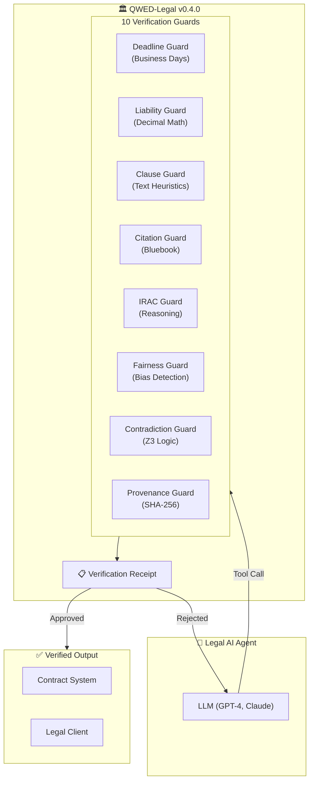
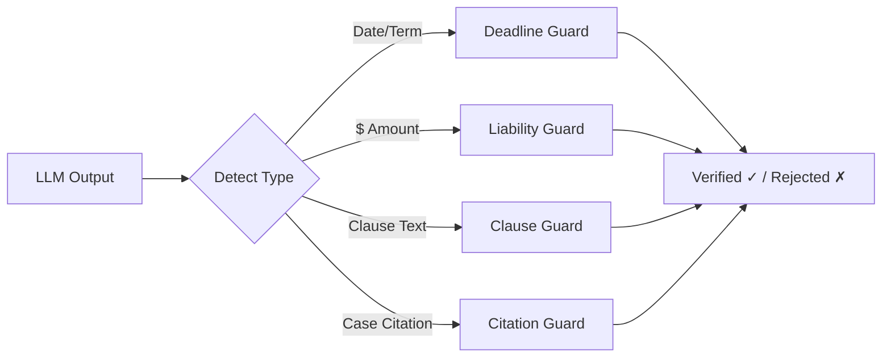

# QWED-Legal

**The Paralegal for AI-Powered Contract Review** 🏛️

> When lawyers used ChatGPT and cited 6 fake court cases (Mata v. Avianca), QWED-Legal would have caught them before the $5,000 fine.

## What is QWED-Legal?

QWED-Legal is a deterministic verification layer for AI-generated legal document analysis. It catches:

- **Date calculation errors** (30 business days miscalculated)
- **Contradictory clauses** (Clause A says X, Clause B says Not X)
- **Liability miscalculations** (200% of $5M ≠ $15M)
- **Hallucinated citations** (fake case names, invalid reporters)
- **Provenance violations** (missing disclosures, tampered content, unauthorized models)

```bash
pip install qwed-legal
```

## Verification boundaries

QWED-Legal verifies **only what can be deterministically proven** — dates, amounts, and structured constraints. Interpretive legal reasoning is not automatically trusted.

<Warning>
  QWED-Legal is a **deterministic rejection layer**, not a general-purpose legal reasoning engine. If a claim cannot be proven, it must not pass.
</Warning>

| Aspect | QWED-Legal does | QWED-Legal does **not** do |
| --- | --- | --- |
| Scope | Verify narrow deterministic claims (dates, amounts, structured constraints) | Draft, summarize, or generate legal text |
| Approach | Deterministic checks where possible | Probabilistic generation or interpretive reasoning |
| Certainty | 100% certainty for supported deterministic checks | Prove subjective, ambiguous, or interpretive conclusions |
| Failure mode | Fails closed when proof is unavailable | Provide a "best guess" answer |
| Role | Block or mark unverified claims before they reach downstream systems | Replace lawyers, drafting tools, or research assistants |

When verification is not possible, the correct outcome is to fail closed — reject the claim or mark it unverified.

## The 10 Guards of Legal Verification

Each guard advertises a verification status so you know how strong a passing result is:

- `DETERMINISTIC` — full formal verification for the supported, structured inputs.
- `PARTIAL / HEURISTIC` — structural or rule-based checks that should not be treated as complete legal proof.

| Guard | Status | Engine | Use case |
|-------|--------|--------|----------|
| **DeadlineGuard** | `DETERMINISTIC` | python-dateutil + holidays | Business days, leap years, jurisdiction holidays |
| **LiabilityGuard** | `DETERMINISTIC` | Decimal + SymPy | Cap %, tiered liability, indemnity limits |
| **ProvenanceGuard** | `DETERMINISTIC` | SHA-256 + regex | AI content provenance and disclosure compliance |
| **ContradictionGuard** | `PARTIAL / HEURISTIC` | Z3 SMT Solver | Structured contradiction checks for modeled clause categories |
| **ClauseGuard** | `PARTIAL / HEURISTIC` | Text heuristics + Z3 | Limited clause consistency and contradiction checks |
| **CitationGuard** | `PARTIAL / HEURISTIC` | Regex patterns | Citation shape and format validation (not authoritative existence proof) |
| **JurisdictionGuard** | `PARTIAL / HEURISTIC` | Rule-based logic | Structured checks around governing law, forum, and CISG |
| **StatuteOfLimitationsGuard** | `PARTIAL / HEURISTIC` | Date calculations | Limitation-period calculations for supported jurisdictions and claim types |
| **IRACGuard** | `PARTIAL / HEURISTIC` | Regex patterns | IRAC structure and consistency checks (not proof of legal reasoning) |
| **FairnessGuard** | `PARTIAL / HEURISTIC` | Counterfactual testing | Counterfactual consistency checks (not full fairness proof) |

## Quick Example

### Verify a Deadline Calculation

```python
from qwed_legal import DeadlineGuard

guard = DeadlineGuard()
result = guard.verify(
    signing_date="2026-01-15",
    term="30 business days",
    claimed_deadline="2026-02-14"  # LLM claimed this
)

print(result.verified)   # False!
print(result.computed_deadline)  # 2026-02-27 (correct)
# ❌ ERROR: Deadline mismatch. Expected 2026-02-27, but LLM claimed 2026-02-14.
```

### Verify a Legal Citation

```python
from qwed_legal import CitationGuard

guard = CitationGuard()
result = guard.verify("Brown v. Board of Education, 347 U.S. 483 (1954)")

print(result.valid)  # True - valid citation format
print(result.parsed_components)
# {'volume': 347, 'reporter': 'U.S.', 'page': '483'}
```

## Architecture

### High-Level Flow



### Guard Selection Flow



## Audit Log: Real Hallucinations Caught

| Contract Input | LLM Claim | QWED Verdict |
|----------------|-----------|--------------|
| "Net 30 Business Days from Dec 20" | Jan 19 | 🛑 **BLOCKED** (Actual: Feb 2) |
| "Liability Cap: 2x Fees ($50k)" | $200,000 | 🛑 **BLOCKED** (Actual: $100,000) |
| "Seller may terminate with 30 days notice" + "Neither party may terminate before 90 days" | "Clauses are consistent" | 🛑 **BLOCKED** (Conflict detected) |
| "Smith v. Jones, 999 FAKE 123" | Valid citation | 🛑 **BLOCKED** (Unknown reporter) |

## Why Not Just Trust the LLM?

LLMs are **probabilistic**. They can:

- **Hallucinate case citations** (Mata v. Avianca scandal)
- **Miscalculate business days** (ignore holidays, weekends)
- **Miss contradictory clauses** (termination notice vs minimum term)
- **Get percentage math wrong** (200% of $5M ≠ $15M)

QWED-Legal uses **deterministic** verification:

| LLM Output | QWED Verification | Engine |
|------------|-------------------|--------|
| "Deadline is Feb 14" | Calculate business days | python-dateutil |
| "Liability cap is $15M" | Decimal math | SymPy |
| "Clauses are consistent" | Z3 satisfiability | Z3 SMT |
| "Citation is valid" | Bluebook regex | Pattern matching |

## Jurisdiction Support

DeadlineGuard supports jurisdiction-specific holidays:

```python
from qwed_legal import DeadlineGuard

# US holidays (default)
us_guard = DeadlineGuard(country="US")

# UK holidays
uk_guard = DeadlineGuard(country="GB")

# California-specific holidays
ca_guard = DeadlineGuard(country="US", state="CA")
```

## Next Steps

- [The 10 Guards](/legal/guards) - Deep dive into each verification guard
- [Examples](/legal/examples) - Real-world contract verification scenarios
- [Troubleshooting](/legal/troubleshooting) - Common issues and solutions
