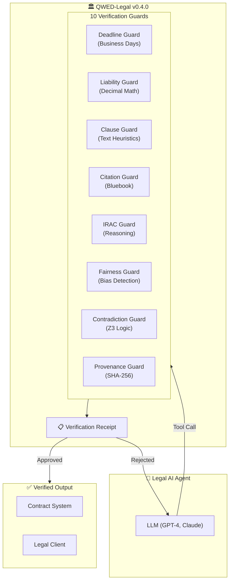
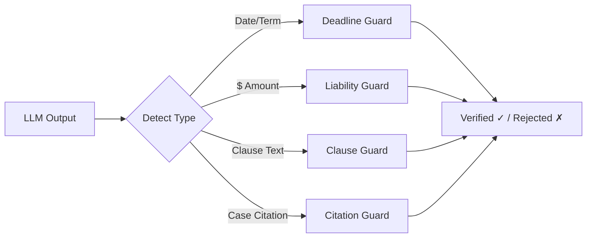

# QWED-Legal

**Deterministic verification guards for computational legal claims.**

> Block unproven legal claims before they become liabilities.

## What is QWED-Legal?

QWED-Legal is a verification layer for **deterministic, computational legal claims**. It is designed to sit between untrusted LLM or workflow output and any downstream legal action.

QWED-Legal verifies only what can be deterministically proven, such as:

- **Date calculations** (business days, holidays, leap years)
- **Liability arithmetic** (cap percentages, tiered amounts, indemnity multipliers)
- **Structured contradictions** between modeled clauses
- **Citation format** for supported reporters
- **Provenance metadata** (hash integrity, disclosure markers, allowed models)

Interpretive legal reasoning is **not** automatically trusted. When proof is not possible, the correct outcome is to reject the claim or mark it unverified.

```bash
pip install qwed-legal
```

## Verification boundaries

QWED-Legal operates under strict limits:

- Only deterministic claims can be verified.
- Ambiguous or interpretive output is rejected or marked unverified.
- Legal reasoning is **not** assumed correct without proof.
- If something cannot be proven, it must not pass.

QWED-Legal is **not**:

- a legal reasoning engine
- a source of legal truth
- a replacement for lawyers
- a contract drafting or review platform
- a guarantee that every legal output can be verified

## Guard coverage

Not every guard provides full formal verification. Some operate on partial rules or structured validation and should **not** be treated as complete legal proof.

| Guard | Status | What it checks |
|-------|--------|----------------|
| **DeadlineGuard** | `DETERMINISTIC` | Date arithmetic and business-day calculations for supported, structured inputs |
| **LiabilityGuard** | `DETERMINISTIC` | Cap and tiered amount computations for supported numeric inputs |
| **ClauseGuard** | `PARTIAL / HEURISTIC` | Limited text-based clause consistency and contradiction checks |
| **CitationGuard** | `PARTIAL / HEURISTIC` | Citation shape / format validation, not authoritative existence proof |
| **JurisdictionGuard** | `PARTIAL / HEURISTIC` | Structured checks around governing law and forum combinations |
| **StatuteOfLimitationsGuard** | `PARTIAL / HEURISTIC` | Limitation-period calculations for supported jurisdictions and claim types |
| **IRACGuard** | `PARTIAL / HEURISTIC` | IRAC structure and consistency checks, not proof of legal reasoning |
| **FairnessGuard** | `PARTIAL / HEURISTIC` | Counterfactual consistency checks (requires an external LLM client) |
| **ContradictionGuard** | `PARTIAL / HEURISTIC` | Structured contradiction checks for a limited set of modeled clause categories |
| **ProvenanceGuard** | `DETERMINISTIC` | SHA-256 hash integrity, disclosure markers, model allowlist, timestamp validity |

A valid result from a `PARTIAL / HEURISTIC` guard does **not** mean the underlying legal claim is correct. It means the claim matched a supported structural pattern.

## Quick example

### Verify a Deadline Calculation

```python
from qwed_legal import DeadlineGuard

guard = DeadlineGuard()
result = guard.verify(
    signing_date="2026-01-15",
    term="30 business days",
    claimed_deadline="2026-02-14",
)

print(result.verified)            # False
print(result.computed_deadline)   # 2026-02-27
print(result.message)
```

### Verify a Legal Citation

```python
from qwed_legal import CitationGuard

guard = CitationGuard()
result = guard.verify("Brown v. Board of Education, 347 U.S. 483 (1954)")

print(result.valid)  # True - matches a supported citation format
print(result.parsed_components)
# {'volume': 347, 'reporter': 'U.S.', 'page': '483'}
```

A valid format result does **not** prove that the cited authority exists or is controlling. It only means the citation matched a supported structural pattern.

## Architecture

### High-Level Flow



### Guard Selection Flow



## Examples of claims QWED-Legal can reject

These are examples of supported checks catching unsupported claims. They are **not** proof that every legal hallucination is detectable.

| Input | Claimed result | Example outcome |
|-------|----------------|-----------------|
| "Net 30 business days from Dec 20" | Wrong computed date | Blocked by `DeadlineGuard` |
| "Liability cap: 2x fees" | Wrong cap arithmetic | Blocked by `LiabilityGuard` |
| Structured liability conflict | "Clauses are consistent" | Blocked by `ContradictionGuard` |
| Unsupported citation reporter | "Valid citation" | Blocked by `CitationGuard` format checks |

## Why not just trust the LLM?

LLMs are **probabilistic** and can fail in legally significant ways:

| Failure mode | Example | Risk |
|--------------|---------|------|
| Fabricated authority | AI cites a nonexistent or malformed legal source | Sanctions, bad filings |
| Deadline mistakes | "30 business days" miscomputed | Missed obligations, defaults |
| Clause inconsistency | Two provisions cannot both be true | Disputes, unenforceable terms |
| False certainty | Model states a legal conclusion without proof | Liability, audit failure |

QWED-Legal treats LLM output as **untrusted input**. It does not assume correctness, and it requires proof for the properties it is able to verify. When proof is not possible, the correct outcome is to fail closed.

## Jurisdiction support

DeadlineGuard supports jurisdiction-specific holidays:

```python
from qwed_legal import DeadlineGuard

# US holidays (default)
us_guard = DeadlineGuard(country="US")

# UK holidays
uk_guard = DeadlineGuard(country="GB")

# California-specific holidays
ca_guard = DeadlineGuard(country="US", state="CA")
```

## Next steps

- [The 10 Guards](/legal/guards) - Deep dive into each verification guard
- [Examples](/legal/examples) - Real-world contract verification scenarios
- [Troubleshooting](/legal/troubleshooting) - Common issues and solutions
