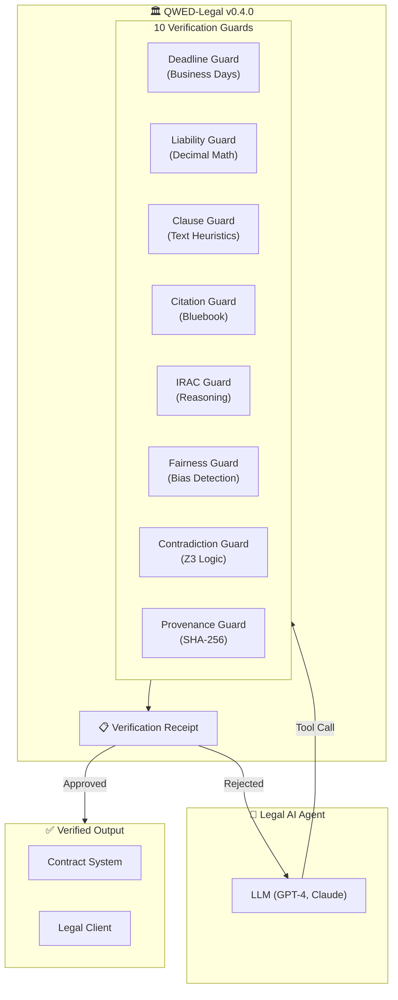
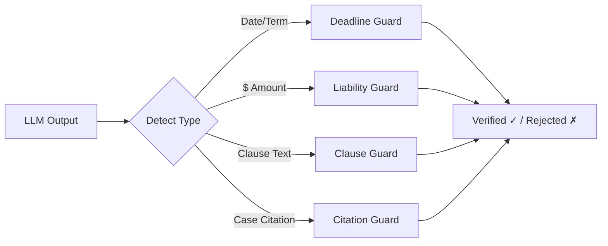

**Deterministic verification guards for computational legal claims.**

> Block unproven legal claims before they become liabilities.

## What is QWED-Legal?

QWED-Legal is a verification layer for **deterministic, computational legal claims**. It is designed to sit between untrusted LLM or workflow output and any downstream legal action.

QWED-Legal verifies only what can be deterministically proven, such as:

- **Date calculations** (business days, holidays, leap years)
- **Liability arithmetic** (cap percentages, tiered amounts, indemnity multipliers)
- **Structured contradictions** between modeled clauses
- **Citation format** for supported reporters
- **Provenance metadata** (hash integrity, disclosure markers, allowed models)

Interpretive legal reasoning is **not** automatically trusted. When proof is not possible, the correct outcome is to reject the claim or mark it unverified.

```bash
pip install qwed-legal
```

## Verification boundaries

QWED-Legal operates under strict limits:

- Only deterministic claims can be verified.
- Ambiguous or interpretive output is rejected or marked unverified.
- Legal reasoning is **not** assumed correct without proof.
- If something cannot be proven, it must not pass.

QWED-Legal is **not**:

- a legal reasoning engine
- a source of legal truth
- a replacement for lawyers
- a contract drafting or review platform
- a guarantee that every legal output can be verified

## Guard coverage

Not every guard provides full formal verification. Some operate on partial rules or structured validation and should **not** be treated as complete legal proof.

| Guard | Status | What it checks |
|-------|--------|----------------|
| **DeadlineGuard** | `DETERMINISTIC` | Date arithmetic and business-day calculations for supported, structured inputs |
| **LiabilityGuard** | `DETERMINISTIC` | Cap and tiered amount computations for supported numeric inputs |
| **ClauseGuard** | `PARTIAL / HEURISTIC` | Limited text-based clause consistency and contradiction checks (explicit Z3 path is deterministic) |
| **CitationGuard** | `PARTIAL / HEURISTIC` | Citation shape / format validation, not authoritative existence proof |
| **JurisdictionGuard** | `PARTIAL / HEURISTIC` | Structured checks around governing law and forum combinations |
| **StatuteOfLimitationsGuard** | `MIXED` | Deterministic date arithmetic over a parsed limitation-period lookup; the lookup itself is `PARSED`, not authority proof |
| **IRACGuard** | `PARTIAL / HEURISTIC` | IRAC structure and consistency checks, not proof of legal reasoning |
| **FairnessGuard** | `HEURISTIC / FAIL-CLOSED` | Counterfactual consistency signal only; **never** returns `verified=True` — fairness cannot be proven by text substitution (requires an external LLM client) |
| **ContradictionGuard** | `MIXED` | Deterministic Z3 SAT/UNSAT over a limited set of modeled clause categories; unmodeled inputs fail closed |
| **ProvenanceGuard** | `DETERMINISTIC` | SHA-256 hash integrity, disclosure markers, model allowlist, timestamp validity |

A valid result from a `PARTIAL / HEURISTIC` or `MIXED` guard does **not** mean the underlying legal claim is correct. It means the claim matched a supported structural pattern, or that a deterministic sub-computation succeeded over parsed inputs.

## Verification traces

As of **v0.4.0**, every guard returns a `verification_trace` — an ordered list of `VerificationStep` records that make each decision auditable. A trace is **not** a narrative explanation. Each step carries an `evidence_type` that classifies *how* its output was derived:

| `evidence_type` | Meaning | `is_proven()` |
|-----------------|---------|:-------------:|
| `DETERMINISTIC` | Proven by math/logic (Z3, date arithmetic, exact compare) | `True` |
| `PARSED` | Read/matched from structure or a lookup table — not authority proof | `False` |
| `INFERRED` | Pattern/keyword derived — may be wrong on edge cases | `False` |
| `HEURISTIC` | Approximate/statistical signal | `False` |
| `UNSUPPORTED` | Guard cannot model this input — fail-closed | `False` |

Only `DETERMINISTIC` steps constitute proof. `PARSED`, `INFERRED`, `HEURISTIC`, and `UNSUPPORTED` steps are visible for auditability but must **not** be treated as verification.

```python
from qwed_legal import StatuteOfLimitationsGuard, trace_to_dict

result = StatuteOfLimitationsGuard().verify(
    claim_type="breach_of_contract",
    jurisdiction="California",
    incident_date="2020-01-01",
    filing_date="2023-01-01",
)

for step in result.verification_trace:
    print(step.step, step.evidence_type, "->", step.output)

# JSON-safe export for audit logs (each entry includes an explicit is_proven flag)
serialized = trace_to_dict(result.verification_trace)
```

## Structured diagnostics

Every guard result exposes `to_diagnostic(claim_inputs=...)`, which returns a `LegalDiagnosticResult` — the same 3-layer contract described in [Verification Diagnostics](/advanced/diagnostics). The status is one of:

| Status | Meaning | `proof_ref` | Control flow |
|--------|---------|-------------|-------------|
| `VERIFIED` | Claim compared against deterministic computation and matches | Required (`sha256:` + 64 hex) | May admit |
| `UNVERIFIABLE` | Claim could not be proven (no claim supplied, ambiguous input, heuristic-only pass, self-declared attestation, citation authority) | Must be `None` | Must reject |
| `BLOCKED` | Guard deterministically rejected the claim (contradiction, mismatch, tampered evidence, invalid format, impossible timeline) | Must be `None` | Must reject |

The `LegalDiagnosticResult` dataclass is frozen and enforces the authority contract in `__post_init__`:

- `VERIFIED` requires a non-empty `proof_ref` matching `sha256:[0-9a-f]{64}`.
- `UNVERIFIABLE` and `BLOCKED` reject `proof_ref` entirely.
- `agent_message` must be a non-empty string.

Attempting to construct a result that violates these rules raises `ValueError` — "VERIFIED without proof" or "BLOCKED with proof" are not caller conventions, they are unrepresentable.

### Per-guard status mapping

Not every guard can ever return `VERIFIED`. Guards whose evidence is inherently non-authoritative (citation format, heuristic clause checks, fairness, self-declared provenance) map their passing outcomes to `UNVERIFIABLE` on purpose:

| Guard | `VERIFIED` when… | `UNVERIFIABLE` when… | `BLOCKED` when… |
|-------|------------------|----------------------|-----------------|
| `DeadlineGuard` | Computed deadline matches the claim | Uninterpretable term, or fallback calendar used (`is_computable=False`) | Computed deadline differs from the claim |
| `LiabilityGuard` | Computed cap/tier matches the claim | No claim supplied (computed-only) or numeric input cannot be parsed | Computed amount differs from the claim |
| `JurisdictionGuard` | **Never** — evidence is `PARSED`/`INFERRED` only | Unsupported jurisdiction, unrecognized governing law, or empty-party placeholder trace | Recognized-law conflict backed by analysis evidence (e.g. US-state law with a non-US forum) |
| `StatuteOfLimitationsGuard` | `CLAIM_VERIFIED` — claim matches deterministic date arithmetic | `COMPUTED_ONLY` (no claim) or unsupported jurisdiction/claim type | `CLAIM_INCORRECT` |
| `CitationGuard` | **Never** — citation authority is not verifiable from format | Format matches a supported reporter | Format invalid |
| `ClauseGuard` | Z3 UNSAT proves no contradiction over modeled constraints | Heuristic pass over `INFERRED` evidence | Deterministic contradiction (Z3 SAT with a witness, or modeled conflict) |
| `FairnessGuard` | **Never** — fairness is not deterministically provable | Any pass | Any deterministic failure |
| `ProvenanceGuard` | **Never** — `SELF_DECLARED` metadata is not external authority | Pass, or input-format failures (`INVALID_PROVENANCE`, `INCOMPLETE_PROVENANCE`, `MISSING_DISCLOSURE`, `INVALID_TIMESTAMP`) | Content tampered (`CONTENT_TAMPERED`) or unauthorized model (`UNAUTHORIZED_MODEL`) |
| `ContradictionGuard` | Z3 UNSAT over modeled clause categories | Unmodeled clause categories | Z3 SAT witness or explicit modeled conflict |

Guards where `VERIFIED` is documented as "Never" are an honesty contract: their strongest positive result is still non-authoritative, so downstream gates that key on `proof_ref` will correctly refuse to admit.

### Proof references

For `VERIFIED` results, `proof_ref` is a SHA-256 hash over the RFC 8785 (JCS) canonical JSON of the proof evidence — the claim inputs, the full `verification_trace` (with `evidence_type` on every step), and a snapshot of the guard result. See [Verification Diagnostics — Proof references](/advanced/diagnostics) for the full API (`compute_proof_ref`, `resolve_proof_ref`) and the tamper-detection contract.

```python
from qwed_legal import DeadlineGuard
from qwed_legal.diagnostics import resolve_proof_ref

result = DeadlineGuard().verify(
    signing_date="2026-01-15",
    term="30 business days",
    claimed_deadline="2026-02-27",
)

diag = result.to_diagnostic(claim_inputs={
    "signing_date": "2026-01-15",
    "term": "30 business days",
    "claimed_deadline": "2026-02-27",
})

print(diag.status)             # LegalDiagnosticStatus.VERIFIED
print(diag.proof_ref)          # "sha256:..."
print(diag.is_authoritative)   # True

# Later — detect any tampering with the retained evidence
evidence = {
    "claim_inputs": diag.developer_fields["claim_inputs"],
    "trace": diag.developer_fields["verification_trace"],
    "result": diag.developer_fields["result"],
}
assert resolve_proof_ref(diag.proof_ref, evidence) is True
```

## Quick example

### Verify a deadline calculation

```python
from qwed_legal import DeadlineGuard

guard = DeadlineGuard()
result = guard.verify(
    signing_date="2026-01-15",
    term="30 business days",
    claimed_deadline="2026-02-14",
)

print(result.verified)            # False
print(result.computed_deadline)   # 2026-02-27
print(result.message)
```

### Verify a legal citation

```python
from qwed_legal import CitationGuard

guard = CitationGuard()
result = guard.verify("Brown v. Board of Education, 347 U.S. 483 (1954)")

print(result.format_valid)  # True - matches a supported citation format
print(result.status)        # "unverifiable_authority" - format ok, authority unknown
print(result.verified)      # False - authority can never be proven by format
print(result.parsed_components)
# {'volume': 347, 'reporter': 'U.S.', 'page': '483'}
```

A valid format result does **not** prove that the cited authority exists or is controlling. `result.verified` is always `False`, and `result.status` is `unverifiable_authority` when the format matches. CitationGuard has no case-law database. It only confirms the citation matched a supported structural pattern.

## Architecture

### High-level flow


```mermaid
flowchart TB
    subgraph Agent["🤖 Legal AI Agent"]
        LLM["LLM (GPT-4, Claude)"]
    end
    
    subgraph QWED["🏛️ QWED-Legal v0.4.0"]
        direction TB
        subgraph Guards["10 Verification Guards"]
            DG["Deadline Guard<br/>(Business Days)"]
            LG["Liability Guard<br/>(Decimal Math)"]
            CG["Clause Guard<br/>(Text Heuristics)"]
            CTG["Citation Guard<br/>(Bluebook)"]
            IG["IRAC Guard<br/>(Reasoning)"]
            FG["Fairness Guard<br/>(Bias Detection)"]
            CDG["Contradiction Guard<br/>(Z3 Logic)"]
            PG["Provenance Guard<br/>(SHA-256)"]
        end
        Receipt["📋 Verification Receipt"]
    end
    
    subgraph Output["✅ Verified Output"]
        Contract["Contract System"]
        Client["Legal Client"]
    end
    
    LLM -->|"Tool Call"| Guards
    Guards --> Receipt
    Receipt -->|"Approved"| Output
    Receipt -->|"Rejected"| LLM
```

### Guard selection flow


```mermaid
flowchart LR
    Input["LLM Output"] --> Detect{"Detect Type"}
    
    Detect -->|"Date/Term"| DG["Deadline Guard"]
    Detect -->|"$ Amount"| LG["Liability Guard"]
    Detect -->|"Clause Text"| CG["Clause Guard"]
    Detect -->|"Case Citation"| CTG["Citation Guard"]
    
    DG --> Result["Verified ✓ / Rejected ✗"]
    LG --> Result
    CG --> Result
    CTG --> Result
```

## Examples of claims QWED-Legal can reject

These are examples of supported checks catching unsupported claims. They are **not** proof that every legal hallucination is detectable.

| Input | Claimed result | Example outcome |
|-------|----------------|-----------------|
| "Net 30 business days from Dec 20" | Wrong computed date | Blocked by `DeadlineGuard` |
| "Liability cap: 2x fees" | Wrong cap arithmetic | Blocked by `LiabilityGuard` |
| Structured liability conflict | "Clauses are consistent" | Blocked by `ContradictionGuard` |
| Unsupported citation reporter | "Valid citation" | Blocked by `CitationGuard` format checks |

## Why not just trust the LLM?

LLMs are **probabilistic** and can fail in legally significant ways:

| Failure mode | Example | Risk |
|--------------|---------|------|
| Fabricated authority | AI cites a nonexistent or malformed legal source | Sanctions, bad filings |
| Deadline mistakes | "30 business days" miscomputed | Missed obligations, defaults |
| Clause inconsistency | Two provisions cannot both be true | Disputes, unenforceable terms |
| False certainty | Model states a legal conclusion without proof | Liability, audit failure |

QWED-Legal treats LLM output as **untrusted input**. It does not assume correctness. It requires proof for every property it verifies. When proof is not possible, it fails closed.

## Jurisdiction support

DeadlineGuard supports jurisdiction-specific holidays:

```python
from qwed_legal import DeadlineGuard

# US holidays (default)
us_guard = DeadlineGuard(country="US")

# UK holidays
uk_guard = DeadlineGuard(country="GB")

# California-specific holidays
ca_guard = DeadlineGuard(country="US", state="CA")
```

## Next steps

- [The 10 guards](/legal/guards) - Deep dive into each verification guard
- [Examples](/legal/examples) - Real-world contract verification scenarios
- [Troubleshooting](/legal/troubleshooting) - Common issues and solutions
