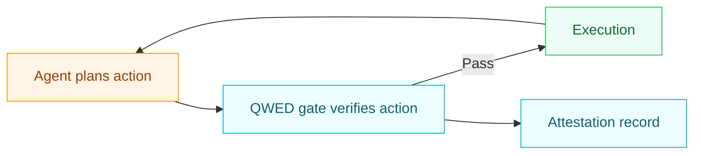

> **Status:** Draft\
> **Version:** 1.1.1\
> **Date:** 2026-04-06\
> **Extends:** QWED-SPEC v1.0, QWED-Attestation v1.0

---

## Table of contents

1. [Introduction](#1-introduction)
2. [Agent verification model](#2-agent-verification-model)
3. [Agent registration](#3-agent-registration)
4. [Verification requests](#4-verification-requests)
5. [Tool verification](#5-tool-verification)
6. [Budget & limits](#6-budget--limits)
7. [Audit trail](#7-audit-trail)
8. [Trust levels](#8-trust-levels)
9. [Runtime hardening](#9-runtime-hardening)
10. [Implementation guidelines](#10-implementation-guidelines)

---

## 1. Introduction

### 1.1 Purpose

QWED-Agent defines a protocol for **AI agents to verify their actions** before execution. As agentic AI systems become more autonomous, QWED-Agent provides guardrails ensuring agents operate within defined boundaries.

### 1.2 Problem statement

| Problem                             | Risk                     |
| ----------------------------------- | ------------------------ |
| Agents execute unverified code      | Security vulnerabilities |
| Agents make unverified calculations | Financial errors         |
| Agents generate unverified SQL      | Data corruption          |
| Agents exceed resource limits       | Cost overruns            |
| No audit trail of agent actions     | Compliance violations    |

### 1.3 Solution

QWED-Agent establishes:

- Pre-execution verification of agent outputs
- Tool call approval workflow
- Budget enforcement
- Complete audit trail
- Trust level management

### 1.4 Terminology

| Term                  | Definition                              |
| --------------------- | --------------------------------------- |
| **Agent**             | Autonomous AI system performing tasks   |
| **Principal**         | Entity that owns/controls the agent     |
| **Tool**              | External capability an agent can invoke |
| **Action**            | Any operation an agent wants to perform |
| **Verification Gate** | Check before action execution           |
| **Budget**            | Resource limits for the agent           |

---

## 2. Agent verification model

### 2.1 Verification flow



### 2.2 Verification types for agents

| Action Type       | Verification Engine | Risk Level |
| ----------------- | ------------------- | ---------- |
| Math calculation  | Math Engine         | Low        |
| Database query    | SQL Engine          | High       |
| Code execution    | Code Engine         | Critical   |
| External API call | Tool Verification   | Medium     |
| File operations   | Security Check      | High       |
| Network requests  | Policy Check        | Medium     |

### 2.3 Decision matrix

| Verification | Risk level | Action |
|---|---|---|
| VERIFIED | Low | Execute immediately |
| VERIFIED | High | Execute with attestation |
| FAILED | Any | Block and notify principal |
| CORRECTED | Low | Execute corrected version |
| CORRECTED | High | Request principal approval |
| UNCERTAIN | Any | Request principal approval |


---

## 3. Agent registration

### 3.1 Registration request

Agents MUST register with QWED before use:

```json
{
  "agent": {
    "name": "CustomerSupportBot",
    "type": "autonomous",
    "description": "Handles customer inquiries",
    "principal_id": "org_abc123",
    "framework": "langchain",
    "model": "claude-3.5-sonnet"
  },
  "permissions": {
    "allowed_engines": ["math", "fact", "sql"],
    "allowed_tools": ["database_read", "send_email"],
    "blocked_tools": ["database_write", "file_delete"]
  },
  "budget": {
    "max_daily_cost_usd": 100.00,
    "max_requests_per_hour": 1000,
    "max_tokens_per_request": 4096
  },
  "trust_level": "supervised"
}
```

### 3.2 Registration response

```json
{
  "agent_id": "agent_xyz789",
  "agent_token": "qwed_agent_...",
  "status": "active",
  "created_at": "2025-12-20T00:30:00Z",
  "permissions": { ... },
  "budget": { ... }
}
```

### 3.3 Agent types

| Type         | Description                          | Trust Level |
| ------------ | ------------------------------------ | ----------- |
| `supervised` | Human approval for high-risk actions | Low         |
| `autonomous` | Self-executing within limits         | Medium      |
| `trusted`    | Full autonomy (enterprise only)      | High        |

### 3.4 Agent identity

Agents receive a DID-based identity:

```
did:qwed:agent:<agent_id>
```

---

## 4. Verification requests

### 4.1 Agent verification request

The `context` object with `conversation_id` and `step_number` is **required**. The `step_number` must be a positive integer that increases monotonically within a conversation. QWED uses these fields to enforce replay protection, loop detection, and conversation length limits. See [conversation controls](/advanced/agent-verification#conversation-controls) for details.

```json
{
  "agent_id": "agent_xyz789",
  "agent_token": "qwed_agent_...",
  "action": {
    "type": "execute_sql",
    "query": "SELECT * FROM customers WHERE status = 'active'",
    "target": "production_db"
  },
  "context": {
    "conversation_id": "conv_123",
    "step_number": 5,
    "user_intent": "Get list of active customers",
    "pre_action_state_hash": "a1b2c3d4e5f6...64-char-sha256-hex-digest",
    "state_source": "db_snapshot"
  },
  "options": {
    "require_attestation": true,
    "risk_threshold": "medium"
  }
}
```

### 4.2 Verification response

```json
{
  "decision": "APPROVED",
  "verification": {
    "status": "VERIFIED",
    "engine": "sql",
    "risk_level": "low",
    "checks_passed": [
      "no_destructive_operations",
      "no_sensitive_columns",
      "schema_valid"
    ]
  },
  "attestation": "eyJhbGciOiJFUzI1NiIs...",
  "budget_remaining": {
    "daily_cost_usd": 89.50,
    "hourly_requests": 42
  }
}
```

### 4.3 Decision types

| Decision          | Meaning                 | Agent Action  |
| ----------------- | ----------------------- | ------------- |
| `APPROVED`        | Safe to execute         | Proceed       |
| `DENIED`          | Verification failed     | Abort + log   |
| `CORRECTED`       | Fixed version available | Use corrected |
| `PENDING`         | Requires human approval | Wait          |
| `BUDGET_EXCEEDED` | Limits reached          | Abort         |

---

## 5. Tool verification

### 5.1 Tool call request

Before an agent calls an external tool:

```json
{
  "agent_id": "agent_xyz789",
  "tool_call": {
    "tool_name": "send_email",
    "parameters": {
      "to": "user@example.com",
      "subject": "Your order status",
      "body": "Your order #12345 has shipped..."
    }
  },
  "justification": "User requested order status update"
}
```

### 5.2 Tool risk assessment

```json
{
  "tool_name": "send_email",
  "risk_assessment": {
    "base_risk": "medium",
    "factors": [
      {"factor": "external_communication", "weight": 0.3},
      {"factor": "pii_in_content", "weight": 0.5}
    ],
    "final_risk": "medium",
    "requires_approval": false
  },
  "policy_checks": [
    {"policy": "no_pii_leakage", "passed": true},
    {"policy": "rate_limit", "passed": true}
  ]
}
```

### 5.3 Tool registry

```json
{
  "tools": [
    {
      "name": "database_read",
      "risk_level": "low",
      "requires_verification": true,
      "verification_engine": "sql"
    },
    {
      "name": "database_write",
      "risk_level": "critical",
      "requires_verification": true,
      "requires_approval": true,
      "verification_engine": "sql"
    },
    {
      "name": "execute_code",
      "risk_level": "critical",
      "requires_verification": true,
      "verification_engine": "code",
      "sandbox_required": true
    }
  ]
}
```

---

## 6. Budget & limits

### 6.1 Budget schema

```json
{
  "budget": {
    "cost": {
      "max_daily_usd": 100.00,
      "max_per_request_usd": 1.00,
      "current_daily_usd": 10.50
    },
    "requests": {
      "max_per_hour": 1000,
      "max_per_day": 10000,
      "current_hour": 42,
      "current_day": 350
    },
    "tokens": {
      "max_per_request": 4096,
      "max_daily": 1000000,
      "current_daily": 50000
    },
    "tools": {
      "max_calls_per_hour": 100,
      "high_risk_calls_remaining": 5
    }
  }
}
```

### 6.2 Budget enforcement

```
┌─────────────────────────────────────────────────────────────┐
│                  BUDGET CHECK FLOW                          │
├─────────────────────────────────────────────────────────────┤
│                                                             │
│  Request ──▶ [Check Cost] ──▶ [Check Rate] ──▶ [Execute]   │
│                   │                │                        │
│                   ▼                ▼                        │
│              Exceeded?         Exceeded?                    │
│                   │                │                        │
│              ┌────┴────┐     ┌────┴────┐                   │
│              │  DENY   │     │  DENY   │                   │
│              │  +429   │     │  +429   │                   │
│              └─────────┘     └─────────┘                   │
│                                                             │
└─────────────────────────────────────────────────────────────┘
```

### 6.3 Budget response

```json
{
  "decision": "BUDGET_EXCEEDED",
  "error": {
    "code": "QWED-AGENT-BUDGET-001",
    "message": "Daily cost limit exceeded",
    "details": {
      "limit": 100.00,
      "current": 102.50,
      "reset_at": "2025-12-21T00:00:00Z"
    }
  }
}
```

---

## 7. Audit trail

### 7.1 Activity log schema

Every agent action is logged:

```json
{
  "activity_id": "act_abc123",
  "agent_id": "agent_xyz789",
  "timestamp": "2025-12-20T00:30:00Z",
  "action": {
    "type": "tool_call",
    "tool": "database_read",
    "parameters": { ... }
  },
  "verification": {
    "status": "VERIFIED",
    "engine": "sql",
    "latency_ms": 45
  },
  "decision": "APPROVED",
  "execution": {
    "success": true,
    "result_hash": "sha256:..."
  },
  "cost": {
    "usd": 0.05,
    "tokens": 150
  },
  "attestation_id": "att_xyz789"
}
```

### 7.2 Audit query API

```http
GET /agents/:agent_id/activity?from=2025-12-01&to=2025-12-20
```

Response:

```json
{
  "agent_id": "agent_xyz789",
  "period": {
    "from": "2025-12-01T00:00:00Z",
    "to": "2025-12-20T00:00:00Z"
  },
  "summary": {
    "total_actions": 15420,
    "approved": 15200,
    "denied": 180,
    "corrected": 40,
    "total_cost_usd": 850.00
  },
  "activities": [ ... ]
}
```

### 7.3 Compliance export

```http
GET /agents/:agent_id/compliance-report?format=pdf
```

---

## 8. Trust levels

### 8.1 Trust level definitions

| Level             | Description             | Verification  | Approval      |
| ----------------- | ----------------------- | ------------- | ------------- |
| **0: Untrusted**  | No autonomous actions   | All           | All           |
| **1: Supervised** | Low-risk autonomous     | High-risk     | High-risk     |
| **2: Autonomous** | Most actions autonomous | Critical only | Critical only |
| **3: Trusted**    | Full autonomy           | None          | None          |

### 8.2 Trust elevation

Agents can request trust elevation:

```json
{
  "agent_id": "agent_xyz789",
  "request": "trust_elevation",
  "from_level": 1,
  "to_level": 2,
  "justification": "30 days of safe operation",
  "evidence": {
    "days_active": 30,
    "total_actions": 50000,
    "denied_actions": 50,
    "denial_rate": 0.001,
    "attestations": 50000
  }
}
```

### 8.3 Trust degradation

Automatic trust reduction on violations:

| Violation                 | Penalty   |
| ------------------------- | --------- |
| Security policy violation | -2 levels |
| Repeated denials (\>10%)  | -1 level  |
| Budget abuse              | -1 level  |
| Principal complaint       | Suspend   |

---

## 9. Runtime hardening

<Info>New in v1.1.0</Info>

### 9.1 Action context requirements

All verification requests MUST include a context with:

| Field | Type | Required | Constraints |
|-------|------|----------|-------------|
| `conversation_id` | string | Yes | Non-empty identifier for the conversation session |
| `step_number` | integer | Yes | Must be >= 1 and monotonically increasing within a conversation |
| `user_intent` | string | No | Human-readable description of intent |
| `pre_action_state_hash` | string | Conditional | SHA-256 hex digest (64 lowercase hex characters) of the world state before the action. Required when `state_source` is provided |
| `state_source` | string | Conditional | Declares how `pre_action_state_hash` was derived. Required when `pre_action_state_hash` is provided. One of: `file_tree`, `db_snapshot`, `conversation_digest`, `git_tree`, `custom` |

The maximum number of steps per conversation is **50**. Exceeding this limit triggers `QWED-AGENT-LOOP-001`.

### 9.2 Replay detection

The runtime tracks the highest committed step number per `(agent_id, conversation_id)` pair. A verification request with a `step_number` less than or equal to the last committed step is rejected as a replay (`QWED-AGENT-LOOP-002`).

Step numbers are only committed when the action decision is `APPROVED` or `PENDING`. Denied actions do not advance the conversation state, allowing the agent to retry the same step number with a different action.

### 9.3 Repetitive loop detection

Actions are fingerprinted using a deterministic JSON serialization of:
- `action_type`
- `query`
- `code`
- `target`
- `parameters`

If the same fingerprint appears more than **2 consecutive times**, the action is blocked with `QWED-AGENT-LOOP-003`. The repeat counter resets when a different action is submitted.

Action parameters MUST be deterministic JSON-compatible values (strings, numbers, booleans, nulls, arrays, and objects with string keys). Non-finite floats (`NaN`, `Infinity`) and non-string dictionary keys are rejected.

### 9.4 Progress-aware doom loop detection (LOOP-004)

<Info>New in v1.1.1</Info>

LOOP-003 detects repeated *actions* but cannot detect an agent that retries the same action on an *unchanged world state*. LOOP-004 closes this gap by binding each action fingerprint to the state of the environment at the time it was proposed.

When `pre_action_state_hash` and `state_source` are provided in the action context, the guard computes a combined fingerprint:

```
fingerprint = SHA-256( canonical_json(action) | "STATE:" | pre_action_state_hash )
```

The combined fingerprint is tracked in a per-conversation sliding window of the last **20** entries. If the same combined fingerprint appears **3 or more times** (including the current request), the action is blocked with `QWED-AGENT-LOOP-004`.

**Key design properties:**

| Property | Detail |
|----------|--------|
| Hash algorithm | SHA-256 (lowercase hex, 64 characters) |
| Sliding window size | 20 entries per `(agent_id, conversation_id)` pair |
| No-progress threshold | 3 identical `action + state` fingerprints |
| State source provenance | Caller must declare how the hash was derived (`file_tree`, `db_snapshot`, `conversation_digest`, `git_tree`, or `custom`) |
| Commit semantics | Fingerprints are only recorded after the action is `APPROVED`. Denied and pending actions do not pollute the history |

**Gradual rollout:** The server-side flag `DOOM_LOOP_GUARD_REQUIRED` controls whether `pre_action_state_hash` and `state_source` are mandatory. When set to `false` (the default during rollout), requests without these fields skip LOOP-004 checks. When set to `true`, requests without both fields are rejected with `QWED-AGENT-STATE-001`.

Both fields must be provided together. Supplying only one triggers `QWED-AGENT-STATE-001`.

### 9.5 In-flight reservations

To prevent race conditions in concurrent environments, the runtime uses a reservation system:

1. When a verification request begins processing, the step number is **reserved**
2. Concurrent requests for the same step are rejected with `QWED-AGENT-LOOP-002`
3. If the action is denied, the reservation is **released** — the step can be retried
4. If the action is approved or pending, the reservation is **committed** — the step is permanently consumed

### 9.6 Unknown action type denial

The runtime fails closed for any `action_type` that does not have explicit registered semantics. An action type is considered registered when it appears in either the action-engine map (e.g. `execute_sql`, `execute_code`, `verify_logic`) or the tool risk map (e.g. `calculate`, `read_file`, `database_read`).

When an unregistered `action_type` is submitted:

1. Risk assessment is **not** performed — there is no deterministic risk binding for the action.
2. Verification checks are **not** run.
3. The in-flight step reservation is released so the agent can retry the same step number with a registered action.
4. The response is `DENIED` with error code `QWED-AGENT-ACTION-001`.

The denial response contains only `decision` and `error` — no `verification` block is emitted, because no engine is bound to the action:

```json
{
  "decision": "DENIED",
  "error": {
    "code": "QWED-AGENT-ACTION-001",
    "message": "Unknown action_type 'transfer_funds_internal_v2' cannot be verified without explicit registered semantics"
  }
}
```

Previously, unregistered action types would receive a generic `"security"` engine label and could pass through verification. The runtime no longer emits this fallback engine; the `engine` field in a verification response always reflects the explicitly registered engine for the action.

### 9.7 Budget denial semantics

Budget check failures (`QWED-AGENT-BUDGET-001`, `QWED-AGENT-BUDGET-002`) do not consume the conversation step. The in-flight reservation is released so the agent can retry the same step number after the budget resets.

### 9.8 Fail-closed rate limiting

When the Redis backend is unavailable, the sliding window rate limiter fails closed (denies all requests) rather than failing open. This prevents uncontrolled access during infrastructure failures. When Redis is entirely absent at process startup, a local in-memory fallback limiter is used.

### 9.9 Environment integrity

On server startup, the runtime MUST verify environment integrity (via `StartupHookGuard`) before initializing the database. A compromised environment causes the server to abort startup with a `RuntimeError`.

### 9.10 Timing-safe authentication

Agent token verification MUST use constant-time comparison (`hmac.compare_digest`) to prevent timing side-channel attacks.

### 9.10 Fail-closed on unknown actions

The runtime MUST reject any verification request whose `action_type` is not explicitly registered in the agent service. An action is considered registered only when it appears in either the engine map (e.g. `execute_sql`, `execute_code`, `calculate`, `verify_logic`, `verify_fact`) or the tool risk table (e.g. `database_read`, `database_write`, `send_email`, `file_read`, `file_write`, `file_delete`, `api_call`).

When an `action_type` has no registered semantics:

- The request is denied with `QWED-AGENT-ACTION-001` before risk assessment runs.
- No `verification` block is returned — the runtime never emits a generic `"security"` engine fallback for unknown actions.
- The in-flight step reservation is released so the agent can retry the same `step_number` with a registered action.

This guarantees that verification outcomes are always tied to explicit, deterministic semantics. An unrecognized action cannot be silently treated as approved or marked as `VERIFIED`.

---

## 10. Implementation guidelines

### 9.1 SDK integration

```python
from qwed_sdk import QWEDAgentClient

# Register agent
agent = QWEDAgentClient.register(
    name="MyAgent",
    principal_id="org_123",
    permissions={
        "allowed_engines": ["math", "sql"],
        "allowed_tools": ["database_read"]
    },
    budget={
        "max_daily_cost_usd": 50.00
    }
)

# Before executing any action
result = agent.verify_action({
    "type": "execute_sql",
    "query": "SELECT * FROM users"
})

if result.decision == "APPROVED":
    # Safe to execute
    execute_query(result.verified_query)
    
    # Log with attestation
    agent.log_execution(
        action_id=result.action_id,
        success=True,
        attestation=result.attestation
    )
```

### 9.2 LangChain integration

```python
from langchain.agents import AgentExecutor
from qwed_sdk.langchain import QWEDVerificationCallback

# Wrap agent with QWED verification
agent_executor = AgentExecutor(
    agent=my_agent,
    tools=my_tools,
    callbacks=[QWEDVerificationCallback(
        agent_id="agent_xyz789",
        agent_token="qwed_agent_..."
    )]
)

# All tool calls automatically verified
result = agent_executor.run("Get customer data")
```

### 9.3 CrewAI integration

```python
from crewai import Agent, Task, Crew
from qwed_sdk.crewai import QWEDVerifiedAgent

# Wrap agents with QWED
verified_agent = QWEDVerifiedAgent(
    agent=researcher,
    qwed_settings={
        "verify_all_tools": True,
        "require_attestation": True
    }
)
```

---

## Appendix A: Error codes

| Code                    | Description              |
| ----------------------- | ------------------------ |
| `QWED-AGENT-001`        | Agent not registered     |
| `QWED-AGENT-002`        | Invalid agent token      |
| `QWED-AGENT-003`        | Agent suspended          |
| `QWED-AGENT-004`        | Tool not allowed         |
| `QWED-AGENT-005`        | Verification failed      |
| `QWED-AGENT-ACTION-001` | Unknown `action_type` — no explicit registered semantics for the requested action |
| `QWED-AGENT-CTX-001`    | Missing required action context (`conversation_id` and `step_number`) |
| `QWED-AGENT-CTX-002`    | Invalid `step_number` (must be >= 1) |
| `QWED-AGENT-ACTION-001` | Unknown `action_type` cannot be verified — the action has no registered engine or tool risk binding |
| `QWED-AGENT-LOOP-001`   | Conversation step limit exceeded (max 50 steps) |
| `QWED-AGENT-LOOP-002`   | Replay or out-of-order action step detected |
| `QWED-AGENT-LOOP-003`   | Repetitive action loop detected (max 2 consecutive identical actions) |
| `QWED-AGENT-LOOP-004`   | No-progress doom loop detected (same action on unchanged state ≥ 3 times) |
| `QWED-AGENT-STATE-001`  | Missing or incomplete state hash fields (`pre_action_state_hash` and `state_source` must be provided together) |
| `QWED-AGENT-STATE-002`  | Invalid `pre_action_state_hash` format (must be 64-character lowercase hex SHA-256) |
| `QWED-AGENT-STATE-003`  | Invalid `state_source` value |
| `QWED-AGENT-STATE-004`  | Action parameters contain non-deterministic values |
| `QWED-AGENT-BUDGET-001` | Daily cost exceeded      |
| `QWED-AGENT-BUDGET-002` | Hourly rate exceeded     |
| `QWED-AGENT-BUDGET-003` | Token limit exceeded     |
| `QWED-AGENT-TRUST-001`  | Insufficient trust level |
| `QWED-AGENT-TRUST-002`  | Action requires approval |

## Appendix B: HTTP endpoints

| Endpoint                  | Method | Description          |
| ------------------------- | ------ | -------------------- |
| `/agents/register`        | POST   | Register new agent   |
| `/agents/:id`             | GET    | Get agent details    |
| `/agents/:id/verify`      | POST   | Verify agent action  |
| `/agents/:id/tools/:tool` | POST   | Verify tool call     |
| `/agents/:id/activity`    | GET    | Get activity log     |
| `/agents/:id/budget`      | GET    | Get budget status    |
| `/agents/:id/trust`       | POST   | Request trust change |

---

_© 2025 QWED-AI. This specification is released under Apache 2.0 License._
