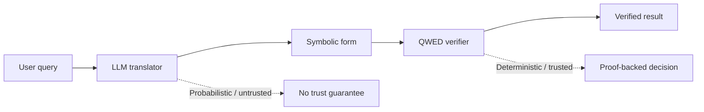
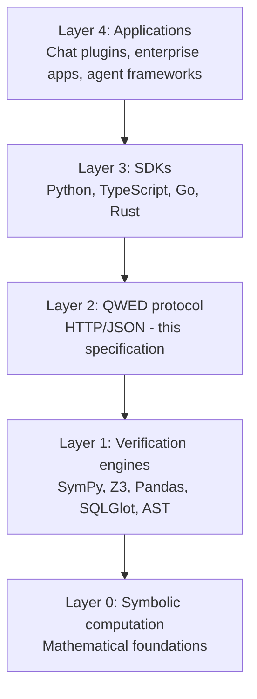

# QWED protocol specification v1.0

> **Status:** Draft  
> **Version:** 1.0.0  
> **Date:** 2025-12-20  
> **Authors:** QWED-AI Team

---

## Table of contents

1. [Introduction](#1-introduction)
2. [Protocol philosophy](#2-protocol-philosophy)
3. [Architecture overview](#3-architecture-overview)
4. [Verification types](#4-verification-types)
5. [Request format](#5-request-format)
6. [Response format](#6-response-format)
7. [QWED-Logic DSL](#7-qwed-logic-dsl)
8. [Error codes](#8-error-codes)
9. [Versioning](#9-versioning)
10. [Security considerations](#10-security-considerations)
11. [Conformance](#11-conformance)

---

## 1. Introduction

### 1.1 Purpose

The QWED Protocol defines a standard interface for **deterministic verification of AI-generated content**. It enables any system to verify the correctness of claims, calculations, logic, code, and other outputs from Large Language Models (LLMs).

### 1.2 Scope

This specification covers:
- Verification request and response formats
- Supported verification types (engines)
- The QWED-Logic Domain Specific Language (DSL)
- Error handling and status codes
- Protocol versioning

### 1.3 Terminology

| Term | Definition |
|------|------------|
| **Verifier** | A QWED-compliant implementation that performs verification |
| **Client** | Any system that sends verification requests |
| **Engine** | A specialized verification module for a specific domain |
| **DSL** | Domain Specific Language for expressing logic |
| **Attestation** | Cryptographic proof of verification result |

### 1.4 Notational conventions

The key words "MUST", "MUST NOT", "REQUIRED", "SHALL", "SHALL NOT", "SHOULD", "SHOULD NOT", "RECOMMENDED", "MAY", and "OPTIONAL" in this document are to be interpreted as described in [RFC 2119](https://www.ietf.org/rfc/rfc2119.txt).

---

## 2. Protocol philosophy

### 2.1 Core principle: LLM as untrusted translator



QWED treats LLMs as **untrusted translators**. The LLM's role is to convert natural language into a symbolic representation that can be verified by deterministic engines. The verification step provides the guarantee.

### 2.2 Design goals

| Goal | Description |
|------|-------------|
| **Determinism** | Same input MUST produce same output |
| **Transparency** | Verification logic is explainable |
| **Model-Agnostic** | Works with any LLM provider |
| **Extensible** | New verification types can be added |
| **Interoperable** | Standard format for all implementations |

### 2.3 Trust model

```
Trust Level 0: User Input           (untrusted)
Trust Level 1: LLM Translation      (untrusted)
Trust Level 2: QWED Verification    (trusted)
Trust Level 3: Symbolic Engine      (trusted, deterministic)
```

---

## 3. Architecture overview

### 3.1 Protocol layers



### 3.2 Request flow

```
1. Client sends VerificationRequest
2. Verifier validates request format
3. Verifier routes to appropriate Engine
4. Engine performs deterministic verification
5. Verifier constructs VerificationResponse
6. Response returned to Client
```

### 3.3 Transport

- **Primary:** HTTP/1.1 or HTTP/2
- **Content-Type:** `application/json`
- **Encoding:** UTF-8
- **Authentication:** Via `X-API-Key` header or Bearer token (implementation-defined)

---

## 4. Verification types

### 4.1 Engine registry

| Engine ID | Name | Description | Technology |
|-----------|------|-------------|------------|
| `math` | Math Verifier | Arithmetic, algebra, calculus | SymPy |
| `logic` | Logic Verifier | Propositional/predicate logic, constraints | Z3 SMT |
| `stats` | Statistics Verifier | Statistical claims on tabular data | Pandas/SciPy |
| `fact` | Fact Verifier | Factual claims with citation | NLP |
| `code` | Code Verifier | Security vulnerability detection | AST analysis |
| `sql` | SQL Verifier | SQL query validation | SQLGlot |
| `image` | Image Verifier | Visual claim verification | Vision API |
| `reasoning` | Reasoning Verifier | Chain-of-thought verification | Multi-step |

### 4.2 Engine capabilities

Each engine MUST declare its capabilities:

```json
{
  "engine_id": "math",
  "name": "Math Verifier",
  "version": "1.0.0",
  "capabilities": {
    "arithmetic": true,
    "algebra": true,
    "calculus": true,
    "symbolic": true,
    "numeric": true,
    "precision": "arbitrary"
  },
  "input_types": ["expression", "equation", "natural_language"],
  "output_types": ["verification_result", "computed_value", "proof"]
}
```

---

## 5. Request format

### 5.1 Base request schema

All verification requests MUST conform to this base schema:

```json
{
  "$schema": "https://json-schema.org/draft/2020-12/schema",
  "$id": "https://qwedai.com/schemas/request/v1",
  "type": "object",
  "required": ["query"],
  "properties": {
    "query": {
      "type": "string",
      "description": "The content to verify",
      "minLength": 1,
      "maxLength": 100000
    },
    "type": {
      "type": "string",
      "enum": ["math", "logic", "stats", "fact", "code", "sql", "image", "reasoning", "natural_language"],
      "default": "natural_language",
      "description": "Verification type"
    },
    "params": {
      "type": "object",
      "description": "Engine-specific parameters"
    },
    "options": {
      "type": "object",
      "properties": {
        "timeout_ms": {
          "type": "integer",
          "minimum": 1000,
          "maximum": 300000,
          "default": 30000
        },
        "include_proof": {
          "type": "boolean",
          "default": false
        },
        "include_attestation": {
          "type": "boolean",
          "default": false
        }
      }
    },
    "metadata": {
      "type": "object",
      "properties": {
        "request_id": {"type": "string"},
        "correlation_id": {"type": "string"},
        "trace_id": {"type": "string"}
      }
    }
  }
}
```

### 5.2 Engine-specific request schemas

#### 5.2.1 Math verification

```json
{
  "query": "x**2 + 2*x + 1 = (x+1)**2",
  "type": "math",
  "params": {
    "domain": "real",
    "precision": 10
  }
}
```

#### 5.2.2 Logic verification

```json
{
  "query": "(AND (GT x 5) (LT y 10))",
  "type": "logic",
  "params": {
    "format": "dsl"
  }
}
```

#### 5.2.3 Code verification

```json
{
  "query": "import os; os.system('rm -rf /')",
  "type": "code",
  "params": {
    "language": "python",
    "check_types": ["security", "quality"]
  }
}
```

#### 5.2.4 Fact verification

```json
{
  "query": "Paris is the capital of France",
  "type": "fact",
  "params": {
    "context": "France is a country in Europe. Its capital city is Paris, known for the Eiffel Tower."
  }
}
```

#### 5.2.5 SQL verification

```json
{
  "query": "SELECT * FROM users WHERE id = 1",
  "type": "sql",
  "params": {
    "schema_ddl": "CREATE TABLE users (id INT PRIMARY KEY, name TEXT, email TEXT)",
    "dialect": "postgresql"
  }
}
```

### 5.3 Batch request

```json
{
  "batch": true,
  "items": [
    {"query": "2+2=4", "type": "math"},
    {"query": "3*3=9", "type": "math"},
    {"query": "(AND (GT x 5))", "type": "logic"}
  ],
  "options": {
    "max_parallel": 10,
    "fail_fast": false
  }
}
```

---

## 6. Response format

### 6.1 Base response schema

```json
{
  "$schema": "https://json-schema.org/draft/2020-12/schema",
  "$id": "https://qwedai.com/schemas/response/v1",
  "type": "object",
  "required": ["status", "verified"],
  "properties": {
    "status": {
      "type": "string",
      "enum": ["VERIFIED", "FAILED", "CORRECTED", "BLOCKED", "ERROR", "TIMEOUT", "UNSUPPORTED"]
    },
    "verified": {
      "type": "boolean",
      "description": "True if verification passed"
    },
    "engine": {
      "type": "string",
      "description": "Engine that performed verification"
    },
    "result": {
      "type": "object",
      "description": "Engine-specific result data"
    },
    "proof": {
      "type": "object",
      "description": "Verification proof (if requested)"
    },
    "attestation": {
      "type": "object",
      "description": "Cryptographic attestation (if requested)"
    },
    "error": {
      "type": "object",
      "properties": {
        "code": {"type": "string"},
        "message": {"type": "string"},
        "details": {"type": "object"}
      }
    },
    "metadata": {
      "type": "object",
      "properties": {
        "request_id": {"type": "string"},
        "latency_ms": {"type": "number"},
        "engine_version": {"type": "string"},
        "protocol_version": {"type": "string"}
      }
    }
  }
}
```

### 6.2 Status codes

| Status | Meaning | HTTP Code |
|--------|---------|-----------|
| `VERIFIED` | Verification passed | 200 |
| `FAILED` | Verification failed (claim is false) | 200 |
| `CORRECTED` | Result corrected (was wrong, now fixed) | 200 |
| `BLOCKED` | Blocked by security policy | 403 |
| `ERROR` | Engine error | 500 |
| `TIMEOUT` | Verification timed out | 504 |
| `UNSUPPORTED` | Query type not supported | 400 |

### 6.3 Example responses

#### 6.3.1 Successful math verification

```json
{
  "status": "VERIFIED",
  "verified": true,
  "engine": "math",
  "result": {
    "is_valid": true,
    "left_side": "x**2 + 2*x + 1",
    "right_side": "(x + 1)**2",
    "simplified_difference": "0",
    "message": "Algebraic identity confirmed"
  },
  "metadata": {
    "request_id": "req_abc123",
    "latency_ms": 45.2,
    "engine_version": "1.0.0",
    "protocol_version": "1.0.0"
  }
}
```

#### 6.3.2 Failed verification

```json
{
  "status": "FAILED",
  "verified": false,
  "engine": "math",
  "result": {
    "is_valid": false,
    "expected": 4,
    "actual": 5,
    "message": "2 + 2 = 4, not 5"
  },
  "metadata": {
    "latency_ms": 12.1
  }
}
```

#### 6.3.3 Logic verification with model

```json
{
  "status": "VERIFIED",
  "verified": true,
  "engine": "logic",
  "result": {
    "satisfiability": "SAT",
    "model": {
      "x": 6,
      "y": 9
    },
    "constraints_evaluated": 2
  }
}
```

#### 6.3.4 Security block

```json
{
  "status": "BLOCKED",
  "verified": false,
  "engine": "security",
  "error": {
    "code": "SECURITY_VIOLATION",
    "message": "Prompt injection detected",
    "details": {
      "pattern": "ignore previous instructions",
      "position": 15
    }
  }
}
```

### 6.4 Batch response

```json
{
  "batch": true,
  "job_id": "batch_xyz789",
  "status": "completed",
  "summary": {
    "total": 3,
    "verified": 2,
    "failed": 1,
    "success_rate": 66.7
  },
  "items": [
    {"id": "0", "status": "VERIFIED", "verified": true},
    {"id": "1", "status": "VERIFIED", "verified": true},
    {"id": "2", "status": "FAILED", "verified": false}
  ],
  "metadata": {
    "total_latency_ms": 234.5
  }
}
```

---

## 7. QWED-Logic DSL

### 7.1 Overview

QWED-Logic is an S-expression based Domain Specific Language for expressing logical constraints. It is designed to be:
- Easy for LLMs to generate
- Safe to parse (no eval)
- Expressive for common logic patterns

### 7.2 Grammar (EBNF)

```ebnf
(* QWED-Logic DSL Grammar v1.0 *)

program     = expression ;
expression  = atom | list ;
list        = "(" operator { expression } ")" ;
atom        = variable | number | boolean | string ;

(* Operators *)
operator    = logic_op | comparison_op | arithmetic_op | quantifier_op | special_op ;

logic_op      = "AND" | "OR" | "NOT" | "IMPLIES" | "IFF" | "XOR" ;
comparison_op = "EQ" | "NE" | "GT" | "GE" | "LT" | "LE" ;
arithmetic_op = "PLUS" | "MINUS" | "MULT" | "DIV" | "MOD" | "POW" | "ABS" | "NEG" ;
quantifier_op = "FORALL" | "EXISTS" ;
special_op    = "IF" | "LET" | "MATCH" ;

(* Atoms *)
variable    = letter { letter | digit | "_" } ;
number      = integer | float ;
integer     = [ "-" ] digit { digit } ;
float       = [ "-" ] digit { digit } "." digit { digit } ;
boolean     = "true" | "false" ;
string      = '"' { character } '"' ;

(* Terminals *)
letter      = "a" | ... | "z" | "A" | ... | "Z" ;
digit       = "0" | ... | "9" ;
character   = ? any printable character except '"' ? ;
```

### 7.3 Operator reference

#### 7.3.1 Logic operators

| Operator | Arity | Description | Example |
|----------|-------|-------------|---------|
| `AND` | 2+ | Logical conjunction | `(AND p q)` |
| `OR` | 2+ | Logical disjunction | `(OR p q)` |
| `NOT` | 1 | Logical negation | `(NOT p)` |
| `IMPLIES` | 2 | Implication | `(IMPLIES p q)` |
| `IFF` | 2 | If and only if | `(IFF p q)` |
| `XOR` | 2 | Exclusive or | `(XOR p q)` |

#### 7.3.2 Comparison operators

| Operator | Arity | Description | Example |
|----------|-------|-------------|---------|
| `EQ` | 2 | Equal | `(EQ x 5)` |
| `NE` | 2 | Not equal | `(NE x 0)` |
| `GT` | 2 | Greater than | `(GT x 5)` |
| `GE` | 2 | Greater or equal | `(GE x 5)` |
| `LT` | 2 | Less than | `(LT x 10)` |
| `LE` | 2 | Less or equal | `(LE x 10)` |

#### 7.3.3 Arithmetic operators

| Operator | Arity | Description | Example |
|----------|-------|-------------|---------|
| `PLUS` | 2+ | Addition | `(PLUS x y)` |
| `MINUS` | 2 | Subtraction | `(MINUS x y)` |
| `MULT` | 2+ | Multiplication | `(MULT x y)` |
| `DIV` | 2 | Division | `(DIV x y)` |
| `MOD` | 2 | Modulo | `(MOD x y)` |
| `POW` | 2 | Power | `(POW x 2)` |
| `ABS` | 1 | Absolute value | `(ABS x)` |
| `NEG` | 1 | Negation | `(NEG x)` |

#### 7.3.4 Quantifiers

| Operator | Arity | Description | Example |
|----------|-------|-------------|---------|
| `FORALL` | 2 | Universal quantifier | `(FORALL x (GT x 0))` |
| `EXISTS` | 2 | Existential quantifier | `(EXISTS x (EQ x 5))` |

### 7.4 Examples

#### Simple constraint
```lisp
(AND (GT x 5) (LT x 10))
; x > 5 AND x < 10
```

#### Invoice validation
```lisp
(AND
  (EQ (PLUS subtotal tax) total)
  (GT invoice_date "2024-01-01")
  (MATCH gst_number "[0-9]{2}[A-Z]{5}[0-9]{4}[A-Z]{1}[1-9A-Z]{1}Z[0-9A-Z]{1}"))
```

#### Business rule
```lisp
(IMPLIES
  (EQ category "electronics")
  (GE tax_rate 0.18))
; IF category = "electronics" THEN tax_rate >= 18%
```

### 7.5 Variable declaration

Variables are automatically inferred from usage. The default type is `Real`. Explicit type declarations:

```lisp
(LET ((x Int) (y Real) (p Bool))
  (AND (GT x 0) (NOT p)))
```

### 7.6 Security

QWED-Logic DSL is designed to be **safe by construction**:
- No code execution (unlike `eval`)
- Whitelist-based operator validation
- Bounded recursion depth
- Input length limits

---

## 8. Error codes

### 8.1 Error code format

```
QWED-<CATEGORY>-<NUMBER>
```

### 8.2 Error categories

| Category | Description |
|----------|-------------|
| `REQ` | Request errors (client-side) |
| `AUTH` | Authentication/authorization errors |
| `ENG` | Engine errors |
| `SEC` | Security violations |
| `SYS` | System errors |

### 8.3 Error code registry

| Code | HTTP | Description |
|------|------|-------------|
| `QWED-REQ-001` | 400 | Invalid request format |
| `QWED-REQ-002` | 400 | Missing required field |
| `QWED-REQ-003` | 400 | Invalid query syntax |
| `QWED-REQ-004` | 400 | Query too long |
| `QWED-REQ-005` | 400 | Unsupported verification type |
| `QWED-AUTH-001` | 401 | Missing API key |
| `QWED-AUTH-002` | 401 | Invalid API key |
| `QWED-AUTH-003` | 403 | Insufficient permissions |
| `QWED-AUTH-004` | 429 | Rate limit exceeded |
| `QWED-ENG-001` | 500 | Engine initialization failed |
| `QWED-ENG-002` | 500 | Verification failed unexpectedly |
| `QWED-ENG-003` | 504 | Verification timeout |
| `QWED-ENG-004` | 500 | Engine not available |
| `QWED-SEC-001` | 403 | Prompt injection detected |
| `QWED-SEC-002` | 403 | Malicious payload detected |
| `QWED-SEC-003` | 403 | PII detected (redacted) |
| `QWED-SYS-001` | 500 | Internal server error |
| `QWED-SYS-002` | 503 | Service unavailable |

### 8.4 Error response format

```json
{
  "status": "ERROR",
  "verified": false,
  "error": {
    "code": "QWED-REQ-003",
    "message": "Invalid query syntax",
    "details": {
      "position": 15,
      "expected": "closing parenthesis",
      "found": "end of input"
    },
    "documentation_url": "https://docs.qwedai.com/errors/QWED-REQ-003"
  }
}
```

---

## 9. Versioning

### 9.1 Semantic versioning

The QWED Protocol follows [Semantic Versioning 2.0.0](https://semver.org/):

```
MAJOR.MINOR.PATCH

MAJOR: Breaking changes
MINOR: New features, backward compatible
PATCH: Bug fixes, backward compatible
```

### 9.2 Version negotiation

Clients SHOULD include the protocol version in requests:

```http
QWED-Protocol-Version: 1.0
```

Servers MUST include the protocol version in responses:

```json
{
  "metadata": {
    "protocol_version": "1.0.0"
  }
}
```

### 9.3 Compatibility

| Change Type | Backward Compatible |
|-------------|---------------------|
| Add new engine | ✅ Yes |
| Add new optional field | ✅ Yes |
| Add new status code | ✅ Yes |
| Remove required field | ❌ No |
| Change field type | ❌ No |
| Remove engine | ❌ No |

---

## 10. Security considerations

### 10.1 Input validation

Implementations MUST:
- Validate all input against JSON Schema
- Enforce maximum query length (RECOMMENDED: 100KB)
- Sanitize inputs before engine processing

### 10.2 Prompt injection defense

Implementations SHOULD:
- Scan for known injection patterns
- Block requests containing manipulation attempts
- Log security events

### 10.3 Rate limiting

Implementations SHOULD implement:
- Per-client rate limiting
- Global rate limiting
- Burst allowance

### 10.4 Audit logging

Implementations SHOULD log:
- All verification requests (with timestamps)
- Security violations
- Errors

### 10.5 Transport security

- HTTPS MUST be used in production
- TLS 1.2+ REQUIRED

---

## 11. Conformance

### 11.1 Conformance levels

| Level | Requirements |
|-------|--------------|
| **Basic** | Implements request/response format, at least 1 engine |
| **Standard** | Basic + All 8 engines + Error codes |
| **Full** | Standard + DSL + Attestation + Batch |

### 11.2 Conformance testing

A conformance test suite is available at:
```
https://github.com/QWED-AI/qwed-conformance
```

### 11.3 Implementation registry

Compliant implementations MAY be registered at:
```
https://qwedai.com/implementations
```

---

## Appendix A: JSON schemas

Full JSON Schema files are available at:
- Request: `https://qwedai.com/schemas/request/v1.json`
- Response: `https://qwedai.com/schemas/response/v1.json`

## Appendix B: Reference implementation

The reference implementation is available at:
- GitHub: `https://github.com/QWED-AI/qwed-verification`
- Docker: `docker pull qwed/qwed-node:latest`

## Appendix C: Change log

### v1.0.0 (2025-12-20)
- Initial specification release
- 8 verification engines defined
- QWED-Logic DSL v1.0

---

*© 2025 QWED-AI. This specification is released under Apache 2.0 License.*
