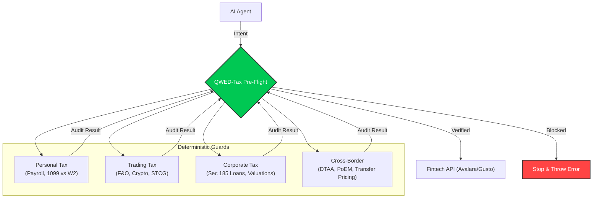

> "Death, Taxes, and Deterministic Verification."

**QWED-Tax** is the deterministic verification layer for Agentic Finance. It protects AI Agents from making costly tax errors by proofing inputs against **IRS (US)** and **CBDT (India)** rules before any transaction is executed.

## The problem

AI agents (LLMs) are handling payroll and tax, but they are largely illiterate in tax law. They hallucinate rates, misclassify workers, and ignore nexus thresholds.

### Real world failures

| Scenario | LLM Hallucination | QWED Verdict |
| :-- | :-- | :-- |
| **Worker Hire** | "Hiring contractor (1099) who uses my laptop" | **BLOCKED** (Misclassification Risk) |
| **Sales Tax** | "No tax in NY for \$600k sales" | **BLOCKED** (Nexus Violation) |
| **Payroll** | "FICA Tax on $500k = $ 31,000" | **BLOCKED** (Limit is $176k / ~$ 10k tax) |
| **W-4 Exempt** | "Employee claims exempt with $5k liability" | **BLOCKED** (IRS Pub 505 Violation) |
| **Transfer Pricing** | "Charge related party 50% below market" | **BLOCKED** (Arm's Length Deviation) |

## Guard coverage

QWED-Tax ships with **20+ deterministic guards** across three jurisdictions:

| Category | Guards | Jurisdiction |
| :-- | :-- | :-- |
| **Payroll** | PayrollGuard, WithholdingGuard, ReciprocityGuard | US |
| **Worker classification** | ClassificationGuard (IRS Common Law + ABC Test) | US |
| **Sales tax** | NexusGuard | US |
| **1099 filing** | Form1099Guard | US |
| **Crypto/VDA** | CryptoTaxGuard | India |
| **Trading** | InvestmentGuard, SpeculationGuard, CapitalGainsGuard | India |
| **GST/AP** | GSTGuard, InputCreditGuard, TDSGuard | India |
| **Corporate** | RelatedPartyGuard, ValuationGuard | India |
| **Banking** | DepositRateGuard | India |
| **Set-off matrix** | InterHeadAdjustmentGuard | India |
| **Cross-border** | RemittanceGuard, DTAAGuard, TransferPricingGuard, PoEMGuard | International |
| **Address** | AddressGuard | US |

## Accounts payable automation

`qwed-tax` secures the entire "Procure-to-Pay" cycle for AI Agents:

- **Validation:** Checks GSTIN/VAT ID formats via `InputCreditGuard.verify_gstin_format()`.
- **Compliance:** Blocks Input Tax Credit (ITC) on "Personal" categories (Food, Cars, Gifts).
- **Withholding:** Auto-calculates TDS/Retention amounts before commercial payment via `TDSGuard`.

## Procedural accuracy (MSLR aligned)

Unlike standard calculators, `qwed-tax` verifies the **procedure**, not just the result. This aligns with **Multi-Step Legal Reasoning (MSLR)** to prevent "Right Answer, Wrong Logic" errors.

- **Step 1: Sanction Check** $\rightarrow$ Is this transaction legal? (e.g., `RelatedPartyGuard` blocks illegal loans _before_ rate checks).
- **Step 2: Limit Check** $\rightarrow$ Is it within quota? (e.g., `RemittanceGuard` checks LRS limit _before_ TCS).
- **Step 3: Calculation** $\rightarrow$ Apply math.

## Architecture

QWED-Tax acts as the **Pre-Flight Middleware** between your AI Agent and Fintech APIs (like Gusto, Stripe, or Avalara).



The system supports two entry points:

- **`TaxPreFlight`** — Intent-based auditor that routes each transaction to the guards required for its declared `action` and **fails closed** on missing, malformed, or unsupported intents.
- **`TaxVerifier`** — Jurisdiction-scoped verifier (`US` or `INDIA`) for direct guard access.

## Z3 theorem prover integration

Several guards use the **Z3 SMT solver** for formal verification instead of heuristic rules:

- **WithholdingGuard** — Proves W-4 exempt status validity against IRS Pub 505 rules.
- **ReciprocityGuard** — Proves correct state withholding under reciprocity agreements.
- **ClassificationGuard (ABC Test)** — Proves worker classification under CA AB5 / NJ / MA laws.
- **InvestmentGuard** — Proves correct tax head classification for stock market transactions.

This means QWED-Tax does not just check rules — it **formally proves** that the AI's tax logic is consistent.

## Zero-data leakage

Unlike cloud API checks (Avalara/Vertex), `qwed-tax` runs **100% locally**.

- **Privacy first:** Your payroll/trading data never leaves your server.
- **No API latency:** Checks are instant (microseconds).
- **GDPR/DPDP compliant:** Ideal for sensitive Fintech environments.

## Data models

QWED-Tax uses strict Pydantic models with `Decimal` precision to prevent floating-point errors in financial calculations.

<Expandable title="Core models">
  <ParamField body="PayrollEntry" type="BaseModel">
    Represents a single payroll record for verification.
    <Expandable title="properties">
      <ParamField body="employee_id" type="str" required>Employee identifier</ParamField>
      <ParamField body="gross_pay" type="Decimal" required>Gross pay amount</ParamField>
      <ParamField body="taxes" type="List[TaxEntry]" required>List of tax withholdings</ParamField>
      <ParamField body="deductions" type="List[DeductionEntry]" required>List of deductions</ParamField>
      <ParamField body="net_pay_claimed" type="Decimal" required>Net pay calculated by the AI/system</ParamField>
      <ParamField body="currency" type="Currency" default="USD">Currency code (USD, EUR, GBP)</ParamField>
    </Expandable>
  </ParamField>

  <ParamField body="ContractorPayment" type="BaseModel">
    Represents a payment to a contractor for 1099 filing checks.
    <Expandable title="properties">
      <ParamField body="contractor_id" type="str" required>Contractor identifier</ParamField>
      <ParamField body="payment_type" type="PaymentType" required>NEC, RENT, ROYALTIES, ATTORNEY, or HEALTHCARE</ParamField>
      <ParamField body="amount" type="Decimal" required>Payment amount</ParamField>
      <ParamField body="calendar_year" type="int" required>Tax year</ParamField>
    </Expandable>
  </ParamField>

  <ParamField body="WorkerClassificationParams" type="BaseModel">
    Input for the ABC Test classification guard.
    <Expandable title="properties">
      <ParamField body="worker_id" type="str" required>Worker identifier</ParamField>
      <ParamField body="freedom_from_control" type="bool" required>ABC Test criterion A</ParamField>
      <ParamField body="work_outside_usual_business" type="bool" required>ABC Test criterion B</ParamField>
      <ParamField body="customarily_engaged_independently" type="bool" required>ABC Test criterion C</ParamField>
      <ParamField body="state" type="State" required>US state code</ParamField>
    </Expandable>
  </ParamField>

  <ParamField body="W4Form" type="BaseModel">
    Input for W-4 withholding verification.
    <Expandable title="properties">
      <ParamField body="employee_id" type="str" required>Employee identifier</ParamField>
      <ParamField body="claim_exempt" type="bool" required>Whether exempt status is claimed</ParamField>
      <ParamField body="tax_liability_last_year" type="float" required>Prior year tax liability</ParamField>
      <ParamField body="expect_refund_this_year" type="bool" required>Whether a refund is expected this year</ParamField>
    </Expandable>
  </ParamField>

  <ParamField body="WorkArrangement" type="BaseModel">
    Input for `ReciprocityGuard` — describes where an employee lives and works.
    <Expandable title="properties">
      <ParamField body="employee_id" type="str" required>Employee identifier</ParamField>
      <ParamField body="residence_address" type="Address" required>Employee's residence address</ParamField>
      <ParamField body="work_address" type="Address" required>Employee's work address (or HQ if remote)</ParamField>
      <ParamField body="is_remote" type="bool" default="false">Whether the employee works remotely</ParamField>
    </Expandable>
  </ParamField>

  <ParamField body="Address" type="BaseModel">
    A US address used by `AddressGuard` and `WorkArrangement`.
    <Expandable title="properties">
      <ParamField body="street" type="str" required>Street address</ParamField>
      <ParamField body="city" type="str" required>City name</ParamField>
      <ParamField body="state" type="State" required>US state enum</ParamField>
      <ParamField body="zip_code" type="str" required>Five-digit ZIP code</ParamField>
    </Expandable>
  </ParamField>

  <ParamField body="VerificationResult" type="BaseModel">
    Standard result returned by payroll verification guards.
    <Expandable title="properties">
      <ParamField body="verified" type="bool" required>Whether the check passed</ParamField>
      <ParamField body="recalculated_net_pay" type="Decimal" required>Deterministically recalculated net pay</ParamField>
      <ParamField body="discrepancy" type="Decimal" required>Difference between claimed and calculated</ParamField>
      <ParamField body="message" type="str" required>Human-readable verdict</ParamField>
      <ParamField body="verification_mode" type="str" default="SYMBOLIC">Always SYMBOLIC (Z3-powered)</ParamField>
    </Expandable>
  </ParamField>
</Expandable>

## Installation

```bash
pip install qwed-tax
```
